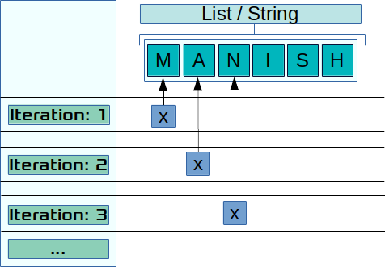

# Loops
----

During the course of solving client requirements, comes across situations where group of some data needs to be processed against a defined set of instructions. 

Loops help in resolving situations where a piece of code needs to be executed against a set of data repetitedly or till certain condition is met or un-met. Or, you use to process a large quantity of data, such as lines of a file or records of a database that must be processed by the same code block.

Python provides two constructs to help in these situations.

- `for`
- `while`

Lets start with the `for` loops.

## For

It is one of the most often used construct in Python. It can accept not only accept static sequences, but also sequences generated by iterators (Structures which allow iterations, i.e. sequentially access to collection of elements). It runs the code block against known iterations of dataset.

The syntax for `for` is as follows:

**Syntax**:

    for <reference> in <sequence>:
        <code block>
        continue
        break
    else:
        <code block>

During the execution of a *for* loop, the reference points to an element in the sequence. At each iteration, the reference is updated, in order for the *for* code block to process the corresponding element.

The clause *break* stops the loop and *continue* passes it to the next iteration. The code inside the `else` is executed at the end of the loop, except if the loop has been interrupted by *break*.

Example:


```python
for x in "Manish":
    print(x, end=" ")
```

    M a n i s h 



In the above example, "Manish Gupta" is a sequence of characters and for loop traverse that sequence of characters. Also you will note that we are ending the print statement with space instead of new line using the option `end=`. 

Similarly in the below example we are going to use the `range` function to generate the sequence of numbers starting from 30 and ending with 5 with difference of 5. 

### The range() function

The function `range(m, n, p)`, is very useful in loops, as it returns a list of integers starting at `m` through smaller than `n` in steps of length `p`, which can be used as the order for the loop.

We can also define the start, stop and step size as `range(start,stop,step size)`. step size defaults to 1 if not provided.

We can generate a sequence of numbers using range() function. range(10) will generate numbers from 0 to 9 (10 numbers).


This function does not store all the values in memory, it would be inefficient. So it remembers the start, stop, step size and generates the next number on the go.

To force this function to output all the items, we can use the function list().


```python
# Output: range(0, 10)
print(range(10))

# Output: [0, 1, 2, 3, 4, 5, 6, 7, 8, 9]
print(list(range(10)))

# Output: [2, 3, 4, 5, 6, 7]
print(list(range(2, 8)))

# Output: [2, 5, 8, 11, 14, 17]
print(list(range(2, 20, 3)))

print(list(range(20, 2, -3)))
```

    range(0, 10)
    [0, 1, 2, 3, 4, 5, 6, 7, 8, 9]
    [2, 3, 4, 5, 6, 7]
    [2, 5, 8, 11, 14, 17]
    [20, 17, 14, 11, 8, 5]


```python
print(dir(range(10)))
```

    ['__class__', '__contains__', '__delattr__', '__dir__', '__doc__', '__eq__', '__format__', '__ge__', '__getattribute__', '__getitem__', '__gt__', '__hash__', '__init__', '__iter__', '__le__', '__len__', '__lt__', '__ne__', '__new__', '__reduce__', '__reduce_ex__', '__repr__', '__reversed__', '__setattr__', '__sizeof__', '__str__', '__subclasshook__', 'count', 'index', 'start', 'step', 'stop']


```python
# Sum 0 to 99
s = 0
for x in range(30, 1, -5):
    print(x)
    s = s + x
print("sum of 30 to 1 with steps -5 is", s)
```

    30
    25
    20
    15
    10
    5
    sum of 30 to 1 with steps -5 is 105


### Nested loops

We can also have nested `for` loops as shown in the below example


```python
for x in range(1, 6):
    for y in range(1, x+1):
        print(x, y)
```

    1 1
    2 1
    2 2
    3 1
    3 2
    3 3
    4 1
    4 2
    4 3
    4 4
    5 1
    5 2
    5 3
    5 4
    5 5


### `for` loop with a list


```python
cols = ["Red", "Green", "Yellow", "White"]

for color in cols:
    print(color)
```

    Red
    Green
    Yellow
    White


```python
cols = ["Red", "Green", "Yellow", "White"]

for color in cols:
    print(color)
else:
    print(" ~~~~ Done ~~~~")
```

    Red
    Green
    Yellow
    White
     ~~~~ Done ~~~~


we can also have conditions where multiple values are returned every iteration.


```python
# Advance code, to be used after learning slicing. Please use instead the other code
# for x in "Manish Gupta"[::-1]:
#     print(x, end=" ")
```


```python
reverse_text = ""
for char in "Manish Gupta":
    reverse_text = char + reverse_text
print(reverse_text)
```

    atpuG hsinaM


```python
x_test = [[1,2],[3,4],[5,6]]

for x in x_test:
    print(x)
    a = x[0]
    b = x[1]
    print (a, b)
```

    [1, 2]
    1 2
    [3, 4]
    3 4
    [5, 6]
    5 6


```python
x_test = [[1,2],[3,4],[5,6], [7,8,9]]

for x in x_test:
    print(x)
```

    [1, 2]
    [3, 4]
    [5, 6]
    [7, 8, 9]


```python
x_test = [[1,2],[3,4],[5,6], [7,8]]

for x, y in x_test:
    print(x, y)
```

    1 2
    3 4
    5 6
    7 8


```python
x_test = [[1,2],[3,4],[5,6], [7,8,9]]

for x in x_test:
    print(x)
    a = x[0]
    b = x[1]
    print (a, b)
```

    [1, 2]
    1 2
    [3, 4]
    3 4
    [5, 6]
    5 6
    [7, 8, 9]
    7 8


### `for` loop with dictionary. 

- Traversing the values.


```python
color = {"c1": "Red", "c2": "Green", "c3": "Orange"}
for value in color.values():
    print(value)
```

    Green
    Orange
    Red


- Traversing the keys


```python
color = {"c1": "Red", "c2": "Green", "c3": "Orange"}  
for col in color:
    print(col, color[col])
```

    c1 Red
    c2 Green
    c3 Orange


```python
color = {"c1": "Red", "c2": "Green", "c3": "Orange"}  
for value in color.values():
    if(value=="Green"): 
        break
    print(value)
else:
    print("Done")
```

    Red


```python
color = {"c1": "Red", "c2": "Green", "c3": "Orange"}  
for value in color.values():
    if(value=="Green"): 
        continue
    print(value)
else:
    print("Done")
```

    Red
    Orange
    Done


### Uses of `for `loops

- Reading & processing a log file which contains logs one line at a time. 

## `While`

Executes a block of code in response to a condition.

Syntax:

    while <condition>:
        <code block>
        continue/break/pass
    else:
        <code block>
            
The code block inside the *while* loop is repeated while the loop condition is evaluated as true.
            
Example:


```python
# Sum 0 to 99
s = 0
x = 1

while x < 100:
    s = s + x
    x = x + 1
else:
    print("!!! Hurry Hurry !!!")
    print(x)

print ("Sum of 0 to 99", s)
```

    !!! Hurry Hurry !!!
    100
    Sum of 0 to 99 4950


```python
while x < 0:
    print("Hello")
else:
    print("Sorry")
```

    Sorry


```python
# while x > 0:
#     print("Hello")
# else:
#     print("Sorry")
```

> **NOTE**: Please try to avoid code similar to above commented code

> **NOTE**: The *while* loop is appropriate when there is no way to determine how many iterations will occur and there is a sequence to follow.


```python
s = 0
x = 100
while x < 100:
    s = s + x
    x = x + 1
else:
    print("x is already equal or greater than 100")
print(s)
```

    x is already equal or greater than 100
    0


```python
x = 1;  
s = 0  
while (x < 10):  
    s = s + x  
    x = x + 1  
    if (x == 5):
        break  
else:  
     print('The sum of first 9 integers : ',s)          
print('The sum of', x, 'numbers is :',s)   
```

    The sum of 5 numbers is : 10


```python
while 10 != int(input('Enter a passkeyid: ')):
    print("Wrong Passkey"),

```

    Enter a passkeyid: 11
    Wrong Passkey
    Enter a passkeyid: 23
    Wrong Passkey
    Enter a passkeyid: 10


```python
while int(input('Enter a passkeyid: ')) != 10:
    print("Wrong Passkey"),
else:
    print("!!! Welcome to the world of Magic !!!")
```

    Enter a passkeyid: 112
    Wrong Passkey
    Enter a passkeyid: 11
    Wrong Passkey
    Enter a passkeyid: 10
    !!! Welcome to the world of Magic !!!


## Break
The break statement is used to exit a `for` or a `while` loop. The purpose of this statement is to end the execution of the loop (for or while) immediately and the program control goes to the statement after the last statement of the loop. If there is an optional else statement in while or for loop it skips the optional clause also


```python
num_sum = 0  
count = 0  
for x in range(1, 9):  
    print(x)
    num_sum = num_sum + x  
    count = count + 1   
    if count == 5:  
        break 
print("Sum of first ",count,"integers is : ", num_sum)  
```

    1
    2
    3
    4
    5
    Sum of first  5 integers is :  15


## Continue Statement 
The continue statement is used in a while or for loop to take the control to the top of the loop without executing the rest statements inside the loop. Here is a simple example.


```python
for x in range(8):  
    if (x == 3 or x==6):
        print("\tSkipping:", x)
        continue  
        print("This should never print")
    else:
        print(x) 
```

    0
    1
    2
    	Skipping: 3
    4
    5
    	Skipping: 6
    7


## The `else` in for 


```python
for x in [1, 10, 4]:
    if x == 10:
        continue
    print("Hello", x)
else:
    print("processing completed without issues.")
```

    Hello 1
    Hello 4
    processing completed without issues.


```python
print("-" * 20)
for x in [1, 10, 4]:
    if x == 10:
        break
    print("Hello", x)
else:
    print("processing completed without issues.")
```

    --------------------
    Hello 1


## Usecases for `else`
A common use case for the else clause in loops is to implement search loops; say you’re performing a search for an item that meets a particular condition, and need to perform additional processing or raise an error if no acceptable value is found:


```python
def meets_condition(x):
    return x==20

data = [10, 20, 33, 42, 44]
for x in data:
    if meets_condition(x):
        break
else:
    print("No one met the condition")
print("lets end it")
```

    lets end it


```python
def meets_condition(x):
    return x==21

data = [10, 20, 33, 42, 44]
for x in data:
    if meets_condition(x):
        break
else:
    print("No one met the condition")
print("lets end it")
```

    No one met the condition
    lets end it


```python
print(list(range(2, 4)))
print(4%2)
```

    [2, 3]
    0


```python

n-> 2:
    x <- []
n -> 3:
    x -> 2
    3%2 
    Prime number
n -> 4
    x -> [2, 3]
        4%2
n -> 5:
    x -> [2, 3, 4]
        
```


      File "<ipython-input-5-8dc7443c8f2d>", line 2
        n-> 2:
          ^
    SyntaxError: invalid syntax


```python
for n in [2, 3, 4, 5, 6, 7, 8, 9]:
    for x in range(2, n):
        if n % x == 0:
            print(n, 'equals', x, '*', n/x)
            break
    else:
        # loop fell through without finding a factor
        print(n, 'is a prime number')
```

    2 is a prime number
    3 is a prime number
    4 equals 2 * 2.0
    5 is a prime number
    6 equals 2 * 3.0
    7 is a prime number
    8 equals 2 * 4.0
    9 equals 3 * 3.0


**NOTE**: When used with a loop, the `else` clause has more in common with the `else` clause of a `try` statement than it does that of `if` statements: a `try` statement’s `else` clause runs when no exception occurs, and a loop’s `else` clause runs when no break occurs. For more on the try statement and exceptions, see Handling Exceptions.
