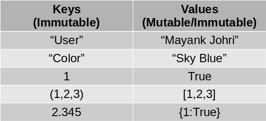

## Dictionary

A dictionary is a list of associations composed by a unique key and corresponding structures. Dictionaries are mutable, like lists.

The key must be an immutable type, usually strings, but can also be tuples or numeric types. On the other hand the items of dictionaries can be either mutable or immutable. The Python dictionary provides no guarantee that the keys are ordered.

Syntax:
```python
dictionary = {'a': a, 'b': b, ..., 'z': z}
```
Structure:



Example of a dictionary:

```python
dic = {'name': 'Dabar', 'band': 'Honey'}
```
Acessing elements:

```python
print dic['name']
```
Adding elements:
```python
dic['key_1'] = '120'
```
Removing one elemento from a dictionary:
```python
del dic['key_1']
```

Getting the items, keys and values:
```python
items = dic.items()
keys = dic.keys()
values = dic.values()
```

**Examples with dictionaries**:


```python
dic = {'name': 'Dabar', 'name': 'Dabar New', 'band': 'Honey'}
print(dic)
```

    {'name': 'Dabar New', 'band': 'Honey'}


```python
print(dic.items())
```

    dict_items([('name', 'Dabar New'), ('band', 'Honey')])


```python
# Progs and their albums
progs = {'Yes': ['Close To The Edge', 'Fragile'],
    'Genesis': ['Foxtrot', 'The Nursery Crime'],
    'ELP': ['Brain Salad Surgery']}

# More progs
progs['King Crimson'] = ['Red', 'Discipline']

# items() returns a list of 
# tuples with key and value 
for singer, album  in progs.items():
    print(singer, ":=>", album)
```

    Yes :=> ['Close To The Edge', 'Fragile']
    Genesis :=> ['Foxtrot', 'The Nursery Crime']
    ELP :=> ['Brain Salad Surgery']
    King Crimson :=> ['Red', 'Discipline']


```python
for albums in progs.values():
    print(albums)
```

    ['Close To The Edge', 'Fragile']
    ['Foxtrot', 'The Nursery Crime']
    ['Brain Salad Surgery']
    ['Red', 'Discipline']


```python
for prog in progs:
    print(prog, "=>", progs[prog])
```

    Yes => ['Close To The Edge', 'Fragile']
    Genesis => ['Foxtrot', 'The Nursery Crime']
    ELP => ['Brain Salad Surgery']
    King Crimson => ['Red', 'Discipline']


```python
# If there is 'ELP', removes
if 'ELP' in progs:
    del progs['ELP']
    
print(progs)
```

    {'Yes': ['Close To The Edge', 'Fragile'], 'Genesis': ['Foxtrot', 'The Nursery Crime'], 'King Crimson': ['Red', 'Discipline']}


```python
multid = {'school': 'DMS',
          'students_details': {
              1001: {
               "name": "Mayank",
                  "age": 41
              },
              1002: {
                "name" : "Vishal",
                "age": 42
              },
              1003: {
                  "name": "Rajeev Chaturvedi",
                  "age": 41
              }
          }
        }
print(multid)
```

    {'school': 'DMS', 'students_details': {1001: {'name': 'Mayank', 'age': 41}, 1002: {'name': 'Vishal', 'age': 42}, 1003: {'name': 'Rajeev Chaturvedi', 'age': 41}}}


```python
multid = {'school': 'DMS',
          'students_details': {
              "students": 
                  [
                      "Mayank",
                      "Vishal",
                      "Rajeev"
                  ]
          }}
print(multid)
```

    {'school': 'DMS', 'students_details': {'students': ['Mayank', 'Vishal', 'Rajeev']}}


```python
dupli = {
    "meme" : "mjmj",
    "test" : "TESt value",
    "meme" : "wewe"
}

print(dupli)
for k in dupli:
    print(k)
```

    {'test': 'TESt value', 'meme': 'wewe'}
    test
    meme


```python
# Matrix in form of string
matrix = '''0 0 0 0 0 0 0 0 0 0 0 0
9 0 0 0 0 0 0 0 0 0 0 0
0 0 0 0 0 0 0 0 0 4 0 0
0 0 0 0 0 0 0 3 0 0 0 0
0 0 0 0 0 0 5 0 0 0 0 0
0 0 0 0 6 0 0 0 0 0 0 0'''

mat = {}

# split the matrix in lines
for row, line in enumerate(matrix.splitlines()):

    # Splits the line int cols
    for col, column in enumerate(line.split()):

        column = int(column)
        # Places the column in the result,
        # if it is differente from zero
        if column:
            mat[row, col] = column

print (mat)
# The counting starts with zero
print ('Complete matrix size:', (row + 1) * (col + 1))
print ('Sparse matrix size:', len(mat))
```

    {(5, 4): 6, (3, 7): 3, (1, 0): 9, (4, 6): 5, (2, 9): 4}
    Complete matrix size: 72
    Sparse matrix size: 5

