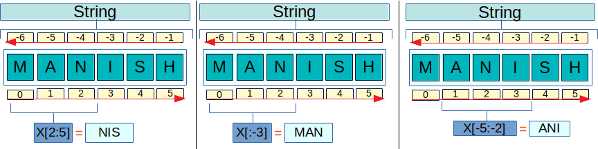

## Slices

*Slices* of *strings* can be obtained by adding indexes between brackets after a  *string* or any other iterable object.



### Python indexes:
-------

+ Start with zero.
+ Count from the end if they are negative.
+ Can be defined as sections, in the form `[start: end + 1: step]`. If not set the start, it will be considered as zero. If not set end + 1, it will be considered the size of the object. The step (between characters), if not set, is 1.

> **!!! TIP !!!**: 
It is possible to invert *strings* by using a negative step:


```python
p = "Manish"
print(p[0:2]) 
print(p[:2])
print(p[1:4])
print(p[-5:-2])
print (p[::-1])
print("implemented"[::-2])
print("implemented"[-5::-2])
print("implemented"[:-7:-2])
print("implemented"[::2])
print("implemented"[1::2])
print("implemented"[1:4:2]) 
```

    Ma
    Ma
    ani
    ani
    hsinaM
    dteepi
    eepi
    dte
    ipeetd
    mlmne
    ml


```python
str1="hello"
print(str1[1:])
print(str1[-1:])
print(str1[-2:4])
print(str1[-4:-2])
print(str1[-1:2:-1])
print(str1[4])
# a b c d   
```

    ello
    o
    l
    el
    ol
    o


> ?1 -> starts from i(**m**) and ends


```python
x = 10
print(id(x))
x = "Mayank Johri"
print(x)
print("id(x)",id(x))
print("x[0:]", id(x[0:]))
print(id(x[1:]))
print(id(x[2:]))
print(x[0:])
print(x[1:])
print(x[2])

x = "God knows"
print(x)
print(id(x))
print(id(x[0]))
print(id(x[1]))
print(id(x[2]))
print(x[0])
print(x[1])
print(x[2])
```

    139791751322304
    Mayank Johri
    id(x) 139791526564528
    x[0:] 139791526564528
    139791526658864
    139791526658928
    Mayank Johri
    ayank Johri
    y
    God knows
    139791526566640
    139791731810800
    139791729111088
    139791732421216
    G
    o
    d

