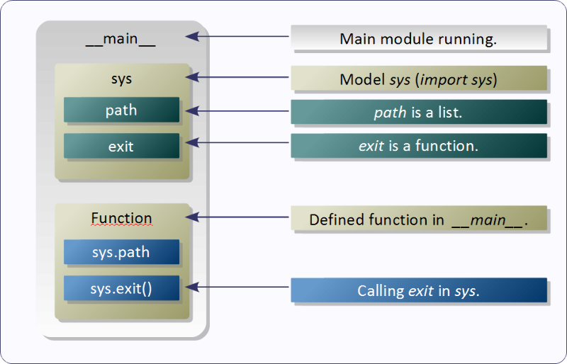

# Modules
----

A module is a file/directory containing Python definitions and statements.

In Python, modules are python files which can be imported into a program. They can contain any Python structure and **run when imported**. When imported for the very first time, they are compiled & stored in a binary file (with the extension ".pyc" or ".pyo"), have their own *namespaces*  and support *Doc Strings*. 

They are **singleton** objects (only one instance is loaded into memory, which is available globally for the program, thus only once they are executed)

> The module’s name (as a string) is available as the value of the global variable **\__name\__**.



The modules are located by the interpreter through the list of folders `PYTHONPATH` (sys.path), which usually includes the current directory first.

The modules are loaded with the `import` statement. Thus, when using a module structure, it is necessary to identify the module. This is called absolute import.

> If it is necessary to run the module again during the execution of the application, it will have to be loaded again with the `reload()` function.


```python
import os

def get_os_details():
    print(os.name)
    print(type(os.name))
    print(os.path.abspath(os.path.curdir))

get_os_details()
```

    posix
    <class 'str'>
    /home/mayank/code/mj/lep/Section 1 - Core Python/Chapter 08 - Modules


## The from...import Statement

Python allows to import specific portions of the module instead of whole module by using ```from ... import``` statement.

The format of it is as follows


```python
from <module> import <attribute/submodule(s)>
```


```python
from os import name
print (type(name))
```

    <class 'str'>


```python
from os import name as os_name
print (os_name)
print
```

    nt


```python
from os import environ, linesep
```

> **NOTE**: To avoid problems such as variable obfuscation, the absolute import is considered a better programming practice than the relative import.

## The from ... import * Statement

This variant can be used to import all names that a module defines

> **NOTE** : **NEVER EVER EVER USE IT** 


```python
from os import *

print(name)
```

    nt


Example of user defined module:


```python
# File calc.py

# Function defined in module
def average(list): return float(sum(list)) / len(list)
```

Example of module usage:


```python
# Imports calc module
import calc

l = [23, 54, 31, 77, 12, 34]

# Calls the function defined in calc
print (calc.average(l))
```

    38.5


The main module of a program has the variable `__name__` equals to `__main__`, thus it is possible to test if the main module:


```python
if __name__ == "__main__":
    # Code here will only be run 
    # if it is the main module
    # and not when it is imported by another program/module
    pass
```

That way it is easy to turn a program into a module.

Another module example:


```python
"""
modutils => utility routines for modules
"""

import os.path
import sys
import glob

def find(txt):
    """find modules with name containing the parameter."""

    resp = []

    for path in sys.path:
        mods = glob.glob('%s/*.py' % path)

        for mod in mods:
            if txt in os.path.basename(mod):
                resp.append(mod)

    return resp
```

Example module use:


```python
from os.path import getsize, getmtime
from time import localtime, asctime

import modutils

mods = modutils.find('os')
print("Valid attributes of module: ", dir(modutils))
for mod in mods:
    tm = asctime(localtime(getmtime(mod)))
    kb = getsize(mod) / 1024
    print ('{0}: ({1} kbytes, {2})'.format(mod, kb, tm))
```

    Valid attributes of module:  ['__builtins__', '__cached__', '__doc__', '__file__', '__loader__', '__name__', '__package__', '__spec__', 'find', 'glob', 'os', 'sys']
    /home/mayank/apps/python/lib/python3.5/os.py: (36.103515625 kbytes, Fri Oct 21 10:14:28 2016)
    /home/mayank/apps/python/lib/python3.5/posixpath.py: (14.5322265625 kbytes, Fri Oct 21 10:14:28 2016)
    /home/mayank/apps/python/lib/python3.5/_osx_support.py: (18.66015625 kbytes, Fri Oct 21 10:14:27 2016)
    /home/mayank/apps/python/lib/python3.5/site-packages/test_pycosat.py: (8.650390625 kbytes, Wed Dec  4 11:22:39 2013)
    /home/mayank/apps/python/lib/python3.5/site-packages/ecos.py: (2.3349609375 kbytes, Thu Sep 10 21:02:58 2015)


> _TIP_: Splitting programs into modules makes it easy to reuse and locate faults in the code.

## The Module Search Path


When a module is requested to be imported, the interpreter first searches for a built-in module with that name. If not found, it then searches for a file named <module_name>.py in a list of directories given by the variable sys.path. sys.path is initialized from these locations:

The directory containing the input script (or the current directory when no file is specified).
PYTHONPATH (a list of directory names, with the same syntax as the shell variable PATH).
The installation-dependent default.

## Packages

> NOTE: To be discussed after classes 

Packages are a way of structuring Python’s module namespace by using “dotted module names”. For example, the module name A.B designates a submodule named B in a package named A. Just like the use of modules saves the authors of different modules from having to worry about each other’s global variable names, the use of dotted module names saves the authors of multi-module packages like NumPy or the Python Imaging Library from having to worry about each other’s module names.

Suppose you want to design a collection of modules (a “package”) for the uniform handling of sound files and sound data. There are many different sound file formats (usually recognized by their extension, for example: .wav, .aiff, .au), so you may need to create and maintain a growing collection of modules for the conversion between the various file formats. There are also many different operations you might want to perform on sound data (such as mixing, adding echo, applying an equalizer function, creating an artificial stereo effect), so in addition you will be writing a never-ending stream of modules to perform these operations. Here’s a possible structure for your package (expressed in terms of a hierarchical filesystem):

Package `maya_util` structure

```
./maya_util:
__init__.py  db  json  misc.py

./maya_util/db:
__init__.py  read.py  write.py

./maya_util/json:
__init__.py  read.py  write.py
```

The `__init__.py` files are required to make Python treat the directories as containing packages; this is done to prevent directories with a common name, such as string, from unintentionally hiding valid modules that occur later on the module search path. In the simplest case, `__init__.py` can just be an empty file, but it can also execute initialization code for the package or set the `__all__` variable, described later.

Users of the package can import individual modules from the package, for example:


```python
import maya_util.db
```


    ---------------------------------------------------------------------------

    ImportError                               Traceback (most recent call last)

    <ipython-input-1-f67e84b2cb33> in <module>()
    ----> 1 import maya_util.db
    

    ImportError: No module named maya_util.db


```python
## Magic of modules
### Hidden modules
# 1)
cond = false
if cond:
    from A import amp1 as a
else:
    from B import bmp1 as a
    

# 2) 
if cond:
    from A import a
    print(a.test)
else:
    from AA import aa as a
    print(a.test)

    
# 3)
# Check how many times import statement is called
for i in range(1,10):
    if cond:
        import a
        print(a.test)
    else:
        import aa as a
        print(a.test)
###
```


    ---------------------------------------------------------------------------

    NameError                                 Traceback (most recent call last)

    <ipython-input-14-bde41af2f67d> in <module>()
          2 ### Hidden modules
          3 # 1)
    ----> 4 cond = false
          5 if cond:
          6     from A import amp1 as a


    NameError: name 'false' is not defined


```python
## PLEASE ADD advance topics in it.
```
