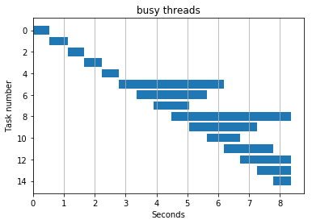
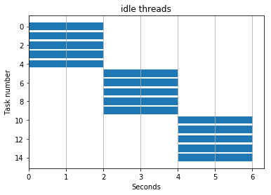

```python
# Python 3.
from concurrent import futures
import datetime
import itertools
import time
import numpy as np
from matplotlib import pyplot as plt
%matplotlib inline

WORKERS=5
ITERS=15

def test_multithreading(Executor, function):
    start_time = datetime.datetime.now()
    with Executor(max_workers=WORKERS) as ex:
        result = list(ex.map(function, itertools.repeat(start_time, ITERS)))

    start, stop = np.array(result).T
    return start, stop

def idle(start_time):
    elapsed = lambda: (datetime.datetime.now() - start_time).total_seconds()
    start = elapsed()
    time.sleep(2)
    stop = elapsed()
    return (start, stop)

def busy(start_time):
    elapsed = lambda: (datetime.datetime.now() - start_time).total_seconds()
    start = elapsed()
    sum(range(10**7))
    stop = elapsed()
    return (start, stop)

def plot(start, stop, title):
    elapsed = stop - start
    plt.barh(range(len(start)), elapsed, left=start)
    plt.ylabel("Task number")
    plt.xlabel("Seconds")
    plt.grid(axis='x')
    plt.title(title)
    plt.gca().invert_yaxis()
    plt.savefig("{}.svg".format(title.replace(" ", "-")))
```


```python
plot(*test_multithreading(futures.ThreadPoolExecutor, busy), title="busy threads")
```





```python
plot(*test_multithreading(futures.ThreadPoolExecutor, idle), title="idle threads")
```





```python

```

    Exception in thread Thread-7:
    Traceback (most recent call last):
      File "C:\apps\Anaconda3\lib\threading.py", line 916, in _bootstrap_inner
        self.run()
      File "C:\apps\Anaconda3\lib\threading.py", line 864, in run
        self._target(*self._args, **self._kwargs)
      File "C:\apps\Anaconda3\lib\concurrent\futures\process.py", line 295, in _queue_management_worker
        shutdown_worker()
      File "C:\apps\Anaconda3\lib\concurrent\futures\process.py", line 253, in shutdown_worker
        call_queue.put_nowait(None)
      File "C:\apps\Anaconda3\lib\multiprocessing\queues.py", line 129, in put_nowait
        return self.put(obj, False)
      File "C:\apps\Anaconda3\lib\multiprocessing\queues.py", line 83, in put
        raise Full
    queue.Full
    


    ---------------------------------------------------------------------------

    BrokenProcessPool                         Traceback (most recent call last)

    <ipython-input-4-e6e373c72233> in <module>()
    ----> 1 plot(*test_multithreading(futures.ProcessPoolExecutor, idle), title="idle processes")
    

    <ipython-input-2-b9cd2cac30a9> in test_multithreading(Executor, function)
         14     start_time = datetime.datetime.now()
         15     with Executor(max_workers=WORKERS) as ex:
    ---> 16         result = list(ex.map(function, itertools.repeat(start_time, ITERS)))
         17 
         18     start, stop = np.array(result).T


    C:\apps\Anaconda3\lib\concurrent\futures\_base.py in result_iterator()
        554                 for future in fs:
        555                     if timeout is None:
    --> 556                         yield future.result()
        557                     else:
        558                         yield future.result(end_time - time.time())


    C:\apps\Anaconda3\lib\concurrent\futures\_base.py in result(self, timeout)
        403                 raise CancelledError()
        404             elif self._state == FINISHED:
    --> 405                 return self.__get_result()
        406             else:
        407                 raise TimeoutError()


    C:\apps\Anaconda3\lib\concurrent\futures\_base.py in __get_result(self)
        355     def __get_result(self):
        356         if self._exception:
    --> 357             raise self._exception
        358         else:
        359             return self._result


    BrokenProcessPool: A process in the process pool was terminated abruptly while the future was running or pending.

