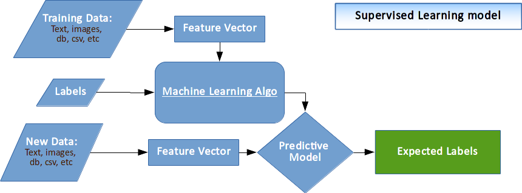

# 1. Supervised Learning Algorithm

## 1.1 Introduction

Supervised learning is concluding a requirement using labeled training data. The training data consist of training examples using which the model is trainied. 

In supervised learning, every example consisting of an input object (typically a vector) and a desired output value (also called the supervisory signal). It analyzes the training set data and produces an inferred function, which can be used for mapping new examples. 

An optimal scenario will allow for the algorithm to correctly determine the class labels for unseen instances. This requires the learning algorithm to generalize from the training data to unseen situations in a "reasonable" way.

A large number of supervised learning algorithms are available in the market, each specific for a specific problem in mind thus they have their strengths and weaknesses, thus we can not use a single learning algorithm to solve all our supervised learning problems. 

They can be classified in two categories

## 1.2 Regression Analysis

It is a form of predictive modelling technique which investigates the relationship between a dependent and independent variable(s). 

This technique can be used for 

- forecasting, 
- time series modelling
- finding the causal effect relationship.

Regression analysis is an important tool for modelling and analyzing data. Here, curve or line are used to analyse the features of the provided data points, in such a manner that the differences between the distances of data points from the curve or line is minimized.

Major Algorithms for regression analysis are as follows 

- Linear Regression
- Logistic Regression
- Polynomial Regression
- Stepwise Regression
- Ridge Regression
- Lasso Regression
- ElasticNet Regression

## 1.3 Classification

Classification is the problem of identifying to which of a set of categories a new observation belongs, on the basis of a training set of data containing observations whose category membership is already defined.

## Libraries

We are going to use sciket for our examples. Please download the following modules using `conda` or `pip`:

> conda install numpy pandas scikit-learn matplotlib

or 
> pip numpy pandas  scikit-learn matplotlib --user

# Reference:
* http://ufldl.stanford.edu/tutorial/supervised/LinearRegression/
* Mastering Machine Learning with scikit-learn
* https://stats.idre.ucla.edu/sas/examples/chp/regression-analysis-byexample-by-chatterjee-hadi-and-pricechapter-11-variable-selection-procedures/
* https://medium.com/machine-learning-for-humans/supervised-learning-2-5c1c23f3560d
