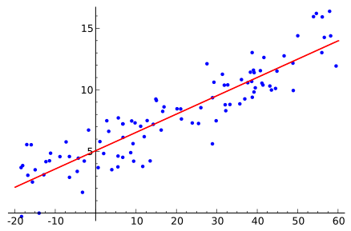

# 2 Regression Analysis


```python
Step 1: Define your problem.
How to Define Your Machine Learning Problem
Step 2: Prepare your data.
How to Prepare Data For Machine Learning
How to Identify Outliers in your Data
Improve Model Accuracy with Data Pre-Processing
Discover Feature Engineering
An Introduction to Feature Selection
Tactics to Combat Imbalanced Classes in Your Machine Learning Dataset
Data Leakage in Machine Learning
Step 3: Spot-check algorithms.
How to Evaluate Machine Learning Algorithms
Why you should be Spot-Checking Algorithms on your Machine Learning Problems
How To Choose The Right Test Options When Evaluating Machine Learning Algorithms
A Data-Driven Approach to Choosing Machine Learning Algorithms
Step 4: Improve results.
How to Improve Machine Learning Results
Machine Learning Performance Improvement Cheat Sheet
How To Improve Deep Learning Performance
Step 5: Present results.
How to Use Machine Learning Results
How To Deploy Your Predictive Model To Production

```


      File "<ipython-input-1-48b3c0d8bb7e>", line 1
        Step 1: Define your problem.
             ^
    SyntaxError: invalid syntax


1. Linear Algorithms
    - Linear Regression
    - Logistic Regression
    - Gradient Descent
    - Linear Discriminant Analysis


2. Nonlinear Algorithms
    - Classification And Regression Trees
    - Naive Bayes
    - K-Nearest Neighbors
    - Learning Vector Quantization
    - Support Vector Machines
    - Bagging and Random Forest
    - Boosting and AdaBoost

## Linear Regression

Linear regression is an modeling approach to describe the relationship between a **scalar dependent variable** Y and one or more **explanatory variables** (or **independent variables**) denoted X. 

In **simple linear regression** only one explanatory variable is present. In **multiple linear regression** more than one explanatory variable are present. 

In **linear regression**, the relationships are modeled using linear predictor functions whose unknown model parameters are estimated from the data and are called **linear models**. 

Example of linear regression



###  Why use linear regression?

* widely used
* runs fast
* easy to use (not a lot of tuning required)
* highly interpretable
* basis for many other methods

### Important Points:

- There must be linear relationship between independent and dependent variables
- Multiple regression suffers from multicollinearity, autocorrelation, heteroskedasticity.
- Linear Regression is very sensitive to Outliers. It can terribly affect the regression line and eventually the forecasted values.
- Multicollinearity can increase the variance of the coefficient estimates and make the estimates very sensitive to minor changes in the model. The result is that the coefficient estimates are unstable
- In case of multiple independent variables, we can go with forward selection, backward elimination and step wise approach for selection of most significant independent variables.

### Simple Linear Regression

### Multiple Linear Regression

### Polynomial Regression

A regression equation is a polynomial regression equation if the power of independent variable is more than 1. The equation below represents a polynomial equation:

```y=a+b*x^2```


In this regression technique, the best fit line is not a straight line. It is rather a curve that fits into the data points.

### Important Points:

- While there might be a temptation to fit a higher degree polynomial to get lower error, this can result in over-fitting. Always plot the relationships to see the fit and focus on making sure that the curve fits the nature of the problem. Here is an example of how plotting can help:
- Especially look out for curve towards the ends and see whether those shapes and trends make sense. Higher polynomials can end up producing wierd results on extrapolation.

## Stepwise Regression

This form of regression is used when we deal with multiple independent variables. In this technique, the selection of independent variables is done with the help of an automatic process, which involves no human intervention.

## Logistic Regression

Logistic regression is used to find the probability of event=Success and event=Failure. We should use logistic regression when the dependent variable is binary (0/ 1, True/ False, Yes/ No) in nature. Here the value of Y ranges from 0 to 1 and it can represented by following equation.

```
odds= p/ (1-p) = probability of event occurrence / probability of not event occurrence
ln(odds) = ln(p/(1-p))
logit(p) = ln(p/(1-p)) = b0+b1X1+b2X2+b3X3....+bkXk
```

Above, p is the probability of presence of the characteristic of interest. A question that you should ask here is “why have we used log in the equation?”.

Since we are working here with a binomial distribution (dependent variable), we need to choose a link function which is best suited for this distribution. And, it is logit function. In the equation above, the parameters are chosen to maximize the likelihood of observing the sample values rather than minimizing the sum of squared errors (like in ordinary regression).

### Important Points:

- It is widely used for classification problems
- Logistic regression doesn’t require linear relationship between dependent and independent variables.  It can handle various types of relationships because it applies a non-linear log transformation to the predicted odds ratio
- To avoid over fitting and under fitting, we should include all significant variables. A good approach to ensure this practice is to use a step wise method to estimate the logistic regression
- It requires large sample sizes because maximum likelihood estimates are less powerful at low sample sizes than ordinary least square
- The independent variables should not be correlated with each other i.e. no multi collinearity.  However, we have the options to include interaction effects of categorical variables in the analysis and in the model.
- If the values of dependent variable is ordinal, then it is called as Ordinal logistic regression
- If dependent variable is multi class then it is known as Multinomial Logistic regression.

## Libraries

- Sciket-learn


We are going to use sciket for our examples. Please download the following modules using `conda` or `pip`:

> conda install pandas scikit scikit-learn matplotlib

or 
> pip pandas scikit scikit-learn matplotlib --user


```python
from sklearn import datasets
from sklearn.model_selection import cross_val_predict
from sklearn import linear_model
import matplotlib.pyplot as plt

lr = linear_model.LinearRegression()
boston = datasets.load_boston()
y = boston.target

# cross_val_predict returns an array of the same size as `y` where each entry
# is a prediction obtained by cross validation:
predicted = cross_val_predict(lr, boston.data, y, cv=10)

fig, ax = plt.subplots()
ax.scatter(y, predicted)
ax.plot([y.min(), y.max()], [y.min(), y.max()], 'k--', lw=4)
ax.set_xlabel('Measured')
ax.set_ylabel('Predicted')
plt.show()
```


## Terms

**R-square:** 

R-squared is a statistical measure of how close the data are to the fitted regression line. It is also known as the coefficient of determination, or the coefficient of multiple determination for multiple regression.

The definition of R-squared is fairly straight-forward; it is the percentage of the response variable variation that is explained by a linear model. Or:

R-squared = Explained variation / Total variation

R-squared is always between 0 and 100%:

    0% indicates that the model explains none of the variability of the response data around its mean.
    100% indicates that the model explains all the variability of the response data around its mean.

In general, the higher the R-squared, the better the model fits your data. However, there are important conditions for this guideline that I’ll talk about both in this post and my next post.

**Standard Error of the Regression (S)**

 In the regression output for Minitab statistical software, you can find S in the Summary of Model section, right next to R-squared. Both statistics provide an overall measure of how well the model fits the data. S is known both as the standard error of the regression and as the standard error of the estimate.

S represents the average distance that the observed values fall from the regression line. Conveniently, it tells you how wrong the regression model is on average using the units of the response variable. Smaller values are better because it indicates that the observations are closer to the fitted line.


### Simple Example 


```python
# Code source: Jaques Grobler
# License: BSD 3 clause


import matplotlib.pyplot as plt
import numpy as np
from sklearn import datasets, linear_model
from sklearn.metrics import mean_squared_error, r2_score

# Load the diabetes dataset
diabetes = datasets.load_diabetes()


# Use only one feature
diabetes_X = diabetes.data[:, np.newaxis, 2]

# Split the data into training/testing sets
diabetes_X_train = diabetes_X[:-20]
diabetes_X_test = diabetes_X[-20:]

# Split the targets into training/testing sets
diabetes_y_train = diabetes.target[:-20]
diabetes_y_test = diabetes.target[-20:]

# Create linear regression object
regr = linear_model.LinearRegression()

# Train the model using the training sets
regr.fit(diabetes_X_train, diabetes_y_train)

# Make predictions using the testing set
diabetes_y_pred = regr.predict(diabetes_X_test)

# The coefficients
print('Coefficients: \n', regr.coef_)
# The mean squared error
print("Mean squared error: %.2f"
      % mean_squared_error(diabetes_y_test, diabetes_y_pred))
# Explained variance score: 1 is perfect prediction
print('Variance score: %.2f' % r2_score(diabetes_y_test, diabetes_y_pred))

# Plot outputs
plt.scatter(diabetes_X_test, diabetes_y_test,  color='black')
plt.plot(diabetes_X_test, diabetes_y_pred, color='blue', linewidth=3)

plt.xticks(())
plt.yticks(())

plt.show()
```

    Coefficients: 
     [ 938.23786125]
    Mean squared error: 2548.07
    Variance score: 0.47


```python
Mean squared error (MSE)
To compute the MSE, we first take the square of the difference between the actual and
predicted values of every record. We then take the average value of these squared
errors. If the predicted value of the i
th record is Pi and the actual value is Ai, then the
MSE is:
```

## References

1. https://machinelearningmastery.com/start-here/#process
2. https://www.analyticsvidhya.com/blog/2015/08/comprehensive-guide-regression/
