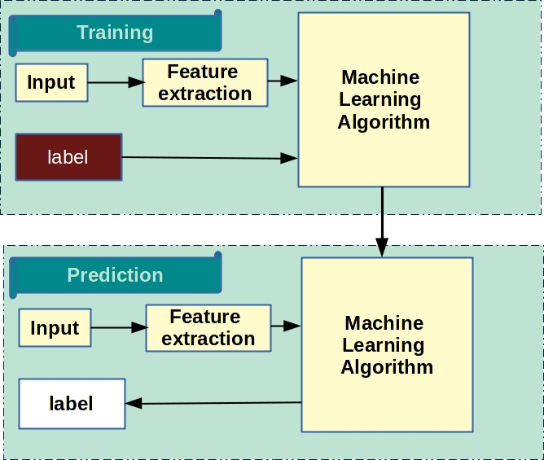

# Classification

Identifying a grouping technique for a given dataset by depending on a value of the target or output attribute, the entire dataset can be qualified to belong to a class. It helps in identifying the data behavior patterns. 

In short, classification is a discrimination mechanism based on the values of the dataset.

Classification is the task of choosing the correct class label for a given input. In basic classification tasks, each input is considered in isolation from all other inputs, and the set of labels is defined in advance. Some examples of classification tasks are:

- classification of fruits based on quality
- Spam classification
- Face Identification, etc

The basic classification task has a number of interesting variants. For example, in multi-class classification, each instance may be assigned multiple labels; in open-class classification, the set of labels is not defined in advance; and in sequence classification, a list of inputs are jointly classified.

A classifier is called supervised if it is built based on training corpora containing the correct label for each input. The framework used by supervised classification is shown in 



It is similar to regression. 

### Labeled Data

What constitutes a label, or a class, is entirely dependent upon the question being asked. Consider this data about survivors of the Titanic:


```python
import pandas as pd
import numpy as np
```


```python
from sklearn import datasets
```


```python
data = pd.read_csv("files/titanic_data.csv")
print(data.head())
```

       PassengerId  Survived  Pclass  \
    0            1         0       3   
    1            2         1       1   
    2            3         1       3   
    3            4         1       1   
    4            5         0       3   
    
                                                    Name     Sex   Age  SibSp  \
    0                            Braund, Mr. Owen Harris    male  22.0      1   
    1  Cumings, Mrs. John Bradley (Florence Briggs Th...  female  38.0      1   
    2                             Heikkinen, Miss. Laina  female  26.0      0   
    3       Futrelle, Mrs. Jacques Heath (Lily May Peel)  female  35.0      1   
    4                           Allen, Mr. William Henry    male  35.0      0   
    
       Parch            Ticket     Fare Cabin Embarked  
    0      0         A/5 21171   7.2500   NaN        S  
    1      0          PC 17599  71.2833   C85        C  
    2      0  STON/O2. 3101282   7.9250   NaN        S  
    3      0            113803  53.1000  C123        S  
    4      0            373450   8.0500   NaN        S  


If my question were “Who lived and who died on the Titanic?” then clearly the class would be “Survived”, and I would write an algorithm that most efficiently predicted survival. However, if my question had been, “What’s the best determinant of where a passenger embarked from?” my classes would be entirely different and would pull from the “Embarked” column.

When writing your own machine learning algorithms, you can tailor them to interpret along the classes given in your data. This means your classes can be “1, 2, 3” or “A, B, C” or “fruit, vegetable, meat”, or whatever. However, if you were to use the algorithms present in Python’s scikit-learn package for Data Science and Machine Learning, you’d have to translate the classes to numerical information.


```python
# To support both python 2 and python 3
from __future__ import division, print_function, unicode_literals

# Common imports
import numpy as np
import os

# to make this notebook's output stable across runs
np.random.seed(42)

# To plot pretty figures
%matplotlib inline
import matplotlib
import matplotlib.pyplot as plt
plt.rcParams['axes.labelsize'] = 14
plt.rcParams['xtick.labelsize'] = 12
plt.rcParams['ytick.labelsize'] = 12

# Where to save the figures
PROJECT_ROOT_DIR = "."
CHAPTER_ID = "classification"

def save_fig(fig_id, tight_layout=True):
    path = os.path.join(PROJECT_ROOT_DIR, "images", CHAPTER_ID, fig_id + ".png")
    print("Saving figure", fig_id)
    if tight_layout:
        plt.tight_layout()
    plt.savefig(path, format='png', dpi=300)
```

## Most common Supervised Classification

- Regression algorithms
- Support Vector Machines
- K-Nearest Neighbors

- Gaussian Processes
- Neural Networks
- Naive Bayes
- Decision Trees

## Linear Classifiers

- Linear Classifiers
    - Logical Regression
    - Naïve Bayes Classifier
    - Perceptron
    - Support Vector Machine
- Quadratic Classifiers
- K-Means Clustering
- Boosting
- Decision Tree
    - Random Forest
- Neural networks
- Bayesian Networks 

## Regression algorithms

## K-Nearest Neighbors

The simplest possible classifier is the nearest neighbor: given a new observation X_test, find in the training set (i.e. the data used to train the estimator) the observation with the closest feature vector. (Please see the Nearest Neighbors section of the online Scikit-learn documentation for more information about this type of classifier.)

It is the simplest of classification model's. The way it works is, when a new observation is provided it take the label of the training samples closest to it in n-dimensional space, where n is the number of features in each sample.

The k-nearest neighbors classifier internally uses an algorithm based on ball trees to represent the samples it
is trained on.


```python
# Loading datasets from sklearn

from sklearn import datasets
import numpy as np
%matplotlib inline
```


```python
iris = datasets.load_iris()
iris_X = iris.data
iris_y = iris.target
np.unique(iris_y)
```


    array([0, 1, 2])


```python
print(dir(iris))
```

    ['DESCR', 'data', 'feature_names', 'target', 'target_names']


```python
print(iris.DESCR)
```

    Iris Plants Database
    ====================
    
    Notes
    -----
    Data Set Characteristics:
        :Number of Instances: 150 (50 in each of three classes)
        :Number of Attributes: 4 numeric, predictive attributes and the class
        :Attribute Information:
            - sepal length in cm
            - sepal width in cm
            - petal length in cm
            - petal width in cm
            - class:
                    - Iris-Setosa
                    - Iris-Versicolour
                    - Iris-Virginica
        :Summary Statistics:
    
        ============== ==== ==== ======= ===== ====================
                        Min  Max   Mean    SD   Class Correlation
        ============== ==== ==== ======= ===== ====================
        sepal length:   4.3  7.9   5.84   0.83    0.7826
        sepal width:    2.0  4.4   3.05   0.43   -0.4194
        petal length:   1.0  6.9   3.76   1.76    0.9490  (high!)
        petal width:    0.1  2.5   1.20  0.76     0.9565  (high!)
        ============== ==== ==== ======= ===== ====================
    
        :Missing Attribute Values: None
        :Class Distribution: 33.3% for each of 3 classes.
        :Creator: R.A. Fisher
        :Donor: Michael Marshall (MARSHALL%PLU@io.arc.nasa.gov)
        :Date: July, 1988
    
    This is a copy of UCI ML iris datasets.
    http://archive.ics.uci.edu/ml/datasets/Iris
    
    The famous Iris database, first used by Sir R.A Fisher
    
    This is perhaps the best known database to be found in the
    pattern recognition literature.  Fisher's paper is a classic in the field and
    is referenced frequently to this day.  (See Duda & Hart, for example.)  The
    data set contains 3 classes of 50 instances each, where each class refers to a
    type of iris plant.  One class is linearly separable from the other 2; the
    latter are NOT linearly separable from each other.
    
    References
    ----------
       - Fisher,R.A. "The use of multiple measurements in taxonomic problems"
         Annual Eugenics, 7, Part II, 179-188 (1936); also in "Contributions to
         Mathematical Statistics" (John Wiley, NY, 1950).
       - Duda,R.O., & Hart,P.E. (1973) Pattern Classification and Scene Analysis.
         (Q327.D83) John Wiley & Sons.  ISBN 0-471-22361-1.  See page 218.
       - Dasarathy, B.V. (1980) "Nosing Around the Neighborhood: A New System
         Structure and Classification Rule for Recognition in Partially Exposed
         Environments".  IEEE Transactions on Pattern Analysis and Machine
         Intelligence, Vol. PAMI-2, No. 1, 67-71.
       - Gates, G.W. (1972) "The Reduced Nearest Neighbor Rule".  IEEE Transactions
         on Information Theory, May 1972, 431-433.
       - See also: 1988 MLC Proceedings, 54-64.  Cheeseman et al"s AUTOCLASS II
         conceptual clustering system finds 3 classes in the data.
       - Many, many more ...
    


```python
# Split iris data in train and test data
# A random permutation, to split the data randomly
np.random.seed(0)
indices = np.random.permutation(len(iris_X))
iris_X_train = iris_X[indices[:-10]]
iris_y_train = iris_y[indices[:-10]]
iris_X_test  = iris_X[indices[-10:]]
iris_y_test  = iris_y[indices[-10:]]
print(len(iris_X_train))
print(len(iris_X_test))
```

    140
    10


```python

# Create and fit a nearest-neighbor classifier
from sklearn.neighbors import KNeighborsClassifier
knn = KNeighborsClassifier()
knn.fit(iris_X_train, iris_y_train) 
print(knn.predict(iris_X_test))
print(iris_y_test)
```

    [1 2 1 0 0 0 2 1 2 0]
    [1 1 1 0 0 0 2 1 2 0]


```python
print(__doc__)

import numpy as np
import matplotlib.pyplot as plt
from matplotlib.colors import ListedColormap
from sklearn import neighbors, datasets

n_neighbors = 15

# import some data to play with
iris = datasets.load_iris()

# we only take the first two features. We could avoid this ugly
# slicing by using a two-dim dataset
X = iris.data[:, :2]
y = iris.target

h = .02  # step size in the mesh

# Create color maps
cmap_light = ListedColormap(['#FFAAAA', '#AAFFAA', '#AAAAFF'])
cmap_bold = ListedColormap(['#FF0000', '#00FF00', '#0000FF'])

for weights in ['uniform', 'distance']:
    # we create an instance of Neighbours Classifier and fit the data.
    clf = neighbors.KNeighborsClassifier(n_neighbors, weights=weights)
    clf.fit(X, y)

    # Plot the decision boundary. For that, we will assign a color to each
    # point in the mesh [x_min, x_max]x[y_min, y_max].
    x_min, x_max = X[:, 0].min() - 1, X[:, 0].max() + 1
    y_min, y_max = X[:, 1].min() - 1, X[:, 1].max() + 1
    xx, yy = np.meshgrid(np.arange(x_min, x_max, h),
                         np.arange(y_min, y_max, h))
    Z = clf.predict(np.c_[xx.ravel(), yy.ravel()])

    # Put the result into a color plot
    Z = Z.reshape(xx.shape)
    plt.figure()
    plt.pcolormesh(xx, yy, Z, cmap=cmap_light)

    # Plot also the training points
    plt.scatter(X[:, 0], X[:, 1], c=y, cmap=cmap_bold,
                edgecolor='k', s=20)
    plt.xlim(xx.min(), xx.max())
    plt.ylim(yy.min(), yy.max())
    plt.title("3-Class classification (k = %i, weights = '%s')"
              % (n_neighbors, weights))

plt.show()
```

    Automatically created module for IPython interactive environment


#### Application to Image Compression

Clustering can be seen as a way of choosing a small number of observations from the information. For
instance, this can be used to posterize an image (conversion of a continuous gradation of tone to several
regions of fewer tones):


```python
from scipy import misc
import scipy 
```


```python
face = misc.face().astype(np.float32)
plt.imshow(face)
```


    <matplotlib.image.AxesImage at 0x7f07b03f5898>


```python
X = face.reshape((-1, 1)) 
k_means = cluster.KMeans(n_clusters=5)
k_means.fit(X)

values = k_means.cluster_centers_.squeeze()
labels = k_means.labels_
```


```python
face_compressed = np.choose(labels, values)
face_compressed.shape = face.shape
plt.imshow(face, cmap=plt.cm.gray)
```


    <matplotlib.image.AxesImage at 0x7f07baea6978>


```python
import matplotlib.pyplot as plt

img = plt.imshow(face_compressed, cmap=plt.cm.gray)
```


### The curse of dimensionality

For an estimator to be effective, you need the distance between neighboring points to be less than some value d, which depends on the problem. In one dimension, this requires on average n ~ 1/d points. In the context of the above k-NN example, if the data is described by just one feature with values ranging from 0 to 1 and with n training observations, then new data will be no further away than 1/n. Therefore, the nearest neighbor decision rule will be efficient as soon as 1/n is small compared to the scale of between-class feature variations.

If the number of features is p, you now require n \sim 1/d^p points. Let’s say that we require 10 points in one dimension: now 10^p points are required in p dimensions to pave the [0, 1] space. As p becomes large, the number of training points required for a good estimator grows exponentially.

For example, if each point is just a single number (8 bytes), then an effective k-NN estimator in a paltry p \sim 20 dimensions would require more training data than the current estimated size of the entire internet (±1000 Exabytes or so).

This is called the curse of dimensionality and is a core problem that machine learning addresses.

## Clustering: grouping observations together

### Dimension Reduction with Principal Component Analysis

The cloud of points spanned by the observations above is very flat in one direction, so that one feature can
almost be exactly computed using the 2 other. PCA finds the directions in which the data is not flat and it can
reduce the dimensionality of the data by projecting on a subspace.


```python
from sklearn import decomposition
pca = decomposition.PCA(n_components=2)
pca.fit(iris.data)
X = pca.transform(iris.data)
```


```python
import pylab as pl
pl.scatter(X[:, 0], X[:, 1], c=iris.target)
```


    <matplotlib.collections.PathCollection at 0x7fc303091358>


#### Putting it all together: face recognition


```python
import numpy as np
import pylab as pl
from sklearn.model_selection import StratifiedKFold
from sklearn import  datasets, decomposition, svm
# ..
# .. load data ..
lfw_people = datasets.fetch_lfw_people(min_faces_per_person=70, resize=0.4)
perm = np.random.permutation(lfw_people.target.size)
lfw_people.data = lfw_people.data[perm]
lfw_people.target = lfw_people.target[perm]
faces = np.reshape(lfw_people.data, (lfw_people.target.shape[0], -1))
# train, test = 
skf = StratifiedKFold(n_splits=2, random_state=True, shuffle=True)
print(skf)
skf.get_n_splits(lfw_people.data, lfw_people.target)
for train_index, test_index in skf.split(lfw_people.data, lfw_people.target ):
#     print("TRAIN:", train_index, "TEST:", test_index)
    X_train, X_test = X[train_index], X[test_index]
    y_train, y_test = y[train_index], y[test_index]
```

    StratifiedKFold(n_splits=2, random_state=True, shuffle=True)
    TRAIN: [   0    2    3    5    7    8   11   12   13   15   16   19   21   25   26
       29   30   33   35   36   38   39   41   43   44   45   46   48   51   54
       55   58   59   66   67   69   72   73   74   76   78   79   81   83   84
       85   86   87   88   89   90   91   92   93   95   99  101  103  104  107
      108  109  110  111  113  114  115  116  118  119  120  121  122  123  124
      125  128  129  130  132  133  136  137  139  141  143  144  145  146  147
      148  149  150  156  158  160  161  163  166  167  168  170  173  179  180
      182  183  184  185  186  188  189  192  195  197  199  202  203  207  208
      209  212  213  214  217  218  219  220  221  223  228  231  232  235  237
      238  241  242  244  245  246  248  249  250  251  252  254  255  257  259
      260  262  263  264  267  268  271  273  274  275  279  280  281  288  289
      291  295  296  298  299  304  305  306  307  308  309  310  311  313  314
      316  319  321  322  327  328  330  332  333  335  336  343  346  347  349
      351  353  354  361  363  364  365  366  368  371  372  373  374  376  377
      378  379  382  383  384  387  389  391  392  393  394  395  396  399  401
      406  409  410  411  415  418  422  424  427  429  431  432  436  440  441
      442  444  447  450  451  453  454  455  461  462  463  468  471  475  478
      484  487  488  490  493  494  496  497  499  501  502  504  505  506  507
      510  511  513  514  517  519  520  523  524  525  528  529  531  532  533
      536  538  540  542  543  544  545  547  549  551  552  554  559  561  562
      565  566  567  570  571  572  575  577  578  580  581  582  586  588  589
      590  592  594  597  599  601  603  605  608  619  622  624  625  628  633
      634  635  637  638  640  643  650  651  654  656  658  659  661  663  664
      666  668  669  671  672  673  674  676  681  682  683  684  688  690  691
      693  694  696  697  700  701  702  704  706  707  708  709  710  711  717
      718  720  722  723  725  727  728  731  732  733  734  738  741  747  748
      749  750  751  752  754  755  756  757  761  766  767  768  769  770  771
      774  775  776  779  780  781  785  787  789  790  794  795  798  799  800
      802  803  804  805  807  810  811  813  816  817  818  819  820  821  822
      827  828  834  835  838  839  845  846  847  849  851  852  853  858  862
      865  866  868  869  878  879  880  883  884  885  886  887  888  889  890
      892  893  894  895  897  901  904  906  909  911  915  917  918  919  924
      925  929  930  932  936  937  938  941  943  944  948  949  950  952  955
      956  959  960  963  966  969  976  977  980  982  983  984  988  990  998
     1000 1001 1007 1008 1012 1013 1016 1018 1019 1020 1023 1024 1025 1028 1029
     1030 1035 1042 1044 1049 1050 1051 1052 1054 1056 1061 1062 1064 1065 1067
     1069 1071 1073 1074 1075 1078 1079 1081 1082 1083 1084 1089 1092 1097 1098
     1100 1101 1102 1108 1113 1115 1116 1117 1118 1119 1120 1122 1123 1125 1126
     1127 1130 1131 1133 1136 1142 1143 1144 1145 1146 1148 1150 1151 1155 1156
     1157 1162 1163 1165 1166 1170 1171 1174 1177 1179 1180 1183 1190 1191 1192
     1193 1196 1197 1198 1202 1206 1208 1209 1210 1212 1213 1214 1215 1217 1218
     1222 1226 1227 1228 1233 1238 1243 1245 1246 1248 1249 1251 1252 1254 1255
     1257 1260 1264 1266 1268 1269 1273 1275 1281 1282 1284 1285] TEST: [   1    4    6    9   10   14   17   18   20   22   23   24   27   28   31
       32   34   37   40   42   47   49   50   52   53   56   57   60   61   62
       63   64   65   68   70   71   75   77   80   82   94   96   97   98  100
      102  105  106  112  117  126  127  131  134  135  138  140  142  151  152
      153  154  155  157  159  162  164  165  169  171  172  174  175  176  177
      178  181  187  190  191  193  194  196  198  200  201  204  205  206  210
      211  215  216  222  224  225  226  227  229  230  233  234  236  239  240
      243  247  253  256  258  261  265  266  269  270  272  276  277  278  282
      283  284  285  286  287  290  292  293  294  297  300  301  302  303  312
      315  317  318  320  323  324  325  326  329  331  334  337  338  339  340
      341  342  344  345  348  350  352  355  356  357  358  359  360  362  367
      369  370  375  380  381  385  386  388  390  397  398  400  402  403  404
      405  407  408  412  413  414  416  417  419  420  421  423  425  426  428
      430  433  434  435  437  438  439  443  445  446  448  449  452  456  457
      458  459  460  464  465  466  467  469  470  472  473  474  476  477  479
      480  481  482  483  485  486  489  491  492  495  498  500  503  508  509
      512  515  516  518  521  522  526  527  530  534  535  537  539  541  546
      548  550  553  555  556  557  558  560  563  564  568  569  573  574  576
      579  583  584  585  587  591  593  595  596  598  600  602  604  606  607
      609  610  611  612  613  614  615  616  617  618  620  621  623  626  627
      629  630  631  632  636  639  641  642  644  645  646  647  648  649  652
      653  655  657  660  662  665  667  670  675  677  678  679  680  685  686
      687  689  692  695  698  699  703  705  712  713  714  715  716  719  721
      724  726  729  730  735  736  737  739  740  742  743  744  745  746  753
      758  759  760  762  763  764  765  772  773  777  778  782  783  784  786
      788  791  792  793  796  797  801  806  808  809  812  814  815  823  824
      825  826  829  830  831  832  833  836  837  840  841  842  843  844  848
      850  854  855  856  857  859  860  861  863  864  867  870  871  872  873
      874  875  876  877  881  882  891  896  898  899  900  902  903  905  907
      908  910  912  913  914  916  920  921  922  923  926  927  928  931  933
      934  935  939  940  942  945  946  947  951  953  954  957  958  961  962
      964  965  967  968  970  971  972  973  974  975  978  979  981  985  986
      987  989  991  992  993  994  995  996  997  999 1002 1003 1004 1005 1006
     1009 1010 1011 1014 1015 1017 1021 1022 1026 1027 1031 1032 1033 1034 1036
     1037 1038 1039 1040 1041 1043 1045 1046 1047 1048 1053 1055 1057 1058 1059
     1060 1063 1066 1068 1070 1072 1076 1077 1080 1085 1086 1087 1088 1090 1091
     1093 1094 1095 1096 1099 1103 1104 1105 1106 1107 1109 1110 1111 1112 1114
     1121 1124 1128 1129 1132 1134 1135 1137 1138 1139 1140 1141 1147 1149 1152
     1153 1154 1158 1159 1160 1161 1164 1167 1168 1169 1172 1173 1175 1176 1178
     1181 1182 1184 1185 1186 1187 1188 1189 1194 1195 1199 1200 1201 1203 1204
     1205 1207 1211 1216 1219 1220 1221 1223 1224 1225 1229 1230 1231 1232 1234
     1235 1236 1237 1239 1240 1241 1242 1244 1247 1250 1253 1256 1258 1259 1261
     1262 1263 1265 1267 1270 1271 1272 1274 1276 1277 1278 1279 1280 1283 1286
     1287]


    ---------------------------------------------------------------------------

    NameError                                 Traceback (most recent call last)

    <ipython-input-22-0c27cfa5f26f> in <module>()
         17     print("TRAIN:", train_index, "TEST:", test_index)
         18     X_train, X_test = X[train_index], X[test_index]
    ---> 19     y_train, y_test = y[train_index], y[test_index]
    

    NameError: name 'y' is not defined


```python

# train, test = iter(StratifiedKFold(n_splits=2, random_state=True, shuffle=True).get_n_splits).next()
# X_train, X_test = faces[train], faces[test]
# y_train, y_test = lfw_people.target[train], lfw_people.target[test]
# ..
# .. dimension reduction ..
pca = decomposition.RandomizedPCA(n_components=150, whiten=True)
pca.fit(X_train)
X_train_pca = pca.transform(X_train)
X_test_pca = pca.transform(X_test)
# ..
# .. classification ..
clf = svm.SVC(C=5., gamma=0.001)
clf.fit(X_train_pca, y_train)


```

    /home/mayank/.local/lib64/python3.6/site-packages/sklearn/utils/deprecation.py:58: DeprecationWarning: Class RandomizedPCA is deprecated; RandomizedPCA was deprecated in 0.18 and will be removed in 0.20. Use PCA(svd_solver='randomized') instead. The new implementation DOES NOT store whiten ``components_``. Apply transform to get them.
      warnings.warn(msg, category=DeprecationWarning)


    ---------------------------------------------------------------------------

    NameError                                 Traceback (most recent call last)

    <ipython-input-23-760e9ff485b2> in <module>()
         12 # .. classification ..
         13 clf = svm.SVC(C=5., gamma=0.001)
    ---> 14 clf.fit(X_train_pca, y_train)
         15 


    NameError: name 'y_train' is not defined


```python

# .. predict on new images ..
for i in range(10):
    print(lfw_people.target_names[clf.predict(X_test_pca[i])[0]])
    _ = pl.imshow(X_test[i].reshape(50, 37), cmap=pl.cm.gray)
    _ = raw_input()
```


    ---------------------------------------------------------------------------

    NameError                                 Traceback (most recent call last)

    <ipython-input-7-b07660da25e0> in <module>()
          2 # .. predict on new images ..
          3 for i in range(10):
    ----> 4     print(lfw_people.target_names[clf.predict(X_test_pca[i])[0]])
          5     _ = pl.imshow(X_test[i].reshape(50, 37), cmap=pl.cm.gray)
          6     _ = raw_input()


    NameError: name 'lfw_people' is not defined


- Linear Classifiers
    - Logical Regression
    - Naïve Bayes Classifier
    - Perceptron
    - Support Vector Machine
- Quadratic Classifiers
- K-Means Clustering
- Boosting
- Decision Tree
    - Random Forest
- Neural networks
- Bayesian Networks 

### Logical Regression


```python
"""
===============================
Plot classification probability
===============================
Plot the classification probability for different classifiers. We use a 3
class dataset, and we classify it with a Support Vector classifier, L1
and L2 penalized logistic regression with either a One-Vs-Rest or multinomial
setting, and Gaussian process classification.
The logistic regression is not a multiclass classifier out of the box. As
a result it can identify only the first class.
"""
print(__doc__)

# Author: Alexandre Gramfort <alexandre.gramfort@inria.fr>
# License: BSD 3 clause

import matplotlib.pyplot as plt
import numpy as np

from sklearn.linear_model import LogisticRegression
from sklearn.svm import SVC
from sklearn.gaussian_process import GaussianProcessClassifier
from sklearn.gaussian_process.kernels import RBF
from sklearn import datasets

iris = datasets.load_iris()
X = iris.data[:, 0:2]  # we only take the first two features for visualization
y = iris.target

n_features = X.shape[1]

C = 1.0
kernel = 1.0 * RBF([1.0, 1.0])  # for GPC

# Create different classifiers. The logistic regression cannot do
# multiclass out of the box.
classifiers = {'L1 logistic': LogisticRegression(C=C, penalty='l1'),
               'L2 logistic (OvR)': LogisticRegression(C=C, penalty='l2'),
               'Linear SVC': SVC(kernel='linear', C=C, probability=True,
                                 random_state=0),
               'L2 logistic (Multinomial)': LogisticRegression(
                C=C, solver='lbfgs', multi_class='multinomial'),
               'GPC': GaussianProcessClassifier(kernel)
               }

n_classifiers = len(classifiers)

plt.figure(figsize=(3 * 2, n_classifiers * 2))
plt.subplots_adjust(bottom=.2, top=.95)

xx = np.linspace(3, 9, 100)
yy = np.linspace(1, 5, 100).T
xx, yy = np.meshgrid(xx, yy)
Xfull = np.c_[xx.ravel(), yy.ravel()]

for index, (name, classifier) in enumerate(classifiers.items()):
    classifier.fit(X, y)

    y_pred = classifier.predict(X)
    classif_rate = np.mean(y_pred.ravel() == y.ravel()) * 100
    print("classif_rate for %s : %f " % (name, classif_rate))

    # View probabilities=
    probas = classifier.predict_proba(Xfull)
    n_classes = np.unique(y_pred).size
    for k in range(n_classes):
        plt.subplot(n_classifiers, n_classes, index * n_classes + k + 1)
        plt.title("Class %d" % k)
        if k == 0:
            plt.ylabel(name)
        imshow_handle = plt.imshow(probas[:, k].reshape((100, 100)),
                                   extent=(3, 9, 1, 5), origin='lower')
        plt.xticks(())
        plt.yticks(())
        idx = (y_pred == k)
        if idx.any():
            plt.scatter(X[idx, 0], X[idx, 1], marker='o', c='k')

ax = plt.axes([0.15, 0.04, 0.7, 0.05])
plt.title("Probability")
plt.colorbar(imshow_handle, cax=ax, orientation='horizontal')

plt.show()
```

    
    ===============================
    Plot classification probability
    ===============================
    Plot the classification probability for different classifiers. We use a 3
    class dataset, and we classify it with a Support Vector classifier, L1
    and L2 penalized logistic regression with either a One-Vs-Rest or multinomial
    setting, and Gaussian process classification.
    The logistic regression is not a multiclass classifier out of the box. As
    a result it can identify only the first class.
    
    classif_rate for L1 logistic : 79.333333 
    classif_rate for L2 logistic (OvR) : 76.666667 
    classif_rate for Linear SVC : 82.000000 
    classif_rate for L2 logistic (Multinomial) : 82.000000 
    classif_rate for GPC : 82.666667 


```python
#!/usr/bin/python
# -*- coding: utf-8 -*-
# URL: https://github.com/scikit-learn/scikit-learn/blob/master/examples/classification/plot_classifier_comparison.py
"""
=====================
Classifier comparison
=====================
A comparison of a several classifiers in scikit-learn on synthetic datasets.
The point of this example is to illustrate the nature of decision boundaries
of different classifiers.
This should be taken with a grain of salt, as the intuition conveyed by
these examples does not necessarily carry over to real datasets.
Particularly in high-dimensional spaces, data can more easily be separated
linearly and the simplicity of classifiers such as naive Bayes and linear SVMs
might lead to better generalization than is achieved by other classifiers.
The plots show training points in solid colors and testing points
semi-transparent. The lower right shows the classification accuracy on the test
set.
"""
print(__doc__)


# Code source: Gaël Varoquaux
#              Andreas Müller
# Modified for documentation by Jaques Grobler
# License: BSD 3 clause

import numpy as np
import matplotlib.pyplot as plt
from matplotlib.colors import ListedColormap
from sklearn.model_selection import train_test_split
from sklearn.preprocessing import StandardScaler
from sklearn.datasets import make_moons, make_circles, make_classification
from sklearn.neural_network import MLPClassifier
from sklearn.neighbors import KNeighborsClassifier
from sklearn.svm import SVC
from sklearn.gaussian_process import GaussianProcessClassifier
from sklearn.gaussian_process.kernels import RBF
from sklearn.tree import DecisionTreeClassifier
from sklearn.ensemble import RandomForestClassifier, AdaBoostClassifier
from sklearn.naive_bayes import GaussianNB
from sklearn.discriminant_analysis import QuadraticDiscriminantAnalysis

h = .02  # step size in the mesh

names = ["Nearest Neighbors", "Linear SVM", "RBF SVM", "Gaussian Process",
         "Decision Tree", "Random Forest", "Neural Net", "AdaBoost",
         "Naive Bayes", "QDA"]

classifiers = [
    KNeighborsClassifier(3),
    SVC(kernel="linear", C=0.025),
    SVC(gamma=2, C=1),
    GaussianProcessClassifier(1.0 * RBF(1.0)),
    DecisionTreeClassifier(max_depth=5),
    RandomForestClassifier(max_depth=5, n_estimators=10, max_features=1),
    MLPClassifier(alpha=1),
    AdaBoostClassifier(),
    GaussianNB(),
    QuadraticDiscriminantAnalysis()]

X, y = make_classification(n_features=2, n_redundant=0, n_informative=2,
                           random_state=1, n_clusters_per_class=1)
rng = np.random.RandomState(2)
X += 2 * rng.uniform(size=X.shape)
linearly_separable = (X, y)

datasets = [make_moons(noise=0.3, random_state=0),
            make_circles(noise=0.2, factor=0.5, random_state=1),
            linearly_separable
            ]

figure = plt.figure(figsize=(27, 9))
i = 1
# iterate over datasets
for ds_cnt, ds in enumerate(datasets):
    # preprocess dataset, split into training and test part
    X, y = ds
    X = StandardScaler().fit_transform(X)
    X_train, X_test, y_train, y_test = \
        train_test_split(X, y, test_size=.4, random_state=42)

    x_min, x_max = X[:, 0].min() - .5, X[:, 0].max() + .5
    y_min, y_max = X[:, 1].min() - .5, X[:, 1].max() + .5
    xx, yy = np.meshgrid(np.arange(x_min, x_max, h),
                         np.arange(y_min, y_max, h))

    # just plot the dataset first
    cm = plt.cm.RdBu
    cm_bright = ListedColormap(['#FF0000', '#0000FF'])
    ax = plt.subplot(len(datasets), len(classifiers) + 1, i)
    if ds_cnt == 0:
        ax.set_title("Input data")
    # Plot the training points
    ax.scatter(X_train[:, 0], X_train[:, 1], c=y_train, cmap=cm_bright,
               edgecolors='k')
    # and testing points
    ax.scatter(X_test[:, 0], X_test[:, 1], c=y_test, cmap=cm_bright, alpha=0.6,
               edgecolors='k')
    ax.set_xlim(xx.min(), xx.max())
    ax.set_ylim(yy.min(), yy.max())
    ax.set_xticks(())
    ax.set_yticks(())
    i += 1

    # iterate over classifiers
    for name, clf in zip(names, classifiers):
        ax = plt.subplot(len(datasets), len(classifiers) + 1, i)
        clf.fit(X_train, y_train)
        score = clf.score(X_test, y_test)

        # Plot the decision boundary. For that, we will assign a color to each
        # point in the mesh [x_min, x_max]x[y_min, y_max].
        if hasattr(clf, "decision_function"):
            Z = clf.decision_function(np.c_[xx.ravel(), yy.ravel()])
        else:
            Z = clf.predict_proba(np.c_[xx.ravel(), yy.ravel()])[:, 1]

        # Put the result into a color plot
        Z = Z.reshape(xx.shape)
        ax.contourf(xx, yy, Z, cmap=cm, alpha=.8)

        # Plot also the training points
        ax.scatter(X_train[:, 0], X_train[:, 1], c=y_train, cmap=cm_bright,
                   edgecolors='k')
        # and testing points
        ax.scatter(X_test[:, 0], X_test[:, 1], c=y_test, cmap=cm_bright,
                   edgecolors='k', alpha=0.6)

        ax.set_xlim(xx.min(), xx.max())
        ax.set_ylim(yy.min(), yy.max())
        ax.set_xticks(())
        ax.set_yticks(())
        if ds_cnt == 0:
            ax.set_title(name)
        ax.text(xx.max() - .3, yy.min() + .3, ('%.2f' % score).lstrip('0'),
                size=15, horizontalalignment='right')
        i += 1

plt.tight_layout()
plt.show()
```

    
    =====================
    Classifier comparison
    =====================
    A comparison of a several classifiers in scikit-learn on synthetic datasets.
    The point of this example is to illustrate the nature of decision boundaries
    of different classifiers.
    This should be taken with a grain of salt, as the intuition conveyed by
    these examples does not necessarily carry over to real datasets.
    Particularly in high-dimensional spaces, data can more easily be separated
    linearly and the simplicity of classifiers such as naive Bayes and linear SVMs
    might lead to better generalization than is achieved by other classifiers.
    The plots show training points in solid colors and testing points
    semi-transparent. The lower right shows the classification accuracy on the test
    set.
    


    /home/mayank/.local/lib64/python3.6/site-packages/sklearn/neural_network/multilayer_perceptron.py:564: ConvergenceWarning: Stochastic Optimizer: Maximum iterations (200) reached and the optimization hasn't converged yet.
      % self.max_iter, ConvergenceWarning)
    /home/mayank/.local/lib64/python3.6/site-packages/sklearn/neural_network/multilayer_perceptron.py:564: ConvergenceWarning: Stochastic Optimizer: Maximum iterations (200) reached and the optimization hasn't converged yet.
      % self.max_iter, ConvergenceWarning)
    /home/mayank/.local/lib64/python3.6/site-packages/sklearn/neural_network/multilayer_perceptron.py:564: ConvergenceWarning: Stochastic Optimizer: Maximum iterations (200) reached and the optimization hasn't converged yet.
      % self.max_iter, ConvergenceWarning)


## Reference:
    1. Dataset: 
        - http://archive.ics.uci.edu/ml/index.php
        - https://github.com/myrobeandwizardhat/DataSet_Survivors
    2. Tutorials
        - https://codefellows.github.io/sea-python-401d6/lectures/supervised_classification.html
        - http://scikit-learn.org/stable/tutorial/statistical_inference/supervised_learning.html
        - http://www.scipy-lectures.org/packages/scikit-learn/index.html
        - http://bugra.github.io/work/notes/2014-11-22/an-introduction-to-supervised-learning-scikit-learn/
        - https://github.com/ageron/handson-ml/blob/master/03_classification.ipynb
