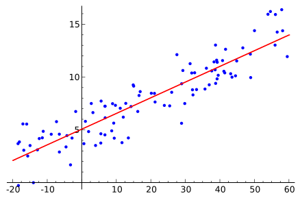

# 1. Linear Regression 

Linear regression is an modeling approach to describe the relationship between a **scalar dependent variable** Y and one or more **explanatory variables** (or **independent variables**) denoted X. 

In other words, it is used to predict the value of an outcome variable Y based on one or more input predictor variables X('s). 

Our aim in this regression is to establish a linear relationship (i.e. a mathematical formula) between the predictor variable(s) and the response variable (Y), in order to use that formula to predict the response Y, with respect to known values of predictors (X's) values.

In **linear regression**, the relationships are modeled using linear predictor functions whose unknown model parameters are estimated from the data and are called **linear models**.
 

Their are two types of Linear Regressions based on the number of predictor variables are present. 

- **Simple Linear Regression**: In it only one explanatory variable is present. 

- **multiple linear regression**: In it more than one explanatory variable are present. 

## samples of linear regression
a. Simple Linear Regression

## Why use linear regression?
- widely used
- runs fast
- easy to use (not a lot of tuning required)
- highly interpretable
- basis for many other methods

## Sample Dataset online
https://vincentarelbundock.github.io/Rdatasets/datasets.html 
