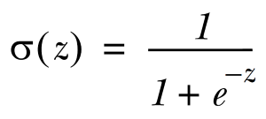

# Logistic Regression

Logistic regression is a statistical method for analyzing a dataset in which there are one or more independent variables that determine an outcome. The outcome is measured with a **dichotomous** variable (variables with only two possible values), for example
```
 - 1 or 0
 - 10 or -10
 True or False
 ```
The goal of logistic regression is to find the best fitting (yet biologically reasonable) model to describe the relationship between the dichotomous characteristic of interest (dependent variable = response or outcome variable) and a set of independent (predictor or explanatory) variables. Logistic regression generates the coefficients (and its standard errors and significance levels) of a formula to predict a `logit` transformation of the probability of presence of the characteristic of interest:

In short, we can say that logistic regression is used for classification tasks similar to binary classification.

In mathematics `sigmoid` behaves in similar manner for large number of value. Its equation is 



## Logistic Regression Assumptions

Any logistic regression example in Python is incomplete without addressing model assumptions in the analysis. The important assumptions of the logistic regression model include:

- Dependent variable is binary
- Desired outcome of the dependent variable should be represented by factor level 1.
- Predictive features are interval (continuous) or categorical
- Features are independent of one another
- Sample size is adequate/high – Rule of thumb: 50 records per predictor
- Only the meaningful variables should be included
- The independent variables should be independent of each other. That is, the model should have little or no multicollinearity.

## Uses for Logistic Regression

- Predict whether a customer will convert (READ: buy or sign-up) to an offer. (will not convert – 0 / will convert – 1)
- Predict and preempt customer action. (will not drop service – 1 / will drop service – 0)
- Predict whether a new drug will cure the average patient. (will not cure – 0 / will cure -1)

## General approach to logistic regression

1. Collect: Any method.
2. Prepare: Numeric values are needed for a distance calculation. A structured data format is best.
3. Analyze: Any method.
4. Train: We’ll spend most of the time training, where we try to find optimal coefficients to classify our data.
5. Test: Classification is quick and easy once the training step is done.
6. Use: This application needs to get some input data and output structured numeric values. Next, the application applies the simple regression calculation on this input data and determines which class the input data should belong to. The application then takes some action on the calculated class.

## Pros / Cons

Pros: 
 - Computationally inexpensive
 - easy to implement
 - knowledge representation 
 - easy to interpret

Cons: 
 - Prone to underfitting, 
 - may have low accuracy 
    
Works with: 
 - Numeric values, 
 - nominal values

## Example

### Goal
The classification goal is to predict if the client will subscribe (yes/no) a term deposit (variable y).

- **DataSet**: https://archive.ics.uci.edu/ml/datasets/bank+marketing
- **Data Source** : http://archive.ics.uci.edu/ml/index.php

### Data Set Information:

The data is related with direct marketing campaigns of a Portuguese banking institution. The marketing campaigns were based on phone calls. Often, more than one contact to the same client was required, in order to access if the product (bank term deposit) would be ('yes') or not ('no') subscribed. 

#### Attribute Information:

Input variables:

##### bank client data:

1. age (numeric)
2. job : type of job (categorical: 'admin.','blue-collar','entrepreneur','housemaid','management','retired','self-employed','services','student','technician','unemployed','unknown')
3. marital : marital status (categorical: 'divorced','married','single','unknown'; note: 'divorced' means divorced or widowed)
4. education (categorical: 'basic.4y','basic.6y','basic.9y','high.school','illiterate','professional.course','university.degree','unknown')
5. default: has credit in default? (categorical: 'no','yes','unknown')
6. housing: has housing loan? (categorical: 'no','yes','unknown')
7. loan: has personal loan? (categorical: 'no','yes','unknown')

##### related with the last contact of the current campaign:

8. contact: contact communication type (categorical: 'cellular','telephone') 
9. month: last contact month of year (categorical: 'jan', 'feb', 'mar', ..., 'nov', 'dec')
10. day_of_week: last contact day of the week (categorical: 'mon','tue','wed','thu','fri')
11. duration: last contact duration, in seconds (numeric). Important note: this attribute highly affects the output target (e.g., if duration=0 then y='no'). Yet, the duration is not known before a call is performed. Also, after the end of the call y is obviously known. Thus, this input should only be included for benchmark purposes and should be discarded if the intention is to have a realistic predictive model.

##### other attributes:

12. campaign: number of contacts performed during this campaign and for this client (numeric, includes last contact)
13. pdays: number of days that passed by after the client was last contacted from a previous campaign (numeric; 999 means client was not previously contacted)
14. previous: number of contacts performed before this campaign and for this client (numeric)
15. poutcome: outcome of the previous marketing campaign (categorical: 'failure','nonexistent','success')

##### social and economic context attributes

16. emp.var.rate: employment variation rate - quarterly indicator (numeric)
17. cons.price.idx: consumer price index - monthly indicator (numeric) 
18. cons.conf.idx: consumer confidence index - monthly indicator (numeric) 
19. euribor3m: euribor 3 month rate - daily indicator (numeric)
20. nr.employed: number of employees - quarterly indicator (numeric)

##### Output variable (desired target):

21. y - has the client subscribed a term deposit? (binary: 'yes','no')


```python
import pandas as pd
import numpy as np
from sklearn import preprocessing
import matplotlib.pyplot as plt 
plt.rc("font", size=14)
from sklearn.linear_model import LogisticRegression
from sklearn.model_selection import train_test_split
import seaborn as sns
sns.set(style="white")
sns.set(style="whitegrid", color_codes=True)
%matplotlib inline
```


```python
data = pd.read_csv('../files/banking_logistic.csv', header=0)
# remove all the rows with missing data
data = data.dropna()
print(data.shape)
print(list(data.columns))
```

    (41188, 21)
    ['age', 'job', 'marital', 'education', 'default', 'housing', 'loan', 'contact', 'month', 'day_of_week', 'duration', 'campaign', 'pdays', 'previous', 'poutcome', 'emp_var_rate', 'cons_price_idx', 'cons_conf_idx', 'euribor3m', 'nr_employed', 'y']


```python
print(data.head())
```

       age          job  marital          education  default housing loan  \
    0   44  blue-collar  married           basic.4y  unknown     yes   no   
    1   53   technician  married            unknown       no      no   no   
    2   28   management   single  university.degree       no     yes   no   
    3   39     services  married        high.school       no      no   no   
    4   55      retired  married           basic.4y       no     yes   no   
    
        contact month day_of_week ...  campaign  pdays  previous     poutcome  \
    0  cellular   aug         thu ...         1    999         0  nonexistent   
    1  cellular   nov         fri ...         1    999         0  nonexistent   
    2  cellular   jun         thu ...         3      6         2      success   
    3  cellular   apr         fri ...         2    999         0  nonexistent   
    4  cellular   aug         fri ...         1      3         1      success   
    
      emp_var_rate  cons_price_idx  cons_conf_idx  euribor3m  nr_employed  y  
    0          1.4          93.444          -36.1      4.963       5228.1  0  
    1         -0.1          93.200          -42.0      4.021       5195.8  0  
    2         -1.7          94.055          -39.8      0.729       4991.6  1  
    3         -1.8          93.075          -47.1      1.405       5099.1  0  
    4         -2.9          92.201          -31.4      0.869       5076.2  1  
    
    [5 rows x 21 columns]


```python
### TODO : It informed you the total count of null values in each cols.
data.isnull().sum()
```


    age               0
    job               0
    marital           0
    education         0
    default           0
    housing           0
    loan              0
    contact           0
    month             0
    day_of_week       0
    duration          0
    campaign          0
    pdays             0
    previous          0
    poutcome          0
    emp_var_rate      0
    cons_price_idx    0
    cons_conf_idx     0
    euribor3m         0
    nr_employed       0
    y                 0
    dtype: int64


```python
print(len(data.columns))
for col in data.columns:
    sns.countplot(y=col, data=data)
    plt.show()
```

    21


Our prediction will be based on the customer’s job, marital status, whether he(she) has credit in default, whether he(she) has a housing loan, whether he(she) has a personal loan, and the outcome of the previous marketing campaigns. So, we will drop the variables that we do not need.


```python
#### This will not work as now we have non integer values :(  
# Please check the tips to find the solution for it.
# for b in data.columns:
#     xaxis = "y"
#     if(b != xaxis):
#         sns.lmplot(x=xaxis, y=b, data=data, fit_reg = True)
#         plt.title("Relationship between %s and Price" %b)
```


```python
print(len(data.columns))
xaxis = "y"
for col in data.columns:
    if(col != xaxis):
        pd.crosstab(data[col], data[xaxis].astype(bool)).plot(kind='bar')
        plt.show()
```

    21


```python
data.drop(data.columns[[0, 3, 7, 8, 9, 10, 11, 12, 13, 15, 16, 17, 18, 19]], axis=1, inplace=True)
```

### 1.5.2 Data Preprocessing

- Create dummy variables, that is variables with only two values, zero and one.

In logistic regression models, encoding all of the independent variables as dummy variables allows easy interpretation and calculation of the odds ratios, and increases the stability and significance of the coefficients.


```python
data2 = pd.get_dummies(data, columns =['job', 'marital', 'default', 'housing', 'loan', 'poutcome'])
```

* Drop the unknown columns


```python
data2.drop(data2.columns[[12, 16, 18, 21, 24]], axis=1, inplace=True)
data2.columns
```


    Index(['y', 'job_admin.', 'job_blue-collar', 'job_entrepreneur',
           'job_housemaid', 'job_management', 'job_retired', 'job_self-employed',
           'job_services', 'job_student', 'job_technician', 'job_unemployed',
           'marital_divorced', 'marital_married', 'marital_single', 'default_no',
           'default_yes', 'housing_no', 'housing_yes', 'loan_no', 'loan_yes',
           'poutcome_failure', 'poutcome_nonexistent', 'poutcome_success'],
          dtype='object')


* Check the independence between the independent variables


```python
sns.heatmap(data2.corr())
plt.show()
```


* Split the data into training and test sets


```python
X = data2.iloc[:,1:]
y = data2.iloc[:,0]
X_train, X_test, y_train, y_test = train_test_split(X, y, random_state=0)
```

* Check out training data is sufficient


```python
X_train.shape
```


    (30891, 23)


## 1.6 Logistic Regression Model

### 1.6.1 Fit logistic regression to the training set


```python
classifier = LogisticRegression(random_state=0)
classifier.fit(X_train, y_train)
```


    LogisticRegression(C=1.0, class_weight=None, dual=False, fit_intercept=True,
              intercept_scaling=1, max_iter=100, multi_class='ovr', n_jobs=1,
              penalty='l2', random_state=0, solver='liblinear', tol=0.0001,
              verbose=0, warm_start=False)


### 1.6.2 Predicting the test set results and creating confusion matrix

The confusion_matrix() function will calculate a confusion matrix and return the result as an array.


```python
y_pred = classifier.predict(X_test)
from sklearn.metrics import confusion_matrix
confusion_matrix = confusion_matrix(y_test, y_pred)
print(confusion_matrix)
```

    [[9046  110]
     [ 912  229]]


The result is telling us that we have 9046+229 correct predictions and 912+110 incorrect predictions.

### 1.6.3 Accuracy


```python
print('Accuracy of logistic regression classifier on test set: {:.2f}'.format(classifier.score(X_test, y_test)))
```

    Accuracy of logistic regression classifier on test set: 0.90


### 1.6.4 Compute precision, recall, F-measure and support

To quote from Scikit Learn:
The precision is the ratio tp / (tp + fp) where tp is the number of true positives and fp the number of false positives. The precision is intuitively the ability of the classifier to not label a sample as positive if it is negative.
The recall is the ratio tp / (tp + fn) where tp is the number of true positives and fn the number of false negatives. The recall is intuitively the ability of the classifier to find all the positive samples.
The F-beta score can be interpreted as a weighted harmonic mean of the precision and recall, where an F-beta score reaches its best value at 1 and worst score at 0.
The F-beta score weights the recall more than the precision by a factor of beta. beta = 1.0 means recall and precision are equally important.
The support is the number of occurrences of each class in y_test.


```python
from sklearn.metrics import classification_report
print(classification_report(y_test, y_pred))
```

                 precision    recall  f1-score   support
    
              0       0.91      0.99      0.95      9156
              1       0.68      0.20      0.31      1141
    
    avg / total       0.88      0.90      0.88     10297
    


Interpretation: Of the entire test set, 88% of the promoted term deposit were the term deposit that the customers liked. Of the entire test set, 90% of the customer’s preferred term deposits that were promoted.

### 1.6.5 Classifier visualization playground


```python
from sklearn.decomposition import PCA
X = data2.iloc[:,1:]
y = data2.iloc[:,0]
pca = PCA(n_components=2).fit_transform(X)
X_train, X_test, y_train, y_test = train_test_split(pca, y, random_state=0)

plt.figure(dpi=120)
plt.scatter(pca[y.values==0,0], pca[y.values==0,1], alpha=0.5, label='YES', s=2, color='navy')
plt.scatter(pca[y.values==1,0], pca[y.values==1,1], alpha=0.5, label='NO', s=2, color='red')
plt.legend()
plt.title('Bank Marketing Data Set\nFirst Two Principal Components')
plt.xlabel('PC1')
plt.ylabel('PC2')
plt.gca().set_aspect('equal')
plt.show()
```


```python
def plot_bank(X, y, fitted_model):
    plt.figure(figsize=(9.8,5), dpi=100)
    for i, plot_type in enumerate(['Decision Boundary', 'Decision Probabilities']):
        plt.subplot(1,2,i+1)
        mesh_step_size = 0.01  # step size in the mesh
        x_min, x_max = X[:, 0].min() - .1, X[:, 0].max() + .1
        y_min, y_max = X[:, 1].min() - .1, X[:, 1].max() + .1
        xx, yy = np.meshgrid(np.arange(x_min, x_max, mesh_step_size), np.arange(y_min, y_max, mesh_step_size))
        if i == 0:
            Z = fitted_model.predict(np.c_[xx.ravel(), yy.ravel()])
        else:
            try:
                Z = fitted_model.predict_proba(np.c_[xx.ravel(), yy.ravel()])[:,1]
            except:
                plt.text(0.4, 0.5, 'Probabilities Unavailable', horizontalalignment='center',
                     verticalalignment='center', transform = plt.gca().transAxes, fontsize=12)
                plt.axis('off')
                break
        Z = Z.reshape(xx.shape)
        plt.scatter(X[y.values==0,0], X[y.values==0,1], alpha=0.8, label='YES', s=5, color='navy')
        plt.scatter(X[y.values==1,0], X[y.values==1,1], alpha=0.8, label='NO', s=5, color='red')
        plt.imshow(Z, interpolation='nearest', cmap='RdYlBu_r', alpha=0.15, 
                   extent=(x_min, x_max, y_min, y_max), origin='lower')
        plt.title(plot_type + '\n' + 
                  str(fitted_model).split('(')[0]+ ' Test Accuracy: ' + str(np.round(fitted_model.score(X, y), 5)))
        plt.gca().set_aspect('equal');
    plt.tight_layout()
    plt.legend()
    plt.subplots_adjust(top=0.9, bottom=0.08, wspace=0.02)
model = LogisticRegression()
model.fit(X_train,y_train)
plot_bank(X_test, y_test, model)
plt.show()
```


As you can see, the PCA has reduced the accuracy of our Logistic Regression model. This is because we use PCA to reduce the amount of the dimension, so we have removed information from our data.


```python
## Example 2: Predicting affair
```


```python
# Import modules
import numpy as np
import pandas as pd
import statsmodels.api as sm
import matplotlib.pyplot as plt
from patsy import dmatrices
from sklearn.linear_model import LogisticRegression
from sklearn.cross_validation import train_test_split
from sklearn import metrics
from sklearn.cross_validation import cross_val_score
```

### Data Pre-Processing


```python
# load dataset
dta = sm.datasets.fair.load_pandas().data

# add "affair" column: 1 represents having affairs, 0 represents not
dta['affair'] = (dta.affairs > 0).astype(int)
```


```python
dta.groupby('affair').mean()
```


<div>
<style scoped>
    .dataframe tbody tr th:only-of-type {
        vertical-align: middle;
    }

    .dataframe tbody tr th {
        vertical-align: top;
    }

    .dataframe thead th {
        text-align: right;
    }
</style>
<table border="1" class="dataframe">
  <thead>
    <tr style="text-align: right;">
      <th></th>
      <th>rate_marriage</th>
      <th>age</th>
      <th>yrs_married</th>
      <th>children</th>
      <th>religious</th>
      <th>educ</th>
      <th>occupation</th>
      <th>occupation_husb</th>
      <th>affairs</th>
    </tr>
    <tr>
      <th>affair</th>
      <th></th>
      <th></th>
      <th></th>
      <th></th>
      <th></th>
      <th></th>
      <th></th>
      <th></th>
      <th></th>
    </tr>
  </thead>
  <tbody>
    <tr>
      <th>0</th>
      <td>4.329701</td>
      <td>28.390679</td>
      <td>7.989335</td>
      <td>1.238813</td>
      <td>2.504521</td>
      <td>14.322977</td>
      <td>3.405286</td>
      <td>3.833758</td>
      <td>0.000000</td>
    </tr>
    <tr>
      <th>1</th>
      <td>3.647345</td>
      <td>30.537019</td>
      <td>11.152460</td>
      <td>1.728933</td>
      <td>2.261568</td>
      <td>13.972236</td>
      <td>3.463712</td>
      <td>3.884559</td>
      <td>2.187243</td>
    </tr>
  </tbody>
</table>
</div>


```python
dta.groupby('rate_marriage').mean()
```


<div>
<style scoped>
    .dataframe tbody tr th:only-of-type {
        vertical-align: middle;
    }

    .dataframe tbody tr th {
        vertical-align: top;
    }

    .dataframe thead th {
        text-align: right;
    }
</style>
<table border="1" class="dataframe">
  <thead>
    <tr style="text-align: right;">
      <th></th>
      <th>age</th>
      <th>yrs_married</th>
      <th>children</th>
      <th>religious</th>
      <th>educ</th>
      <th>occupation</th>
      <th>occupation_husb</th>
      <th>affairs</th>
      <th>affair</th>
    </tr>
    <tr>
      <th>rate_marriage</th>
      <th></th>
      <th></th>
      <th></th>
      <th></th>
      <th></th>
      <th></th>
      <th></th>
      <th></th>
      <th></th>
    </tr>
  </thead>
  <tbody>
    <tr>
      <th>1.0</th>
      <td>33.823232</td>
      <td>13.914141</td>
      <td>2.308081</td>
      <td>2.343434</td>
      <td>13.848485</td>
      <td>3.232323</td>
      <td>3.838384</td>
      <td>1.201671</td>
      <td>0.747475</td>
    </tr>
    <tr>
      <th>2.0</th>
      <td>30.471264</td>
      <td>10.727011</td>
      <td>1.735632</td>
      <td>2.330460</td>
      <td>13.864943</td>
      <td>3.327586</td>
      <td>3.764368</td>
      <td>1.615745</td>
      <td>0.635057</td>
    </tr>
    <tr>
      <th>3.0</th>
      <td>30.008056</td>
      <td>10.239174</td>
      <td>1.638469</td>
      <td>2.308157</td>
      <td>14.001007</td>
      <td>3.402820</td>
      <td>3.798590</td>
      <td>1.371281</td>
      <td>0.550856</td>
    </tr>
    <tr>
      <th>4.0</th>
      <td>28.856601</td>
      <td>8.816905</td>
      <td>1.369536</td>
      <td>2.400981</td>
      <td>14.144514</td>
      <td>3.420161</td>
      <td>3.835861</td>
      <td>0.674837</td>
      <td>0.322926</td>
    </tr>
    <tr>
      <th>5.0</th>
      <td>28.574702</td>
      <td>8.311662</td>
      <td>1.252794</td>
      <td>2.506334</td>
      <td>14.399776</td>
      <td>3.454918</td>
      <td>3.892697</td>
      <td>0.348174</td>
      <td>0.181446</td>
    </tr>
  </tbody>
</table>
</div>


### Data Visualization


```python
# show plots in the notebook
%matplotlib inline
```


```python
# histogram of education
dta.educ.hist()
plt.title('Histogram of Education')
plt.xlabel('Education Level')
plt.ylabel('Frequency')
```


    Text(0,0.5,'Frequency')


```python
# histogram of marriage rating
dta.rate_marriage.hist()
plt.title('Histogram of Marriage Rating')
plt.xlabel('Marriage Rating')
plt.ylabel('Frequency')
```


    Text(0,0.5,'Frequency')


```python
# barplot of marriage rating grouped by affair (True or False)
pd.crosstab(dta.rate_marriage, dta.affair.astype(bool)).plot(kind='bar')
plt.title('Marriage Rating Distribution by Affair Status')
plt.xlabel('Marriage Rating')
plt.ylabel('Frequency')
```


    Text(0,0.5,'Frequency')


Let's use a stacked barplot to look at the percentage of women having affairs by number of years of marriage.


```python
affair_yrs_married = pd.crosstab(dta.yrs_married, dta.affair.astype(bool))
affair_yrs_married.div(affair_yrs_married.sum(1).astype(float), axis=0).plot(kind='bar', stacked=True)
plt.title('Affair Percentage by Years Married')
plt.xlabel('Years Married')
plt.ylabel('Percentage')
```


    Text(0,0.5,'Percentage')


### Prepare Data for Logistic Regression

To prepare the data, I want to add an intercept column as well as dummy variables for occupation and occupation_husb, since I'm treating them as categorial variables. The dmatrices function from the patsy module can do that using formula language.


```python
# create dataframes with an intercept column and dummy variables for
# occupation and occupation_husb
y, X = dmatrices('affair ~ rate_marriage + age + yrs_married + children + \
                  religious + educ + C(occupation) + C(occupation_husb)',
                  dta, return_type="dataframe")
print(X.columns)
```

    Index(['Intercept', 'C(occupation)[T.2.0]', 'C(occupation)[T.3.0]',
           'C(occupation)[T.4.0]', 'C(occupation)[T.5.0]', 'C(occupation)[T.6.0]',
           'C(occupation_husb)[T.2.0]', 'C(occupation_husb)[T.3.0]',
           'C(occupation_husb)[T.4.0]', 'C(occupation_husb)[T.5.0]',
           'C(occupation_husb)[T.6.0]', 'rate_marriage', 'age', 'yrs_married',
           'children', 'religious', 'educ'],
          dtype='object')


The column names for the dummy variables are ugly, so let's rename those.


```python
# fix column names of X
X = X.rename(columns = {'C(occupation)[T.2.0]':'occ_2',
                        'C(occupation)[T.3.0]':'occ_3',
                        'C(occupation)[T.4.0]':'occ_4',
                        'C(occupation)[T.5.0]':'occ_5',
                        'C(occupation)[T.6.0]':'occ_6',
                        'C(occupation_husb)[T.2.0]':'occ_husb_2',
                        'C(occupation_husb)[T.3.0]':'occ_husb_3',
                        'C(occupation_husb)[T.4.0]':'occ_husb_4',
                        'C(occupation_husb)[T.5.0]':'occ_husb_5',
                        'C(occupation_husb)[T.6.0]':'occ_husb_6'})
```

We also need to flatten y into a 1-D array, so that scikit-learn will properly understand it as the response variable.


```python
# flatten y into a 1-D array
y = np.ravel(y)
```

### Logistic Regression


```python
# instantiate a logistic regression model, and fit with X and y
model = LogisticRegression()
model = model.fit(X, y)

# check the accuracy on the training set
model.score(X, y)
```


    0.72588752748978946


```python
# what percentage had affairs?
y.mean()
```


    0.32249450204209867


Only 32% of the women had affairs, which means that you could obtain 68% accuracy by always predicting "no". So we're doing better than the null error rate, but not by much.

### Model Evaluation Using a Validation Set


```python
# evaluate the model by splitting into train and test sets
X_train, X_test, y_train, y_test = train_test_split(X, y, test_size=0.3, random_state=0)
model2 = LogisticRegression()
model2.fit(X_train, y_train)
```


    LogisticRegression(C=1.0, class_weight=None, dual=False, fit_intercept=True,
              intercept_scaling=1, max_iter=100, multi_class='ovr', n_jobs=1,
              penalty='l2', random_state=None, solver='liblinear', tol=0.0001,
              verbose=0, warm_start=False)


```python
# predict class labels for the test set
predicted = model2.predict(X_test)
print (predicted)
```

    [ 1.  0.  0. ...,  0.  0.  0.]


```python
# generate class probabilities
probs = model2.predict_proba(X_test)
print (probs)
```

    [[ 0.35148525  0.64851475]
     [ 0.90955539  0.09044461]
     [ 0.72569407  0.27430593]
     ..., 
     [ 0.55730636  0.44269364]
     [ 0.81211049  0.18788951]
     [ 0.74732836  0.25267164]]


```python
# generate evaluation metrics
print (metrics.accuracy_score(y_test, predicted))
print (metrics.roc_auc_score(y_test, probs[:, 1]))
```

    0.729319371728
    0.745948078253


```python
print (metrics.confusion_matrix(y_test, predicted))
print (metrics.classification_report(y_test, predicted))
```

    [[1169  134]
     [ 383  224]]
                 precision    recall  f1-score   support
    
            0.0       0.75      0.90      0.82      1303
            1.0       0.63      0.37      0.46       607
    
    avg / total       0.71      0.73      0.71      1910
    


### Model Evaluation Using Cross-Validation

### Predicting the Probability of an Affair


```python
model.predict_proba(np.array([[1, 0, 0, 1, 0, 0, 1, 0, 0, 0, 0, 3, 25, 3, 1, 4,
                              16]]))
```


    array([[ 0.77472403,  0.22527597]])


## Reference

1. The logit function is the inverse of the sigmoidal "logistic" function or logistic transform used in mathematics, especially in statistics. When the function's variable represents a probability p, the `logit` function gives the log-odds, or the logarithm of the odds p/(1 − p).
2. http://nbviewer.jupyter.org/gist/justmarkham/6d5c061ca5aee67c4316471f8c2ae976
