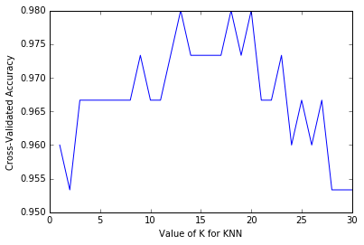

# Efficiently searching for optimal tuning parameters
*From the video series: [Introduction to machine learning with scikit-learn](https://github.com/justmarkham/scikit-learn-videos)*

## Agenda

- How can K-fold cross-validation be used to search for an **optimal tuning parameter**?
- How can this process be made **more efficient**?
- How do you search for **multiple tuning parameters** at once?
- What do you do with those tuning parameters before making **real predictions**?
- How can the **computational expense** of this process be reduced?

## Review of K-fold cross-validation

Steps for cross-validation:

- Dataset is split into K "folds" of **equal size**
- Each fold acts as the **testing set** 1 time, and acts as the **training set** K-1 times
- **Average testing performance** is used as the estimate of out-of-sample performance

Benefits of cross-validation:

- More **reliable** estimate of out-of-sample performance than train/test split
- Can be used for selecting **tuning parameters**, choosing between **models**, and selecting **features**

Drawbacks of cross-validation:

- Can be computationally **expensive**

## Review of parameter tuning using `cross_val_score`

**Goal:** Select the best tuning parameters (aka "hyperparameters") for KNN on the iris dataset


```python
from sklearn.datasets import load_iris
from sklearn.neighbors import KNeighborsClassifier
from sklearn.cross_validation import cross_val_score
import matplotlib.pyplot as plt
%matplotlib inline
```


```python
# read in the iris data
iris = load_iris()

# create X (features) and y (response)
X = iris.data
y = iris.target
```


```python
# 10-fold cross-validation with K=5 for KNN (the n_neighbors parameter)
knn = KNeighborsClassifier(n_neighbors=5)
scores = cross_val_score(knn, X, y, cv=10, scoring='accuracy')
print(scores)
```

    [ 1.          0.93333333  1.          1.          0.86666667  0.93333333
      0.93333333  1.          1.          1.        ]


```python
# use average accuracy as an estimate of out-of-sample accuracy
print(scores.mean())
```

    0.966666666667


```python
# search for an optimal value of K for KNN
k_range = list(range(1, 31))
k_scores = []
for k in k_range:
    knn = KNeighborsClassifier(n_neighbors=k)
    scores = cross_val_score(knn, X, y, cv=10, scoring='accuracy')
    k_scores.append(scores.mean())
print(k_scores)
```

    [0.95999999999999996, 0.95333333333333337, 0.96666666666666656, 0.96666666666666656, 0.96666666666666679, 0.96666666666666679, 0.96666666666666679, 0.96666666666666679, 0.97333333333333338, 0.96666666666666679, 0.96666666666666679, 0.97333333333333338, 0.98000000000000009, 0.97333333333333338, 0.97333333333333338, 0.97333333333333338, 0.97333333333333338, 0.98000000000000009, 0.97333333333333338, 0.98000000000000009, 0.96666666666666656, 0.96666666666666656, 0.97333333333333338, 0.95999999999999996, 0.96666666666666656, 0.95999999999999996, 0.96666666666666656, 0.95333333333333337, 0.95333333333333337, 0.95333333333333337]


```python
# plot the value of K for KNN (x-axis) versus the cross-validated accuracy (y-axis)
plt.plot(k_range, k_scores)
plt.xlabel('Value of K for KNN')
plt.ylabel('Cross-Validated Accuracy')
```


    <matplotlib.text.Text at 0x86787b8>


## More efficient parameter tuning using `GridSearchCV`

Allows you to define a **grid of parameters** that will be **searched** using K-fold cross-validation


```python
from sklearn.grid_search import GridSearchCV
```


```python
# define the parameter values that should be searched
k_range = list(range(1, 31))
print(k_range)
```

    [1, 2, 3, 4, 5, 6, 7, 8, 9, 10, 11, 12, 13, 14, 15, 16, 17, 18, 19, 20, 21, 22, 23, 24, 25, 26, 27, 28, 29, 30]


```python
# create a parameter grid: map the parameter names to the values that should be searched
param_grid = dict(n_neighbors=k_range)
print(param_grid)
```

    {'n_neighbors': [1, 2, 3, 4, 5, 6, 7, 8, 9, 10, 11, 12, 13, 14, 15, 16, 17, 18, 19, 20, 21, 22, 23, 24, 25, 26, 27, 28, 29, 30]}


```python
# instantiate the grid
grid = GridSearchCV(knn, param_grid, cv=10, scoring='accuracy')
```

- You can set **`n_jobs = -1`** to run computations in parallel (if supported by your computer and OS)


```python
# fit the grid with data
grid.fit(X, y)
```


    GridSearchCV(cv=10, error_score='raise',
           estimator=KNeighborsClassifier(algorithm='auto', leaf_size=30, metric='minkowski',
               metric_params=None, n_jobs=1, n_neighbors=30, p=2,
               weights='uniform'),
           fit_params={}, iid=True, n_jobs=1,
           param_grid={'n_neighbors': [1, 2, 3, 4, 5, 6, 7, 8, 9, 10, 11, 12, 13, 14, 15, 16, 17, 18, 19, 20, 21, 22, 23, 24, 25, 26, 27, 28, 29, 30]},
           pre_dispatch='2*n_jobs', refit=True, scoring='accuracy', verbose=0)


```python
# view the complete results (list of named tuples)
grid.grid_scores_
```


    [mean: 0.96000, std: 0.05333, params: {'n_neighbors': 1},
     mean: 0.95333, std: 0.05207, params: {'n_neighbors': 2},
     mean: 0.96667, std: 0.04472, params: {'n_neighbors': 3},
     mean: 0.96667, std: 0.04472, params: {'n_neighbors': 4},
     mean: 0.96667, std: 0.04472, params: {'n_neighbors': 5},
     mean: 0.96667, std: 0.04472, params: {'n_neighbors': 6},
     mean: 0.96667, std: 0.04472, params: {'n_neighbors': 7},
     mean: 0.96667, std: 0.04472, params: {'n_neighbors': 8},
     mean: 0.97333, std: 0.03266, params: {'n_neighbors': 9},
     mean: 0.96667, std: 0.04472, params: {'n_neighbors': 10},
     mean: 0.96667, std: 0.04472, params: {'n_neighbors': 11},
     mean: 0.97333, std: 0.03266, params: {'n_neighbors': 12},
     mean: 0.98000, std: 0.03055, params: {'n_neighbors': 13},
     mean: 0.97333, std: 0.04422, params: {'n_neighbors': 14},
     mean: 0.97333, std: 0.03266, params: {'n_neighbors': 15},
     mean: 0.97333, std: 0.03266, params: {'n_neighbors': 16},
     mean: 0.97333, std: 0.03266, params: {'n_neighbors': 17},
     mean: 0.98000, std: 0.03055, params: {'n_neighbors': 18},
     mean: 0.97333, std: 0.03266, params: {'n_neighbors': 19},
     mean: 0.98000, std: 0.03055, params: {'n_neighbors': 20},
     mean: 0.96667, std: 0.03333, params: {'n_neighbors': 21},
     mean: 0.96667, std: 0.03333, params: {'n_neighbors': 22},
     mean: 0.97333, std: 0.03266, params: {'n_neighbors': 23},
     mean: 0.96000, std: 0.04422, params: {'n_neighbors': 24},
     mean: 0.96667, std: 0.03333, params: {'n_neighbors': 25},
     mean: 0.96000, std: 0.04422, params: {'n_neighbors': 26},
     mean: 0.96667, std: 0.04472, params: {'n_neighbors': 27},
     mean: 0.95333, std: 0.04269, params: {'n_neighbors': 28},
     mean: 0.95333, std: 0.04269, params: {'n_neighbors': 29},
     mean: 0.95333, std: 0.04269, params: {'n_neighbors': 30}]


```python
# examine the first tuple
print(grid.grid_scores_[0].parameters)
print(grid.grid_scores_[0].cv_validation_scores)
print(grid.grid_scores_[0].mean_validation_score)
```

    {'n_neighbors': 1}
    [ 1.          0.93333333  1.          0.93333333  0.86666667  1.
      0.86666667  1.          1.          1.        ]
    0.96


```python
# create a list of the mean scores only
grid_mean_scores = [result.mean_validation_score for result in grid.grid_scores_]
print(grid_mean_scores)
```

    [0.95999999999999996, 0.95333333333333337, 0.96666666666666667, 0.96666666666666667, 0.96666666666666667, 0.96666666666666667, 0.96666666666666667, 0.96666666666666667, 0.97333333333333338, 0.96666666666666667, 0.96666666666666667, 0.97333333333333338, 0.97999999999999998, 0.97333333333333338, 0.97333333333333338, 0.97333333333333338, 0.97333333333333338, 0.97999999999999998, 0.97333333333333338, 0.97999999999999998, 0.96666666666666667, 0.96666666666666667, 0.97333333333333338, 0.95999999999999996, 0.96666666666666667, 0.95999999999999996, 0.96666666666666667, 0.95333333333333337, 0.95333333333333337, 0.95333333333333337]


```python
# plot the results
plt.plot(k_range, grid_mean_scores)
plt.xlabel('Value of K for KNN')
plt.ylabel('Cross-Validated Accuracy')
```


    <matplotlib.text.Text at 0x93352e8>





```python
# examine the best model
print(grid.best_score_)
print(grid.best_params_)
print(grid.best_estimator_)
```

    0.98
    {'n_neighbors': 13}
    KNeighborsClassifier(algorithm='auto', leaf_size=30, metric='minkowski',
               metric_params=None, n_jobs=1, n_neighbors=13, p=2,
               weights='uniform')


## Searching multiple parameters simultaneously

- **Example:** tuning `max_depth` and `min_samples_leaf` for a `DecisionTreeClassifier`
- Could tune parameters **independently**: change `max_depth` while leaving `min_samples_leaf` at its default value, and vice versa
- But, best performance might be achieved when **neither parameter** is at its default value


```python
# define the parameter values that should be searched
k_range = list(range(1, 31))
weight_options = ['uniform', 'distance']
```


```python
# create a parameter grid: map the parameter names to the values that should be searched
param_grid = dict(n_neighbors=k_range, weights=weight_options)
print(param_grid)
```

    {'n_neighbors': [1, 2, 3, 4, 5, 6, 7, 8, 9, 10, 11, 12, 13, 14, 15, 16, 17, 18, 19, 20, 21, 22, 23, 24, 25, 26, 27, 28, 29, 30], 'weights': ['uniform', 'distance']}


```python
# instantiate and fit the grid
grid = GridSearchCV(knn, param_grid, cv=10, scoring='accuracy')
grid.fit(X, y)
```


    GridSearchCV(cv=10, error_score='raise',
           estimator=KNeighborsClassifier(algorithm='auto', leaf_size=30, metric='minkowski',
               metric_params=None, n_jobs=1, n_neighbors=30, p=2,
               weights='uniform'),
           fit_params={}, iid=True, n_jobs=1,
           param_grid={'n_neighbors': [1, 2, 3, 4, 5, 6, 7, 8, 9, 10, 11, 12, 13, 14, 15, 16, 17, 18, 19, 20, 21, 22, 23, 24, 25, 26, 27, 28, 29, 30], 'weights': ['uniform', 'distance']},
           pre_dispatch='2*n_jobs', refit=True, scoring='accuracy', verbose=0)


```python
# view the complete results
grid.grid_scores_
```


    [mean: 0.96000, std: 0.05333, params: {'n_neighbors': 1, 'weights': 'uniform'},
     mean: 0.96000, std: 0.05333, params: {'n_neighbors': 1, 'weights': 'distance'},
     mean: 0.95333, std: 0.05207, params: {'n_neighbors': 2, 'weights': 'uniform'},
     mean: 0.96000, std: 0.05333, params: {'n_neighbors': 2, 'weights': 'distance'},
     mean: 0.96667, std: 0.04472, params: {'n_neighbors': 3, 'weights': 'uniform'},
     mean: 0.96667, std: 0.04472, params: {'n_neighbors': 3, 'weights': 'distance'},
     mean: 0.96667, std: 0.04472, params: {'n_neighbors': 4, 'weights': 'uniform'},
     mean: 0.96667, std: 0.04472, params: {'n_neighbors': 4, 'weights': 'distance'},
     mean: 0.96667, std: 0.04472, params: {'n_neighbors': 5, 'weights': 'uniform'},
     mean: 0.96667, std: 0.04472, params: {'n_neighbors': 5, 'weights': 'distance'},
     mean: 0.96667, std: 0.04472, params: {'n_neighbors': 6, 'weights': 'uniform'},
     mean: 0.96667, std: 0.04472, params: {'n_neighbors': 6, 'weights': 'distance'},
     mean: 0.96667, std: 0.04472, params: {'n_neighbors': 7, 'weights': 'uniform'},
     mean: 0.96667, std: 0.04472, params: {'n_neighbors': 7, 'weights': 'distance'},
     mean: 0.96667, std: 0.04472, params: {'n_neighbors': 8, 'weights': 'uniform'},
     mean: 0.96667, std: 0.04472, params: {'n_neighbors': 8, 'weights': 'distance'},
     mean: 0.97333, std: 0.03266, params: {'n_neighbors': 9, 'weights': 'uniform'},
     mean: 0.97333, std: 0.03266, params: {'n_neighbors': 9, 'weights': 'distance'},
     mean: 0.96667, std: 0.04472, params: {'n_neighbors': 10, 'weights': 'uniform'},
     mean: 0.97333, std: 0.03266, params: {'n_neighbors': 10, 'weights': 'distance'},
     mean: 0.96667, std: 0.04472, params: {'n_neighbors': 11, 'weights': 'uniform'},
     mean: 0.97333, std: 0.03266, params: {'n_neighbors': 11, 'weights': 'distance'},
     mean: 0.97333, std: 0.03266, params: {'n_neighbors': 12, 'weights': 'uniform'},
     mean: 0.97333, std: 0.04422, params: {'n_neighbors': 12, 'weights': 'distance'},
     mean: 0.98000, std: 0.03055, params: {'n_neighbors': 13, 'weights': 'uniform'},
     mean: 0.97333, std: 0.03266, params: {'n_neighbors': 13, 'weights': 'distance'},
     mean: 0.97333, std: 0.04422, params: {'n_neighbors': 14, 'weights': 'uniform'},
     mean: 0.97333, std: 0.03266, params: {'n_neighbors': 14, 'weights': 'distance'},
     mean: 0.97333, std: 0.03266, params: {'n_neighbors': 15, 'weights': 'uniform'},
     mean: 0.98000, std: 0.03055, params: {'n_neighbors': 15, 'weights': 'distance'},
     mean: 0.97333, std: 0.03266, params: {'n_neighbors': 16, 'weights': 'uniform'},
     mean: 0.97333, std: 0.03266, params: {'n_neighbors': 16, 'weights': 'distance'},
     mean: 0.97333, std: 0.03266, params: {'n_neighbors': 17, 'weights': 'uniform'},
     mean: 0.98000, std: 0.03055, params: {'n_neighbors': 17, 'weights': 'distance'},
     mean: 0.98000, std: 0.03055, params: {'n_neighbors': 18, 'weights': 'uniform'},
     mean: 0.97333, std: 0.03266, params: {'n_neighbors': 18, 'weights': 'distance'},
     mean: 0.97333, std: 0.03266, params: {'n_neighbors': 19, 'weights': 'uniform'},
     mean: 0.98000, std: 0.03055, params: {'n_neighbors': 19, 'weights': 'distance'},
     mean: 0.98000, std: 0.03055, params: {'n_neighbors': 20, 'weights': 'uniform'},
     mean: 0.96667, std: 0.04472, params: {'n_neighbors': 20, 'weights': 'distance'},
     mean: 0.96667, std: 0.03333, params: {'n_neighbors': 21, 'weights': 'uniform'},
     mean: 0.96667, std: 0.04472, params: {'n_neighbors': 21, 'weights': 'distance'},
     mean: 0.96667, std: 0.03333, params: {'n_neighbors': 22, 'weights': 'uniform'},
     mean: 0.96667, std: 0.04472, params: {'n_neighbors': 22, 'weights': 'distance'},
     mean: 0.97333, std: 0.03266, params: {'n_neighbors': 23, 'weights': 'uniform'},
     mean: 0.97333, std: 0.03266, params: {'n_neighbors': 23, 'weights': 'distance'},
     mean: 0.96000, std: 0.04422, params: {'n_neighbors': 24, 'weights': 'uniform'},
     mean: 0.97333, std: 0.03266, params: {'n_neighbors': 24, 'weights': 'distance'},
     mean: 0.96667, std: 0.03333, params: {'n_neighbors': 25, 'weights': 'uniform'},
     mean: 0.97333, std: 0.03266, params: {'n_neighbors': 25, 'weights': 'distance'},
     mean: 0.96000, std: 0.04422, params: {'n_neighbors': 26, 'weights': 'uniform'},
     mean: 0.96667, std: 0.04472, params: {'n_neighbors': 26, 'weights': 'distance'},
     mean: 0.96667, std: 0.04472, params: {'n_neighbors': 27, 'weights': 'uniform'},
     mean: 0.98000, std: 0.03055, params: {'n_neighbors': 27, 'weights': 'distance'},
     mean: 0.95333, std: 0.04269, params: {'n_neighbors': 28, 'weights': 'uniform'},
     mean: 0.97333, std: 0.03266, params: {'n_neighbors': 28, 'weights': 'distance'},
     mean: 0.95333, std: 0.04269, params: {'n_neighbors': 29, 'weights': 'uniform'},
     mean: 0.97333, std: 0.03266, params: {'n_neighbors': 29, 'weights': 'distance'},
     mean: 0.95333, std: 0.04269, params: {'n_neighbors': 30, 'weights': 'uniform'},
     mean: 0.96667, std: 0.03333, params: {'n_neighbors': 30, 'weights': 'distance'}]


```python
# examine the best model
print(grid.best_score_)
print(grid.best_params_)
```

    0.98
    {'n_neighbors': 13, 'weights': 'uniform'}


## Using the best parameters to make predictions


```python
# train your model using all data and the best known parameters
knn = KNeighborsClassifier(n_neighbors=13, weights='uniform')
knn.fit(X, y)

# make a prediction on out-of-sample data
knn.predict([[3, 5, 4, 2]])
```


    array([1])


```python
# shortcut: GridSearchCV automatically refits the best model using all of the data
grid.predict([[3, 5, 4, 2]])
```


    array([1])


## Reducing computational expense using `RandomizedSearchCV`

- Searching many different parameters at once may be computationally infeasible
- `RandomizedSearchCV` searches a subset of the parameters, and you control the computational "budget"


```python
from sklearn.grid_search import RandomizedSearchCV
```


```python
# specify "parameter distributions" rather than a "parameter grid"
param_dist = dict(n_neighbors=k_range, weights=weight_options)
```

- **Important:** Specify a continuous distribution (rather than a list of values) for any continous parameters


```python
# n_iter controls the number of searches
rand = RandomizedSearchCV(knn, param_dist, cv=10, scoring='accuracy', n_iter=10, random_state=5)
rand.fit(X, y)
rand.grid_scores_
```


    [mean: 0.97333, std: 0.03266, params: {'n_neighbors': 18, 'weights': 'distance'},
     mean: 0.96667, std: 0.04472, params: {'n_neighbors': 8, 'weights': 'uniform'},
     mean: 0.97333, std: 0.03266, params: {'n_neighbors': 24, 'weights': 'distance'},
     mean: 0.98000, std: 0.03055, params: {'n_neighbors': 20, 'weights': 'uniform'},
     mean: 0.95333, std: 0.04269, params: {'n_neighbors': 28, 'weights': 'uniform'},
     mean: 0.97333, std: 0.03266, params: {'n_neighbors': 9, 'weights': 'uniform'},
     mean: 0.96667, std: 0.04472, params: {'n_neighbors': 5, 'weights': 'distance'},
     mean: 0.96667, std: 0.04472, params: {'n_neighbors': 5, 'weights': 'uniform'},
     mean: 0.97333, std: 0.03266, params: {'n_neighbors': 19, 'weights': 'uniform'},
     mean: 0.96667, std: 0.04472, params: {'n_neighbors': 20, 'weights': 'distance'}]


```python
# examine the best model
print(rand.best_score_)
print(rand.best_params_)
```

    0.98
    {'n_neighbors': 20, 'weights': 'uniform'}


```python
# run RandomizedSearchCV 20 times (with n_iter=10) and record the best score
best_scores = []
for _ in range(20):
    rand = RandomizedSearchCV(knn, param_dist, cv=10, scoring='accuracy', n_iter=10)
    rand.fit(X, y)
    best_scores.append(round(rand.best_score_, 3))
print(best_scores)
```

    [0.98, 0.973, 0.98, 0.973, 0.973, 0.98, 0.98, 0.98, 0.973, 0.98, 0.98, 0.973, 0.98, 0.973, 0.973, 0.98, 0.98, 0.98, 0.98, 0.98]


## Resources

- scikit-learn documentation: [Grid search](http://scikit-learn.org/stable/modules/grid_search.html), [GridSearchCV](http://scikit-learn.org/stable/modules/generated/sklearn.grid_search.GridSearchCV.html), [RandomizedSearchCV](http://scikit-learn.org/stable/modules/generated/sklearn.grid_search.RandomizedSearchCV.html)
- Timed example: [Comparing randomized search and grid search](http://scikit-learn.org/stable/auto_examples/model_selection/randomized_search.html)
- scikit-learn workshop by Andreas Mueller: [Video segment on randomized search](https://youtu.be/0wUF_Ov8b0A?t=17m38s) (3 minutes), [related notebook](https://github.com/amueller/pydata-nyc-advanced-sklearn/blob/master/Chapter%203%20-%20Randomized%20Hyper%20Parameter%20Search.ipynb)
- Paper by Yoshua Bengio: [Random Search for Hyper-Parameter Optimization](http://www.jmlr.org/papers/volume13/bergstra12a/bergstra12a.pdf)

## Comments or Questions?

- Email: <kevin@dataschool.io>
- Website: http://dataschool.io
- Twitter: [@justmarkham](https://twitter.com/justmarkham)


```python
from IPython.core.display import HTML
def css_styling():
    styles = open("styles/custom.css", "r").read()
    return HTML(styles)
css_styling()
```


<style>
    @font-face {
        font-family: "Computer Modern";
        src: url('http://mirrors.ctan.org/fonts/cm-unicode/fonts/otf/cmunss.otf');
    }
    div.cell{
        width: 90%;
/*        margin-left:auto;*/
/*        margin-right:auto;*/
    }
    ul {
        line-height: 145%;
        font-size: 90%;
    }
    li {
        margin-bottom: 1em;
    }
    h1 {
        font-family: Helvetica, serif;
    }
    h4{
        margin-top: 12px;
        margin-bottom: 3px;
       }
    div.text_cell_render{
        font-family: Computer Modern, "Helvetica Neue", Arial, Helvetica, Geneva, sans-serif;
        line-height: 145%;
        font-size: 130%;
        width: 90%;
        margin-left:auto;
        margin-right:auto;
    }
    .CodeMirror{
            font-family: "Source Code Pro", source-code-pro,Consolas, monospace;
    }
/*    .prompt{
        display: None;
    }*/
    .text_cell_render h5 {
        font-weight: 300;
        font-size: 16pt;
        color: #4057A1;
        font-style: italic;
        margin-bottom: 0.5em;
        margin-top: 0.5em;
        display: block;
    }

    .warning{
        color: rgb( 240, 20, 20 )
        }
</style>
<script>
    MathJax.Hub.Config({
                        TeX: {
                           extensions: ["AMSmath.js"]
                           },
                tex2jax: {
                    inlineMath: [ ['$','$'], ["\\(","\\)"] ],
                    displayMath: [ ['$$','$$'], ["\\[","\\]"] ]
                },
                displayAlign: 'center', // Change this to 'center' to center equations.
                "HTML-CSS": {
                    styles: {'.MathJax_Display': {"margin": 4}}
                }
        });
</script>


