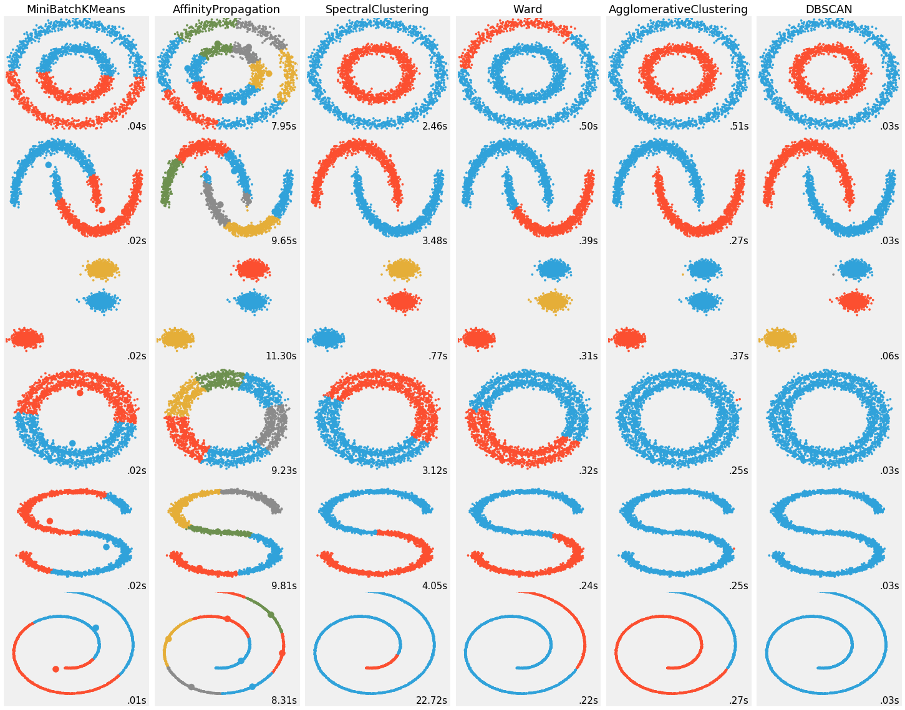

```python
# Author : Vincent Michel, 2010
#          Alexandre Gramfort, 2011
# License: BSD 3 clause

print(__doc__)

import time as time
import numpy as np
import scipy as sp
import matplotlib.pyplot as plt
from sklearn.feature_extraction.image import grid_to_graph
from sklearn.cluster import AgglomerativeClustering

###############################################################################
# Generate data
face = sp.misc.face()
# Downsample the image by a factor of 4
face = face[::2, ::2] + face[1::2, ::2] + face[::2, 1::2] + face[1::2, 1::2]
X = np.reshape(face, (-1, 1))

###############################################################################
# Define the structure A of the data. Pixels connected to their neighbors.
print("Converting grid_to_graph")
connectivity = grid_to_graph(*face.shape)

###############################################################################
# Compute clustering
print("Compute structured hierarchical clustering...")
st = time.time()
n_clusters = 15  # number of regions
ward = AgglomerativeClustering(n_clusters=n_clusters,
        linkage='ward', connectivity=connectivity).fit(X)
label = np.reshape(ward.labels_, face.shape)
print("Elapsed time: ", time.time() - st)
print("Number of pixels: ", label.size)
print("Number of clusters: ", np.unique(label).size)

###############################################################################
# Plot the results on an image
plt.figure(figsize=(5, 5))
plt.imshow(face, cmap=plt.cm.gray)
for l in range(n_clusters):
    plt.contour(label == l, contours=1,
                colors=[plt.cm.spectral(l / float(n_clusters)), ])
plt.xticks(())
plt.yticks(())
plt.show()
```

    Automatically created module for IPython interactive environment
    Converting grid_to_graph
    Compute structured hierarchical clustering...
    Elapsed time:  190.28415751457214
    Number of pixels:  589824
    Number of clusters:  15


    ---------------------------------------------------------------------------

    TypeError                                 Traceback (most recent call last)

    <ipython-input-2-84a444761f55> in <module>()
         42 for l in range(n_clusters):
         43     plt.contour(label == l, contours=1,
    ---> 44                 colors=[plt.cm.spectral(l / float(n_clusters)), ])
         45 plt.xticks(())
         46 plt.yticks(())


    ~/.local/lib64/python3.6/site-packages/matplotlib/pyplot.py in contour(*args, **kwargs)
       2774                       mplDeprecation)
       2775     try:
    -> 2776         ret = ax.contour(*args, **kwargs)
       2777     finally:
       2778         ax._hold = washold


    ~/.local/lib64/python3.6/site-packages/matplotlib/__init__.py in inner(ax, *args, **kwargs)
       1708                     warnings.warn(msg % (label_namer, func.__name__),
       1709                                   RuntimeWarning, stacklevel=2)
    -> 1710             return func(ax, *args, **kwargs)
       1711         pre_doc = inner.__doc__
       1712         if pre_doc is None:


    ~/.local/lib64/python3.6/site-packages/matplotlib/axes/_axes.py in contour(self, *args, **kwargs)
       5864             self.cla()
       5865         kwargs['filled'] = False
    -> 5866         contours = mcontour.QuadContourSet(self, *args, **kwargs)
       5867         self.autoscale_view()
       5868         return contours


    ~/.local/lib64/python3.6/site-packages/matplotlib/contour.py in __init__(self, ax, *args, **kwargs)
        851         self._transform = kwargs.pop('transform', None)
        852 
    --> 853         kwargs = self._process_args(*args, **kwargs)
        854         self._process_levels()
        855 


    ~/.local/lib64/python3.6/site-packages/matplotlib/contour.py in _process_args(self, *args, **kwargs)
       1444                 self._corner_mask = mpl.rcParams['contour.corner_mask']
       1445 
    -> 1446             x, y, z = self._contour_args(args, kwargs)
       1447 
       1448             _mask = ma.getmask(z)


    ~/.local/lib64/python3.6/site-packages/matplotlib/contour.py in _contour_args(self, args, kwargs)
       1522         if Nargs <= 2:
       1523             z = ma.asarray(args[0], dtype=np.float64)
    -> 1524             x, y = self._initialize_x_y(z)
       1525             args = args[1:]
       1526         elif Nargs <= 4:


    ~/.local/lib64/python3.6/site-packages/matplotlib/contour.py in _initialize_x_y(self, z)
       1609         """
       1610         if z.ndim != 2:
    -> 1611             raise TypeError("Input must be a 2D array.")
       1612         elif z.shape[0] < 2 or z.shape[1] < 2:
       1613             raise TypeError("Input z must be at least a 2x2 array.")


    TypeError: Input must be a 2D array.


>>> x = 10
>>> y = x
>>> del(x)
>>> print(y)
10
>>> print(x)
Traceback (most recent call last):
  File "<stdin>", line 1, in <module>
NameError: name 'x' is not defined


```python
# import time as time
# import numpy as np
# import scipy as sp
# import matplotlib.pyplot as plt
# from sklearn.feature_extraction.image import grid_to_graph
# from sklearn.cluster import AgglomerativeClustering

# ###############################################################################
# # Generate data
# face = sp.misc.face()
# # Downsample the image by a factor of 4
# face = face[::2, ::2] + face[1::2, ::2] + face[::2, 1::2] + face[1::2, 1::2]
# X = np.reshape(face, (-1, 1))

# ###############################################################################
# # Define the structure A of the data. Pixels connected to their neighbors.
# print("Converting grid_to_graph")
# print(face.shape)
# print(*face.shape)
# # connectivity = grid_to_graph(*face.shape)
```


```python
# Original URL: https://bugra.github.io/work/notes/2014-11-16/an-introduction-to-unsupervised-learning-scikit-learn/

%matplotlib inline
import itertools
import numpy as np
import matplotlib as mlp
import matplotlib.pyplot as plt
import pandas as pd
import scipy


from sklearn import cluster
from sklearn import datasets
from sklearn import metrics
from sklearn.neighbors import kneighbors_graph
from sklearn.preprocessing import StandardScaler

from sklearn import decomposition # PCA

import time
```


```python
np.random.seed(0)

n_samples = 2500
noisy_circles = datasets.make_circles(n_samples=n_samples, factor=.5, noise=.05)
noisy_moons = datasets.make_moons(n_samples=n_samples, noise=.05)
blobs = datasets.make_blobs(n_samples=n_samples, random_state=8)
circles = datasets.make_circles(n_samples=n_samples, noise=.05)
s_curve = datasets.make_s_curve(n_samples=n_samples, noise=.05)
swiss_roll = datasets.make_swiss_roll(n_samples=n_samples, noise=.05)

s_curve = np.vstack((s_curve[0][:, 0], s_curve[0][:, 2])).T, None
swiss_roll = np.vstack((swiss_roll[0][:,0], swiss_roll[0][:,2])).T, None

data_samples = [
                noisy_circles, 
                noisy_moons, 
                blobs, 
                circles, 
                s_curve, 
                swiss_roll
               ]
```


```python
colors = np.array([ii.strip() for ii in '#30a2da, #fc4f30, #e5ae38, #6d904f, #8b8b8b'.split(',')])
colors = np.hstack([colors] * 200)
plt.figure(figsize=(20, 16))
with plt.style.context('fivethirtyeight'):
    plt.subplots_adjust(left=.001, right=.999, bottom=.001, top=.96, wspace=.05,
                        hspace=.01)

    plot_num = 1
    for ii, dataset in enumerate(data_samples):
        X, y = dataset
        # normalize dataset for easier parameter selection
        X = StandardScaler().fit_transform(X)

        # estimate bandwidth for mean shift
        bandwidth = cluster.estimate_bandwidth(X, quantile=0.3)

        # connectivity matrix for structured Ward
        connectivity = kneighbors_graph(X, n_neighbors=10)
        # make connectivity symmetric
        connectivity = 0.5 * (connectivity + connectivity.T)

        # Compute distances
        distances = metrics.euclidean_distances(X)
        if ii == 2:
            n_clusters = 3
        else:
            n_clusters = 2
        # create clustering estimators
        ms = cluster.MeanShift(bandwidth=bandwidth, bin_seeding=True)
        two_means = cluster.MiniBatchKMeans(n_clusters=n_clusters)
        ward = cluster.AgglomerativeClustering(n_clusters=n_clusters,
                        linkage='ward', connectivity=connectivity)
        spectral = cluster.SpectralClustering(n_clusters=n_clusters,
                                              eigen_solver='arpack',
                                              affinity="nearest_neighbors")
        dbscan = cluster.DBSCAN(eps=.2)
        affinity_propagation = cluster.AffinityPropagation(damping=.9,
                                                           preference=-200)

        average_linkage = cluster.AgglomerativeClustering(linkage="average",
                                affinity="cityblock", n_clusters=n_clusters,
                                connectivity=connectivity)

        

        clustering_algos = [
                    ('MiniBatchKMeans', two_means),
                    ('AffinityPropagation', affinity_propagation),
        #           ('MeanShift', ms),
                    ('SpectralClustering', spectral),
                    ('Ward', ward),
                    ('AgglomerativeClustering', average_linkage),
                    ('DBSCAN', dbscan)
                   ]

        for name, algorithm in clustering_algos:
            # predict cluster memberships
            t0 = time.time()
            algorithm.fit(X)
            t1 = time.time()
            if hasattr(algorithm, 'labels_'):
                y_pred = algorithm.labels_.astype(np.int)
            else:
                y_pred = algorithm.predict(X)

            plt.subplot(len(clustering_algos), len(data_samples), plot_num)
            if ii == 0:
                plt.title(name, size=18)
            plt.scatter(X[:, 0], X[:, 1], color=colors[y_pred].tolist(), s=10)

            if hasattr(algorithm, 'cluster_centers_'):
                centers = algorithm.cluster_centers_
                center_colors = colors[:len(centers)]
                plt.scatter(centers[:, 0], centers[:, 1], s=100, c=center_colors)
            plt.xlim(-2, 2)
            plt.ylim(-2, 2)
            plt.xticks(())
            plt.yticks(())
            plt.text(.99, .01, ('%.2fs' % (t1 - t0)).lstrip('0'),
                     transform=plt.gca().transAxes, size=15,
                     horizontalalignment='right')
            plot_num += 1

```

    /home/mayank/.local/lib64/python3.6/site-packages/sklearn/manifold/spectral_embedding_.py:234: UserWarning: Graph is not fully connected, spectral embedding may not work as expected.
      warnings.warn("Graph is not fully connected, spectral embedding"
    /home/mayank/.local/lib64/python3.6/site-packages/sklearn/cluster/hierarchical.py:193: UserWarning: the number of connected components of the connectivity matrix is 2 > 1. Completing it to avoid stopping the tree early.
      affinity='euclidean')
    /home/mayank/.local/lib64/python3.6/site-packages/sklearn/cluster/hierarchical.py:426: UserWarning: the number of connected components of the connectivity matrix is 2 > 1. Completing it to avoid stopping the tree early.
      affinity=affinity)
    /home/mayank/.local/lib64/python3.6/site-packages/sklearn/manifold/spectral_embedding_.py:234: UserWarning: Graph is not fully connected, spectral embedding may not work as expected.
      warnings.warn("Graph is not fully connected, spectral embedding"
    /home/mayank/.local/lib64/python3.6/site-packages/sklearn/cluster/hierarchical.py:193: UserWarning: the number of connected components of the connectivity matrix is 2 > 1. Completing it to avoid stopping the tree early.
      affinity='euclidean')
    /home/mayank/.local/lib64/python3.6/site-packages/sklearn/cluster/hierarchical.py:426: UserWarning: the number of connected components of the connectivity matrix is 2 > 1. Completing it to avoid stopping the tree early.
      affinity=affinity)
    /home/mayank/.local/lib64/python3.6/site-packages/sklearn/manifold/spectral_embedding_.py:234: UserWarning: Graph is not fully connected, spectral embedding may not work as expected.
      warnings.warn("Graph is not fully connected, spectral embedding"
    /home/mayank/.local/lib64/python3.6/site-packages/sklearn/cluster/hierarchical.py:193: UserWarning: the number of connected components of the connectivity matrix is 3 > 1. Completing it to avoid stopping the tree early.
      affinity='euclidean')
    /home/mayank/.local/lib64/python3.6/site-packages/sklearn/cluster/hierarchical.py:426: UserWarning: the number of connected components of the connectivity matrix is 3 > 1. Completing it to avoid stopping the tree early.
      affinity=affinity)
    /home/mayank/.local/lib64/python3.6/site-packages/sklearn/manifold/spectral_embedding_.py:234: UserWarning: Graph is not fully connected, spectral embedding may not work as expected.
      warnings.warn("Graph is not fully connected, spectral embedding"




