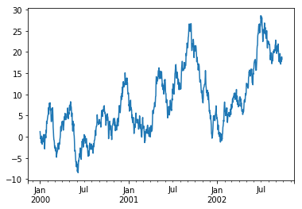

```python
# import numpy as np
# from pandas.io.json import json_normalize
# %matplotlib inline
# import pandas
# data = [{'state': 'Florida',
#           'shortname': 'FL',
#           'info': {
#                'governor': 'Rick Scott'
#           },
#           'counties': [{'name': 'Dade', 'population': 12345},
#                       {'name': 'Broward', 'population': 40000},
#                       {'name': 'Palm Beach', 'population': 60000}]},
#          {'state': 'Ohio',
#           'shortname': 'OH',
#           'info': {
#                'governor': 'John Kasich'
#           },
#           'counties': [{'name': 'Summit', 'population': 1234},
#                        {'name': 'Cuyahoga', 'population': 1337}]}]
# result = json_normalize(data, 'counties', ['state', 'shortname',
#                                            ['info', 'governor']])

# ts = pandas.Series(np.random.randn(1000), index=pandas.date_range('1/1/2000', periods=1000))
# ts = ts.cumsum()
# ts.plot()
```


    <matplotlib.axes._subplots.AxesSubplot at 0x7fe4b9df15f8>




