# Matplotlib

Matplotlib is a plotting library. In this section give a brief introduction to the matplotlib.pyplot module, which provides a plotting system similar to that of MATLAB.


```python
import numpy as np
import matplotlib.pyplot as plt
```


```python
##################
%matplotlib inline
```

**NOTE:** 

Use the below code for 

- **IPython console: ** ```%matplotlib```

- ** Jupyter notebook:** ```%matplotlib inline```

## Plotting

The most important function in matplotlib is plot, which allows you to plot 2D data. Here is a simple example:


```python
# Compute the x and y coordinates for points on a sine curve
x = np.arange(0, 3 * np.pi, 0.1)
y = np.sin(x)

# Plot the points using matplotlib
plt.plot(x, y)
plt.show()
```


    [<matplotlib.lines.Line2D at 0x7f5c551d46d8>]


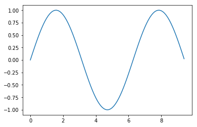


```python
a = np.array([1, 4, 5, 66, 77, 334], int)
plt.plot(a)
plt.show()
```


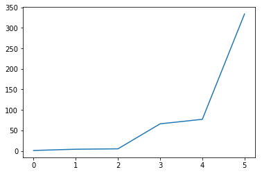


```python
Lets add more details to the graphs.
```


```python
y_cos = np.cos(x)
y_sin = np.sin(x)
# Plot the points using matplotlib
plt.plot(x, y_sin)
plt.plot(x, y_cos)
plt.xlabel('x axis label')
plt.ylabel('y axis label')
plt.title('Sine and Cosine Graph')
plt.legend(['Sine', 'Cosine'])
plt.show()
```


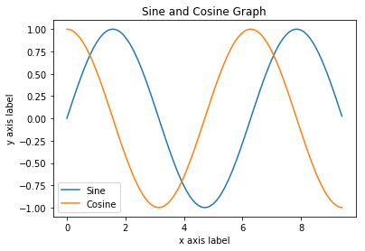


### Subplots

You can plot different things in the same figure using the subplot function. Here is an example:


```python
# Compute the x and y coordinates for points on sine and cosine curves
x = np.arange(0, 3 * np.pi, 0.1)
y_sin = np.sin(x)
y_cos = np.cos(x)

# Set up a subplot grid that has height 2 and width 1,
# and set the first such subplot as active.
plt.subplot(2, 1, 1)

# Make the first plot
plt.plot(x, y_sin)
plt.title('Sine')

# Set the second subplot as active, and make the second plot.
plt.subplot(2, 1, 2)
plt.plot(x, y_cos)
plt.title('Cosine')

# Show the figure.
plt.show()
```


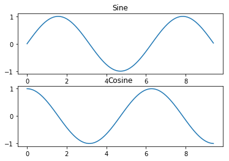


Reading csv file and plotting the data.


```python
# # import numpy as np
# data = np.genfromtxt('Metadata_Indicator_API_IND_DS2_en_csv_v2.csv', delimiter=',',
#                      names=['INDICATOR_CODE', 'INDICATOR_NAME', 'SOURCE_NOTE', 'SOURCE_ORGANIZATION'])
# plt.plot(data['INDICATOR_CODE'], data['INDICATOR_NAME'], color='r', label='the data')
# plt.show()
```

## Simple plot


```python
import numpy as np

X = np.linspace(-np.pi, np.pi, 256, endpoint=True)
C, S = np.cos(X), np.sin(X)
```


```python
print(C)
print(S)
```

    [-1.         -0.99969645 -0.99878599 -0.99726917 -0.99514692 -0.99242051
     -0.98909161 -0.98516223 -0.98063477 -0.97551197 -0.96979694 -0.96349314
     -0.95660442 -0.94913494 -0.94108925 -0.93247223 -0.92328911 -0.91354546
     -0.9032472  -0.89240058 -0.88101219 -0.86908895 -0.85663808 -0.84366715
     -0.83018403 -0.81619691 -0.80171428 -0.78674494 -0.77129796 -0.75538273
     -0.73900892 -0.72218645 -0.70492555 -0.68723669 -0.66913061 -0.6506183
     -0.63171101 -0.6124202  -0.5927576  -0.57273514 -0.55236497 -0.53165947
     -0.51063119 -0.48929292 -0.46765759 -0.44573836 -0.42354851 -0.40110153
     -0.37841105 -0.35549083 -0.3323548  -0.30901699 -0.28549159 -0.26179286
     -0.2379352  -0.21393308 -0.18980109 -0.16555388 -0.14120615 -0.1167727
     -0.09226836 -0.067708   -0.04310654 -0.0184789   0.00615995  0.03079506
      0.05541147  0.07999425  0.10452846  0.12899922  0.15339165  0.17769097
      0.20188241  0.22595129  0.24988299  0.27366299  0.29727685  0.32071024
      0.34394892  0.36697879  0.38978587  0.41235632  0.43467642  0.45673264
      0.47851157  0.5         0.52118488  0.54205336  0.56259275  0.5827906
      0.60263464  0.62211282  0.64121331  0.65992453  0.67823512  0.69613395
      0.71361015  0.73065313  0.74725253  0.76339828  0.77908057  0.79428989
      0.80901699  0.82325295  0.83698911  0.85021714  0.862929    0.87511698
      0.88677369  0.89789203  0.90846527  0.91848699  0.92795109  0.93685184
      0.94518383  0.952942    0.96012165  0.9667184   0.97272827  0.9781476
      0.9829731   0.98720184  0.99083125  0.99385914  0.99628365  0.99810333
      0.99931706  0.99992411  0.99992411  0.99931706  0.99810333  0.99628365
      0.99385914  0.99083125  0.98720184  0.9829731   0.9781476   0.97272827
      0.9667184   0.96012165  0.952942    0.94518383  0.93685184  0.92795109
      0.91848699  0.90846527  0.89789203  0.88677369  0.87511698  0.862929
      0.85021714  0.83698911  0.82325295  0.80901699  0.79428989  0.77908057
      0.76339828  0.74725253  0.73065313  0.71361015  0.69613395  0.67823512
      0.65992453  0.64121331  0.62211282  0.60263464  0.5827906   0.56259275
      0.54205336  0.52118488  0.5         0.47851157  0.45673264  0.43467642
      0.41235632  0.38978587  0.36697879  0.34394892  0.32071024  0.29727685
      0.27366299  0.24988299  0.22595129  0.20188241  0.17769097  0.15339165
      0.12899922  0.10452846  0.07999425  0.05541147  0.03079506  0.00615995
     -0.0184789  -0.04310654 -0.067708   -0.09226836 -0.1167727  -0.14120615
     -0.16555388 -0.18980109 -0.21393308 -0.2379352  -0.26179286 -0.28549159
     -0.30901699 -0.3323548  -0.35549083 -0.37841105 -0.40110153 -0.42354851
     -0.44573836 -0.46765759 -0.48929292 -0.51063119 -0.53165947 -0.55236497
     -0.57273514 -0.5927576  -0.6124202  -0.63171101 -0.6506183  -0.66913061
     -0.68723669 -0.70492555 -0.72218645 -0.73900892 -0.75538273 -0.77129796
     -0.78674494 -0.80171428 -0.81619691 -0.83018403 -0.84366715 -0.85663808
     -0.86908895 -0.88101219 -0.89240058 -0.9032472  -0.91354546 -0.92328911
     -0.93247223 -0.94108925 -0.94913494 -0.95660442 -0.96349314 -0.96979694
     -0.97551197 -0.98063477 -0.98516223 -0.98909161 -0.99242051 -0.99514692
     -0.99726917 -0.99878599 -0.99969645 -1.        ]
    [ -1.22464680e-16  -2.46374492e-02  -4.92599411e-02  -7.38525275e-02
      -9.84002783e-02  -1.22888291e-01  -1.47301698e-01  -1.71625679e-01
      -1.95845467e-01  -2.19946358e-01  -2.43913720e-01  -2.67733003e-01
      -2.91389747e-01  -3.14869589e-01  -3.38158275e-01  -3.61241666e-01
      -3.84105749e-01  -4.06736643e-01  -4.29120609e-01  -4.51244057e-01
      -4.73093557e-01  -4.94655843e-01  -5.15917826e-01  -5.36866598e-01
      -5.57489439e-01  -5.77773831e-01  -5.97707459e-01  -6.17278221e-01
      -6.36474236e-01  -6.55283850e-01  -6.73695644e-01  -6.91698439e-01
      -7.09281308e-01  -7.26433574e-01  -7.43144825e-01  -7.59404917e-01
      -7.75203976e-01  -7.90532412e-01  -8.05380919e-01  -8.19740483e-01
      -8.33602385e-01  -8.46958211e-01  -8.59799851e-01  -8.72119511e-01
      -8.83909710e-01  -8.95163291e-01  -9.05873422e-01  -9.16033601e-01
      -9.25637660e-01  -9.34679767e-01  -9.43154434e-01  -9.51056516e-01
      -9.58381215e-01  -9.65124085e-01  -9.71281032e-01  -9.76848318e-01
      -9.81822563e-01  -9.86200747e-01  -9.89980213e-01  -9.93158666e-01
      -9.95734176e-01  -9.97705180e-01  -9.99070481e-01  -9.99829250e-01
      -9.99981027e-01  -9.99525720e-01  -9.98463604e-01  -9.96795325e-01
      -9.94521895e-01  -9.91644696e-01  -9.88165472e-01  -9.84086337e-01
      -9.79409768e-01  -9.74138602e-01  -9.68276041e-01  -9.61825643e-01
      -9.54791325e-01  -9.47177357e-01  -9.38988361e-01  -9.30229309e-01
      -9.20905518e-01  -9.11022649e-01  -9.00586702e-01  -8.89604013e-01
      -8.78081248e-01  -8.66025404e-01  -8.53443799e-01  -8.40344072e-01
      -8.26734175e-01  -8.12622371e-01  -7.98017227e-01  -7.82927610e-01
      -7.67362681e-01  -7.51331890e-01  -7.34844967e-01  -7.17911923e-01
      -7.00543038e-01  -6.82748855e-01  -6.64540179e-01  -6.45928062e-01
      -6.26923806e-01  -6.07538946e-01  -5.87785252e-01  -5.67674716e-01
      -5.47219547e-01  -5.26432163e-01  -5.05325184e-01  -4.83911424e-01
      -4.62203884e-01  -4.40215741e-01  -4.17960345e-01  -3.95451207e-01
      -3.72701992e-01  -3.49726511e-01  -3.26538713e-01  -3.03152674e-01
      -2.79582593e-01  -2.55842778e-01  -2.31947641e-01  -2.07911691e-01
      -1.83749518e-01  -1.59475791e-01  -1.35105247e-01  -1.10652682e-01
      -8.61329395e-02  -6.15609061e-02  -3.69514994e-02  -1.23196595e-02
       1.23196595e-02   3.69514994e-02   6.15609061e-02   8.61329395e-02
       1.10652682e-01   1.35105247e-01   1.59475791e-01   1.83749518e-01
       2.07911691e-01   2.31947641e-01   2.55842778e-01   2.79582593e-01
       3.03152674e-01   3.26538713e-01   3.49726511e-01   3.72701992e-01
       3.95451207e-01   4.17960345e-01   4.40215741e-01   4.62203884e-01
       4.83911424e-01   5.05325184e-01   5.26432163e-01   5.47219547e-01
       5.67674716e-01   5.87785252e-01   6.07538946e-01   6.26923806e-01
       6.45928062e-01   6.64540179e-01   6.82748855e-01   7.00543038e-01
       7.17911923e-01   7.34844967e-01   7.51331890e-01   7.67362681e-01
       7.82927610e-01   7.98017227e-01   8.12622371e-01   8.26734175e-01
       8.40344072e-01   8.53443799e-01   8.66025404e-01   8.78081248e-01
       8.89604013e-01   9.00586702e-01   9.11022649e-01   9.20905518e-01
       9.30229309e-01   9.38988361e-01   9.47177357e-01   9.54791325e-01
       9.61825643e-01   9.68276041e-01   9.74138602e-01   9.79409768e-01
       9.84086337e-01   9.88165472e-01   9.91644696e-01   9.94521895e-01
       9.96795325e-01   9.98463604e-01   9.99525720e-01   9.99981027e-01
       9.99829250e-01   9.99070481e-01   9.97705180e-01   9.95734176e-01
       9.93158666e-01   9.89980213e-01   9.86200747e-01   9.81822563e-01
       9.76848318e-01   9.71281032e-01   9.65124085e-01   9.58381215e-01
       9.51056516e-01   9.43154434e-01   9.34679767e-01   9.25637660e-01
       9.16033601e-01   9.05873422e-01   8.95163291e-01   8.83909710e-01
       8.72119511e-01   8.59799851e-01   8.46958211e-01   8.33602385e-01
       8.19740483e-01   8.05380919e-01   7.90532412e-01   7.75203976e-01
       7.59404917e-01   7.43144825e-01   7.26433574e-01   7.09281308e-01
       6.91698439e-01   6.73695644e-01   6.55283850e-01   6.36474236e-01
       6.17278221e-01   5.97707459e-01   5.77773831e-01   5.57489439e-01
       5.36866598e-01   5.15917826e-01   4.94655843e-01   4.73093557e-01
       4.51244057e-01   4.29120609e-01   4.06736643e-01   3.84105749e-01
       3.61241666e-01   3.38158275e-01   3.14869589e-01   2.91389747e-01
       2.67733003e-01   2.43913720e-01   2.19946358e-01   1.95845467e-01
       1.71625679e-01   1.47301698e-01   1.22888291e-01   9.84002783e-02
       7.38525275e-02   4.92599411e-02   2.46374492e-02   1.22464680e-16]


## Plotting with default settings

Matplotlib comes with a set of default settings that allow customizing all kinds of properties. You can control the defaults of almost every property in matplotlib: figure size and dpi, line width, color and style, axes, axis and grid properties, text and font properties and so on.


```python
import numpy as np
import matplotlib.pyplot as plt

X = np.linspace(-np.pi, np.pi, 256, endpoint=True)
C, S = np.cos(X), np.sin(X)

plt.plot(X, C)
plt.plot(X, S)

plt.show()
```


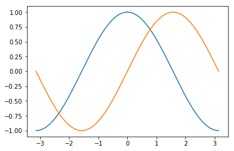


### Instantiating defaults


```python
import numpy as np
import matplotlib.pyplot as plt

# Create a figure of size 8x6 inches, 80 dots per inch
plt.figure(figsize=(8, 6), dpi=80)

# Create a new subplot from a grid of 1x1
plt.subplot(1, 1, 1)

X = np.linspace(-np.pi, np.pi, 256, endpoint=True)
C, S = np.cos(X), np.sin(X)

# Plot cosine with a blue continuous line of width 1 (pixels)
plt.plot(X, C, color="blue", linewidth=1.0, linestyle="-")

# Plot sine with a green continuous line of width 1 (pixels)
plt.plot(X, S, color="green", linewidth=1.0, linestyle="-")

# Set x limits
plt.xlim(-4.0, 4.0)

# Set x ticks
plt.xticks(np.linspace(-4, 4, 9, endpoint=True))

# Set y limits
plt.ylim(-1.0, 1.0)

# Set y ticks
plt.yticks(np.linspace(-1, 1, 5, endpoint=True))

# Save figure using 72 dots per inch
# plt.savefig("exercise_2.png", dpi=72)

# Show result on screen
plt.show()
```


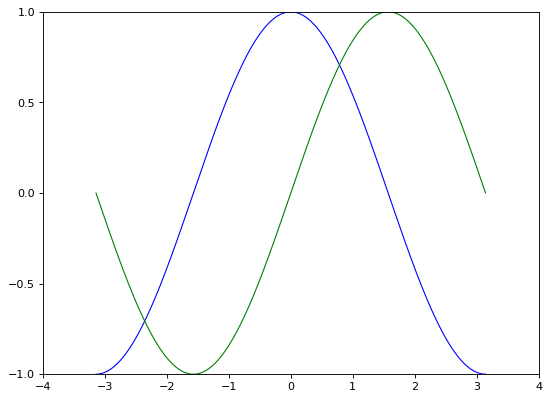


We can also change the attributes of the graph


```python
plt.figure(figsize=(10, 6), dpi=80)

plt.plot(X, C, color="blue", linewidth=2.5, linestyle="-.")
plt.plot(X, S, color="red",  linewidth=2.5, linestyle="-")

```


    [<matplotlib.lines.Line2D at 0x7f5c55033b00>]


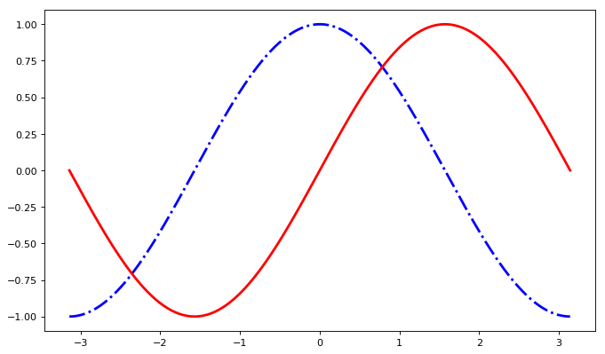


#### Setting limits

Current limits of the figure are a bit too tight and we want to make some space in order to clearly see all data points


```python
plt.xlim(X.min() * 1.1, X.max() * 1.1)
plt.ylim(C.min() * 1.1, C.max() * 1.1)

plt.plot(X, C, color="blue", linewidth=2.5, linestyle="-")
plt.plot(X, S, color="red",  linewidth=2.5, linestyle="-")
```


    [<matplotlib.lines.Line2D at 0x7f5c54fc49b0>]


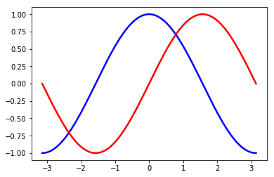


#### Setting ticks

Current ticks are not ideal because they do not show the interesting values (+/-π,+/-π/2) for sine and cosine. We’ll change them such that they show only these values.


```python
plt.xticks([-np.pi, -np.pi/2, 0, np.pi/2, np.pi])
plt.yticks([-1, 0, +1])
plt.plot(X, C, color="blue", linewidth=2.5, linestyle="-")
plt.plot(X, S, color="red",  linewidth=2.5, linestyle="-")
```


    [<matplotlib.lines.Line2D at 0x7f5c54f344e0>]


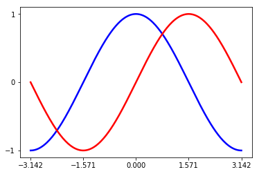


```python
t = 2 * np.pi / 3
plt.plot([t, t], [0, np.cos(t)], color='blue', linewidth=2.5, linestyle="--")
plt.scatter([t, ], [np.cos(t), ], 50, color='blue')

plt.annotate(r'$cos(\frac{2\pi}{3})=-\frac{1}{2}$',
             xy=(t, np.cos(t)), xycoords='data',
             xytext=(-90, -50), textcoords='offset points', fontsize=16,
             arrowprops=dict(arrowstyle="->", connectionstyle="arc3,rad=.2"))

plt.plot([t, t],[0, np.sin(t)], color='red', linewidth=2.5, linestyle="--")
plt.scatter([t, ],[np.sin(t), ], 50, color='red')

plt.annotate(r'$sin(\frac{2\pi}{3})=\frac{\sqrt{3}}{2}$',
             xy=(t, np.sin(t)), xycoords='data',
             xytext=(+10, +30), textcoords='offset points', fontsize=16,
             arrowprops=dict(arrowstyle="->", connectionstyle="arc3,rad=.2"))
plt.plot(X, C, color="blue", linewidth=2.5, linestyle="-")
plt.plot(X, S, color="red",  linewidth=2.5, linestyle="-")
```


    [<matplotlib.lines.Line2D at 0x7f5c54d06160>]


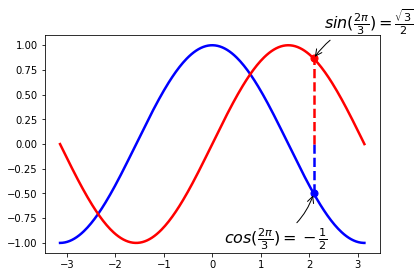


```python
ax = plt.gca()  # gca stands for 'get current axis'
ax.spines['right'].set_color('none')
ax.spines['top'].set_color('none')
ax.xaxis.set_ticks_position('bottom')
ax.spines['bottom'].set_position(('data',0))
ax.yaxis.set_ticks_position('left')
ax.spines['left'].set_position(('data',0))

plt.plot(X, C, color="blue", linewidth=2.5, linestyle="-.")
plt.plot(X, S, color="red",  linewidth=2.5, linestyle="-")
```


    [<matplotlib.lines.Line2D at 0x7f5c55201da0>]


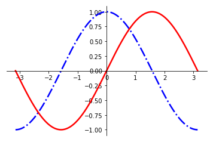


#### Adding a legend


```python
ax = plt.gca()  # gca stands for 'get current axis'
ax.spines['right'].set_color('none')
ax.spines['top'].set_color('none')
ax.xaxis.set_ticks_position('bottom')
ax.spines['bottom'].set_position(('data',0))
ax.yaxis.set_ticks_position('left')
ax.spines['left'].set_position(('data',0))
plt.plot(X, C, color="blue", linewidth=2.5, linestyle="-.", label="cosine")
plt.plot(X, S, color="red",  linewidth=2.5, linestyle="-", label="sine")

plt.legend(loc='upper left')

```


    <matplotlib.legend.Legend at 0x7f5c55176e10>


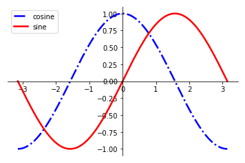


## Figures, Subplots, Axes and Ticks

#### Figures 
A “figure” in matplotlib means the whole window in the user interface. Within this figure there can be “subplots”.
A figure is the windows in the GUI that has “Figure #” as title. Figures are numbered starting from 1 as opposed to the normal Python way starting from 0. This is clearly MATLAB-style. There are several parameters that determine what the figure looks like:

| Argument  	| Default          	| Description                                 	|
|-----------	|------------------	|---------------------------------------------	|
| num       	| 1                	| number of figure                            	|
| figsize   	| figure.figsize   	| figure size in inches (width, height)       	|
| dpi       	| figure.dpi       	| resolution in dots per inch                 	|
| facecolor 	| figure.facecolor 	| color of the drawing background             	|
| edgecolor 	| figure.edgecolor 	| color of edge around the drawing background 	|
| frameon   	| True             	| draw figure frame or not                    	|

The defaults can be specified in the resource file and will be used most of the time. Only the number of the figure is frequently changed.

As with other objects, you can set figure properties also setp or with the set_something methods.

When you work with the GUI you can close a figure by clicking on the x in the upper right corner. But you can close a figure programmatically by calling close. Depending on the argument it closes (1) the current figure (no argument), (2) a specific figure (figure number or figure instance as argument), or (3) all figures ("all" as argument).


```python
plt.close(1)  
```

#### Subplots

With subplot you can arrange plots in a regular grid. You need to specify the number of rows and columns and the number of the plot. Note that the gridspec command is a more powerful alternative.


```python
x = np.arange(0, 3 * np.pi, 0.1)
y_sin = np.sin(x)
y_cos = np.cos(x)

# Set up a subplot grid that has height 2 and width 1,
# and set the first such subplot as active.
plt.subplot(2, 1, 1)

# Make the first plot
plt.plot(x, y_sin)
plt.title('Sine')

# Set the second subplot as active, and make the second plot.
plt.subplot(2, 1, 2)
plt.plot(x, y_cos)
plt.title('Cosine')

# Show the figure.
plt.show()
```


```python
# Set up a subplot grid that has height 2 and width 1,
# and set the first such subplot as active.
plt.subplot(2, 1, 1)

# Make the first plot
plt.plot(x, y_sin)
plt.title('Sine')

# Set the second subplot as active, and make the second plot.
plt.subplot(2, 1, 2)
plt.plot(x, y_cos)
plt.title('Cosine')

# Show the figure.
plt.show()
```


### Set up a subplot grid that has height 2 and width 1,
# and set the first such subplot as active.
plt.subplot(1, 2, 1)

# Make the first plot
plt.plot(x, y_sin)
plt.title('Sine')

# Set the second subplot as active, and make the second plot.
plt.subplot(1, 2, 2)
plt.plot(x, y_cos)
plt.title('Cosine')

# Show the figure.
plt.show()


```python
# Set up a subplot grid that has height 2 and width 1,
# and set the first such subplot as active.
plt.subplot(2, 2, 1)

# Make the first plot
plt.plot(x, y_sin)
plt.title('Sine')

# Set the second subplot as active, and make the second plot.
plt.subplot(2, 2, 2)
plt.plot(x, y_cos)
plt.title('Cosine')

a = np.linspace(-1, 1, num=100)
y_arcsin = np.arcsin(a)
y_arccos = np.arccos(a)

plt.subplot(2, 2, 3)
plt.plot(a, y_arcsin)
plt.title('arcsin')

plt.subplot(2, 2, 4)
plt.plot(a, y_arccos)
plt.title('arccos')

# Show the figure.
plt.show()
```


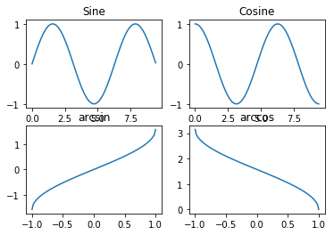


#### Axes

Axes are very similar to subplots but allow placement of plots at any location in the figure. So if we want to put a smaller plot inside a bigger one we do so with axes.

#### Ticks

Well formatted ticks are an important part of publishing-ready figures. Matplotlib provides a totally configurable system for ticks. There are tick locators to specify where ticks should appear and tick formatters to give ticks the appearance you want. Major and minor ticks can be located and formatted independently from each other. Per default minor ticks are not shown, i.e. there is only an empty list for them because it is as NullLocator

##### Tick Locators

Tick locators control the positions of the ticks. They are set as follows:

```
ax = plt.gca()
ax.xaxis.set_major_locator(eval(locator))
```

There are several locators for different kind of requirements:

- NullLocator()
- MultipleLocator()
- FixedLocator()
- IndexLocator()
- LinearLocator()
- LogLocator()
- AutoLocator()

All of these locators derive from the base class matplotlib.ticker.Locator. You can make your own locator deriving from it. Handling dates as ticks can be especially tricky. Therefore, matplotlib provides special locators in matplotlib.dates.

### Plots


```python
n = 256
X = np.linspace(-np.pi, np.pi, n, endpoint=True)
Y = np.sin(2 * X)

plt.plot(X, Y + 1, color='blue', alpha=1.00)
plt.plot(X, Y - 1, color='blue', alpha=1.00)
```


    [<matplotlib.lines.Line2D at 0x7f5c549d7f98>]


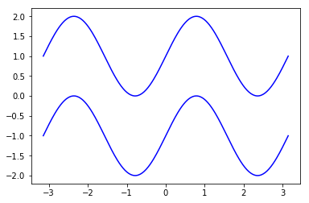


##### Plots with fill


```python
x = np.arange(0.0, 2, 0.01)
y1 = np.sin(2*np.pi*x)
y2 = 1.2*np.sin(4*np.pi*x)

fig, (ax1, ax2, ax3) = plt.subplots(3, 1, sharex=True)

ax1.fill_between(x, 0, y1)
ax1.set_ylabel('between y1 and 0')

ax2.fill_between(x, y1, 1)
ax2.set_ylabel('between y1 and 1')

ax3.fill_between(x, y1, y2)
ax3.set_ylabel('between y1 and y2')
ax3.set_xlabel('x')
plt.show()
```


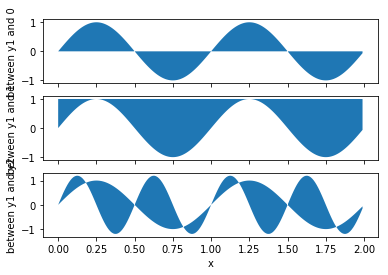


### Scatter Plots


```python
n = 1024
X = np.random.normal(0,1,n)
Y = np.random.normal(0,1,n)

plt.scatter(X,Y)
```


    <matplotlib.collections.PathCollection at 0x7f5c5498fe80>


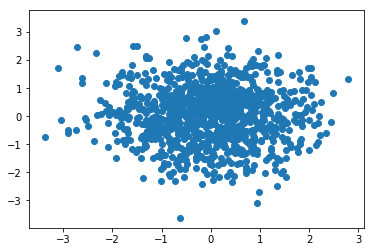


```python
# with colors
import numpy as np
import matplotlib.pyplot as plt

n = 1024
X = np.random.normal(0, 1, n)
Y = np.random.normal(0, 1, n)
T = np.arctan2(Y, X)
print(t)
plt.axes([0.025, 0.025, 0.95, 0.95])
plt.scatter(X, Y, s=75, c=T, alpha=.5)

plt.xlim(-1.5, 1.5)
plt.xticks(())
plt.ylim(-1.5, 1.5)
plt.yticks(())

plt.show()
```

    2.0943951023931953


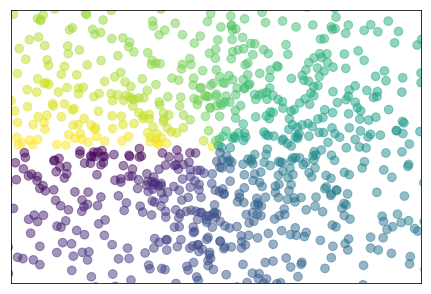


### Bar Plots


```python
import numpy as np
import matplotlib.pyplot as plt

n = 12
X = np.arange(n)
Y1 = (1 - X / float(n)) * np.random.uniform(0.5, 0.7, n)
Y2 = (1 - X / float(n)) * np.random.uniform(0.5, 1.0, n)

plt.axes([0.025, 0.025, 0.95, 0.95])
plt.bar(X, +Y1, facecolor='#9999ff', edgecolor='white')
plt.bar(X, -Y2, facecolor='#ff9999', edgecolor='white')

for x, y in zip(X, Y1):
    plt.text(x + 0.4, y + 0.05, '%.2f' % y, ha='center', va= 'bottom')

for x, y in zip(X, Y2):
    plt.text(x + 0.4, -y - 0.05, '%.2f' % y, ha='center', va= 'top')

plt.xlim(-.5, n)
plt.xticks(())
plt.ylim(-1.25, 1.25)
plt.yticks(())

plt.show()
```


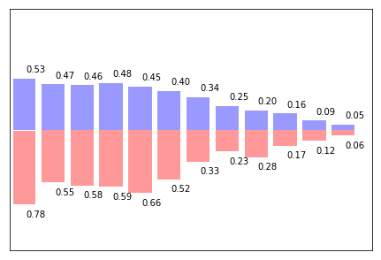


### Contour Plots


```python
import numpy as np
import matplotlib.pyplot as plt

def f(x,y):
    return (1 - x / 2 + x**5 + y**3) * np.exp(-x**2 -y**2)

n = 256
x = np.linspace(-3, 3, n)
y = np.linspace(-3, 3, n)
X,Y = np.meshgrid(x, y)

plt.axes([0.025, 0.025, 0.95, 0.95])

plt.contourf(X, Y, f(X, Y), 8, alpha=.75, cmap=plt.cm.hot)
C = plt.contour(X, Y, f(X, Y), 8, colors='black', linewidth=.5)
plt.clabel(C, inline=1, fontsize=10)

plt.xticks(())
plt.yticks(())
plt.show()
```

    /home/mayank/.local/lib64/python3.6/site-packages/matplotlib/contour.py:967: UserWarning: The following kwargs were not used by contour: 'linewidth'
      s)


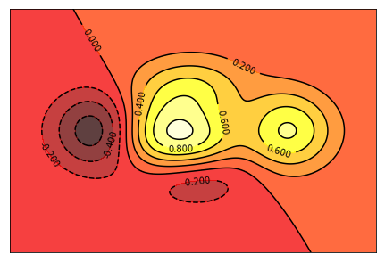


## References 
- http://www.scipy-lectures.org/intro/matplotlib/matplotlib.html
- https://stackoverflow.com/questions/35318650/runtimewarning-invalid-value-encountered-in-arccos
