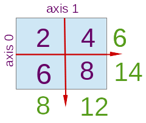

# Numpy 

NumPy is a Python library, which is mainly used for scientific computing. It contains a collection of tools and techniques that can be used to resolve number of problems in scientific computing. 

It also provides a high-performance multidimensional array object, and tools for working with these arrays.

As its not a core python library, it needs to be installed. It can be installed using `pip` utility

$:> pip install numpy --user

To use Numpy, we first need to import the numpy package:


```python
import numpy as np
```

## Arrays or N-Dimension Array

One of tools provided by NumPy is ndarray. It is high-performance multidimensional array object that is a powerful data structure for efficient computation of arrays and matrices. To work with these arrays, there’s a huge amount of high-level mathematical functions operate on these matrices and arrays.

In other words, numpy array is a n dimentional grid of same data type values and is indexed by a tuple of non-negative integers. 

- **Rank** of the array: The number of dimenstions
- **Shape** of an array: Tuple of integers giving the size of the array along each dimension.


```python
a = np.array([1, 4, 5, 66, 77, 334], float)
print(type(a), a.shape)
print( a)
a[0] = 125 + 1/4 
print( a)
```

    <class 'numpy.ndarray'> (6,)
    [   1.    4.    5.   66.   77.  334.]
    [ 125.25    4.      5.     66.     77.    334.  ]


```python
am = np.array([[3,5,7,9], [2, 4, 5, 6]], float)
print(type(am), am.shape)
print(am)
```

    <class 'numpy.ndarray'> (2, 4)
    [[ 3.  5.  7.  9.]
     [ 2.  4.  5.  6.]]


```python
am3= np.array([[3,5,7,9], [2, 4, 5, 6], [2, 6, 10, 14]], float)
print(type(am3), am3.shape)
print(am3)
```

    <class 'numpy.ndarray'> (3, 4)
    [[  3.   5.   7.   9.]
     [  2.   4.   5.   6.]
     [  2.   6.  10.  14.]]


```python
am3= np.array([[3,5,7,9], [2, 4, 5, 6], [2, 6, 10, 23]], int)
print(type(am3), am3.shape)
print(am3)
```

    <class 'numpy.ndarray'> (3, 4)
    [[ 3  5  7  9]
     [ 2  4  5  6]
     [ 2  6 10 23]]


### Initialize ndarray

numpy arrays can be initialize using nested Python lists, and elements can be accessed using square brackets, similar to python nested lists.


```python
import numpy as np

a = np.array(range(2,20,4))   # Create a rank 1 array
print(type(a))            # Prints "<class 'numpy.ndarray'>"
print(a.shape)

for i in a:
    print(i, end=", ")  
print()

b = np.array([[2, 4, 6], 
              [11, 13, 15]])    # Create a rank 2 array
print(b.shape)                     
print(b[0, 0], b[0, 1], b[1, 0])   

c = np.array([[[2, 4], [6, 8]], 
              [[11, 13], [15, 17]], 
              [[111, 113], [115, 117]]])    # Create a rank 3 array
print(c.shape)
```

    <class 'numpy.ndarray'>
    (5,)
    2, 6, 10, 14, 18, 
    (2, 3)
    2 4 11
    (3, 2, 2)


```python
b = np.array([[2, [4], 6], 
              [11, [13], 15]]) 
```


    ---------------------------------------------------------------------------

    ValueError                                Traceback (most recent call last)

    <ipython-input-21-c8950c85be4c> in <module>()
          1 b = np.array([[2, [4], 6], 
    ----> 2               [11, [13], 15]]) 
    

    ValueError: setting an array element with a sequence.


above failed as all the elements were not of same data type

### Other ways to create narray

Numpy also provides many other functions to create arrays


```python
a = np.zeros((2,4))   # Create an array of all zeros
print(a)              

print("*"*30)
b = np.ones((1, 4 , 2))    # Create an array of all ones
print(b)              

print("*"*30)
c = np.full((2,5), 101)  # Create a constant array
print(c)     

print("*"*30)
d = np.eye(5)         # Create an identity matrix
print(d)              

print("*"*30)
e = np.random.random((1, 4))  # Create an array filled with random values
print(e)    
            
print("*"*30)
e = np.random.random((2, 4))  # Create an array filled with random values
print(e)    
```

    [[ 0.  0.  0.  0.]
     [ 0.  0.  0.  0.]]
    ******************************
    [[[ 1.  1.]
      [ 1.  1.]
      [ 1.  1.]
      [ 1.  1.]]]
    ******************************
    [[101 101 101 101 101]
     [101 101 101 101 101]]
    ******************************
    [[ 1.  0.  0.  0.  0.]
     [ 0.  1.  0.  0.  0.]
     [ 0.  0.  1.  0.  0.]
     [ 0.  0.  0.  1.  0.]
     [ 0.  0.  0.  0.  1.]]
    ******************************
    [[ 0.14647399  0.50898243  0.33317223  0.44465891]]
    ******************************
    [[ 0.64268132  0.94310808  0.43606459  0.2647407 ]
     [ 0.68878914  0.00351772  0.45044272  0.73452985]]


### Array indexing

Numpy offers several ways to index into arrays.

#### Slicing 
numpy arrays can also be sliced, similar to Python lists. Since arrays may be multidimensional, slice for each dimension of the array needs to be provided.


```python
b = np.array([[2, 4, 6], [11, 13, 15], [112, 114, 116], [222, 444, 666]])    # Create a rank 2 array
print(b.shape)  
b2 = b[1 : 2]
print(b2)

b3 = b[1 : 3 ]
print(b3)


b21 = b[1 : 2][0][0]
print(b21)

```

    (4, 3)
    [[11 13 15]]
    [[ 11  13  15]
     [112 114 116]]
    11


the last example does not look that convinent, so lets try the following one


```python
print(b[1:2, 0])
print(b[1:2, :1])
print(b[1:2, ::2])
print(b[1:2, :])
```

    [11]
    [[11]]
    [[11 15]]
    [[11 13 15]]


```python
ar = np.random.random((4, 2, 3))
print(ar)
print(ar.shape)
```

    [[[ 0.78155547  0.53826601  0.09531976]
      [ 0.98980317  0.86689664  0.36229961]]
    
     [[ 0.4992801   0.46200014  0.06354446]
      [ 0.81296965  0.64600616  0.131951  ]]
    
     [[ 0.59257305  0.81722561  0.54578791]
      [ 0.66044111  0.26211378  0.40707875]]
    
     [[ 0.96219847  0.1613063   0.189287  ]
      [ 0.0524492   0.72456332  0.63874431]]]
    (4, 2, 3)


```python
t1 = ar[1: 2]
print(t1)
print(t1.shape)
```

    [[[ 0.4992801   0.46200014  0.06354446]
      [ 0.81296965  0.64600616  0.131951  ]]]
    (1, 2, 3)


#### Integer array indexing: 
When you index into numpy arrays using slicing, the resulting array view will always be a subarray of the original array. In contrast, integer array indexing allows you to construct arbitrary arrays using the data from another array. Here is an example:


```python
a = np.array([[1, 2], [3, 4], [5, 6]])
print(a)
print("*"*20)
# print(a.shape)
# print("*"*20)
# An example of integer array indexing.
# The returned array will have shape (3,) and
print(a[[0, 1, 2], [0, 1, 0]])  # Prints "[1 4 5]"
print("*"*20)
print(a[0, 0])
print(a[1, 1])
print(a[2, 0])
print("*"*20)
# The above example of integer array indexing is equivalent to this:
print(np.array([a[0, 0], a[1, 1], a[2, 0]]))  # Prints "[1 4 5]"
print("*"*20)
# When using integer array indexing, you can reuse the same
# element from the source array:
print(a[[0, 0], [1, 1]])  # Prints "[2 2]"
print("*"*20)
# Equivalent to the previous integer array indexing example
print(np.array([a[0, 1], a[0, 1]]))  # Prints "[2 2]"
```

    [[1 2]
     [3 4]
     [5 6]]
    ********************
    [1 4 5]
    ********************
    1
    4
    5
    ********************
    [1 4 5]
    ********************
    [2 2]
    ********************
    [2 2]


One useful trick with integer array indexing is selecting or mutating one element from each row of a matrix:


```python
import numpy as np

# Create a new array from which we will select elements
a = np.array([[1,2,3], [4,5,6], [7,8,9], [10, 11, 12]])

print(a)

# Create an array of indices
b = np.array([0, 2, 0, 1])

# Select one element from each row of a using the indices in b
print(a[np.arange(4), b])  

# Mutate one element from each row of a using the indices in b
a[np.arange(4), b] += 10

print(a)
```

    [[ 1  2  3]
     [ 4  5  6]
     [ 7  8  9]
     [10 11 12]]
    [ 1  6  7 11]
    [[11  2  3]
     [ 4  5 16]
     [17  8  9]
     [10 21 12]]


#### Boolean array indexing:
Boolean array indexing lets you pick out arbitrary elements of an array. Frequently this type of indexing is used to select the elements of an array that satisfy some condition. Here is an example:


```python
import numpy as np

a = np.array([[1,2], [3, 4], [5, 6]])

bool_idx = (a > 2)   # Find the elements of a that are bigger than 2;
                     # this returns a numpy array of Booleans of the same
                     # shape as a, where each slot of bool_idx tells
                     # whether that element of a is > 2.

print(bool_idx)

# We use boolean array indexing to construct a rank 1 array
# consisting of the elements of a corresponding to the True values
# of bool_idx
print(a[bool_idx])

# We can do all of the above in a single concise statement:
print(a[a > 2])
```

    [[False False]
     [ True  True]
     [ True  True]]
    [3 4 5 6]
    [3 4 5 6]


```python
am = np.array([[3,5,7,9], [2, 4, 5, 6.101]])
bool_idx2 = (am > 5)
print(bool_idx2)
print(am[bool_idx2])
```

    [[False False  True  True]
     [False False False  True]]
    [ 7.     9.     6.101]


```python
am = np.array([[3,5,7,9], [2, 4, 5, 6]], int)
bool_idx2 = (am >= 5)
print(bool_idx2)
print(am[bool_idx2])
```

    [[False  True  True  True]
     [False False  True  True]]
    [5 7 9 5 6]


```python
print(am[am >= 5])
```

    [5 7 9 5 6]


## Datatypes

Every numpy array is a grid of elements of the same type. Numpy provides a large set of numeric datatypes that you can use to construct arrays. Numpy tries to guess a datatype when you create an array, but functions that construct arrays usually also include an optional argument to explicitly specify the datatype. Here is an example:


```python
import numpy as np

x = np.array([1, 2])   # Let numpy choose the datatype
print(x.dtype)         

x = np.array([1.0, 2.0])   # Let numpy choose the datatype
print(x.dtype)             

x = np.array([1, 2], dtype=np.int64)   # Force a particular datatype
print(x.dtype)

```

    int64
    float64
    int64


A data type object represent, fixed block of memory corresponding to an array, depending on the following aspects:
* Size of data
* Type of data (integer, float or Python object)
* Byte order (little-endian or big-endian)
* In case of custom type, the name & data type of each field and part of the memory block taken by each field
* If data type is a subarray, its shape and data type

Numpy supports following data types, some of them might not be present in python.

**Data Types**|**Description**|**Range**|
:-----:|:-----:|:-----:|
bool\_|Boolean (True or False) stored as a byte| 0 1
int\_|Default integer type (same as C long; normally either int64 or int32)|
intc| Identical to C int (normally int32 or int64)|
intp| Integer used for indexing (same as C ssize\_t; normally either int32 or int64)|
int8| Byte | (-128 to 127)
int16| Integer | (-32768 to 32767)
int32| Integer | (-2147483648 to 2147483647)
int64| Integer |(-9223372036854775808 to 9223372036854775807)|
uint8| Unsigned integer |(0 to 255)|
uint16| Unsigned integer |(0 to 65535)|
uint32| Unsigned integer |(0 to 4294967295)|
uint64| Unsigned integer |(0 to 18446744073709551615)|
float\_| Shorthand for float64||
float16| Half precision float: sign bit, 5 bits exponent, 10 bits mantissa||
float32| Single precision float: sign bit, 8 bits exponent, 23 bits mantissa| |
float64| Double precision float: sign bit, 11 bits exponent, 52 bits mantissa||
complex\_|Shorthand for complex128||
complex64| Complex number, represented by two 32-bit floats (real and imaginary components)||
complex128| Complex number, represented by two 64-bit floats (real and imaginary components)||

built-in data type has a character code that uniquely identifies it. 

| Char code 	| Data Types               	|
|----------	|------------------------	|
| 'b'      	| boolean                	|
| 'i'      	| (signed) integer       	|
| 'u'      	| unsigned integer       	|
| 'f'      	| floating-point         	|
| 'c'      	| complex-floating point 	|
| 'm'      	| timedelta              	|
| 'M'      	| datetime               	|
| 'O'      	| (Python) objects       	|
| 'S', 'a' 	| (byte-)string          	|
| 'U'      	| Unicode                	|
| 'V'      	| raw data (void)        	|


```python
dt = np.dtype('i1')
print(dt)
dt = np.dtype('i2')
print(dt)
dt = np.dtype('i4')
print(dt)
dt = np.dtype('i8')
print(dt)
```

    int8
    int16
    int32
    int64


```python
dt = np.dtype([('we will be using this user later in our examples.','a128')])
print(dt)
```

    [('we will be using this user later in our examples.', 'S128')]


```python
user=np.dtype([('first_name','S30'), ('last_name','S30'), ('pay', 'i2'), ('designation_id', 'f2')])
print(user)
```

    [('first_name', 'S30'), ('last_name', 'S30'), ('pay', '<i2'), ('designation_id', '<f2')]


```python
a4 = np.array([[1, 3, 2], [1, 4, 5]],  dtype=np.int8)
print(a4)
```

    [[1 3 2]
     [1 4 5]]


```python
a4 = np.array([[1, 3, 2], [1, 4, 5]],  dtype=np.float)
print(a4)
```

    [[ 1.  3.  2.]
     [ 1.  4.  5.]]


```python
# TODO How much memory space a variable is taking
```

### Array math

In numpy standard mathematical operations when used with arrays, operate at element level, which makes it mandetory that the  arrays  should  be  the  same  size.


```python
import numpy as np

x = np.array([[1,2],[3,4]], dtype=np.float64)
y = np.array([[5,6],[7,8]], dtype=np.float64)
print(x)
print(y)
```

    [[ 1.  2.]
     [ 3.  4.]]
    [[ 5.  6.]
     [ 7.  8.]]


```python
print(x + y)
print(np.add(x, y))
```

    [[  6.   8.]
     [ 10.  12.]]
    [[  6.   8.]
     [ 10.  12.]]


```python
print(x - y)
print(np.subtract(x, y))
```

    [[-4. -4.]
     [-4. -4.]]
    [[-4. -4.]
     [-4. -4.]]


```python
print(x * y)
print(np.multiply(x, y))
```

    [[  5.  12.]
     [ 21.  32.]]
    [[  5.  12.]
     [ 21.  32.]]


```python
print(x / y)
print(np.divide(x, y))
```

    [[ 0.2         0.33333333]
     [ 0.42857143  0.5       ]]
    [[ 0.2         0.33333333]
     [ 0.42857143  0.5       ]]


```python
print(np.sqrt(x))
```

    [[ 1.          1.41421356]
     [ 1.73205081  2.        ]]


```python
am = np.array([[3,5,7,9], [2, 4, 5, 6], [12, 14, 15, 6]], float)
print(am)
print(am.shape)

am1 = np.array([[3,5,7,9], [2, 4, 5, 6]], float)
print(am1)
print(am1.shape)
```

    [[  3.   5.   7.   9.]
     [  2.   4.   5.   6.]
     [ 12.  14.  15.   6.]]
    (3, 4)
    [[ 3.  5.  7.  9.]
     [ 2.  4.  5.  6.]]
    (2, 4)


In the above examples am and am1 are of different shapes, thus any maths operation performed will result in failure as shown in the below maths operations.


```python
am + am1
```


    ---------------------------------------------------------------------------

    ValueError                                Traceback (most recent call last)

    <ipython-input-107-0edb45543ca5> in <module>()
    ----> 1 am + am1
    

    ValueError: operands could not be broadcast together with shapes (3,4) (2,4) 


```python
am - am1
```


    ---------------------------------------------------------------------------

    ValueError                                Traceback (most recent call last)

    <ipython-input-108-943550f81a9a> in <module>()
    ----> 1 am - am1
    

    ValueError: operands could not be broadcast together with shapes (3,4) (2,4) 


```python
am * am1
```


    ---------------------------------------------------------------------------

    ValueError                                Traceback (most recent call last)

    <ipython-input-109-5f7d2bc0cdec> in <module>()
    ----> 1 am * am1
    

    ValueError: operands could not be broadcast together with shapes (3,4) (2,4) 


Now, lets update the arrays with similar shape and observe the standard maths operations.


```python
am = np.array([[2, 4, 5, 6], [12, 14, 15, 6]], float)
print(am)
print(am.shape)

am1 = np.array([[3,5,7,9], [2, 4, 5, 6]], float)
print(am1)
print(am1.shape)
```

    [[  2.   4.   5.   6.]
     [ 12.  14.  15.   6.]]
    (2, 4)
    [[ 3.  5.  7.  9.]
     [ 2.  4.  5.  6.]]
    (2, 4)


```python
am + am1
```


    array([[  5.,   9.,  12.,  15.],
           [ 14.,  18.,  20.,  12.]])


```python
am - am1
```


    array([[ -1.,  -1.,  -2.,  -3.],
           [ 10.,  10.,  10.,   0.]])


```python
am * am1
```


    array([[  6.,  20.,  35.,  54.],
           [ 24.,  56.,  75.,  36.]])


```python
am ** am1
```


    array([[  8.00000000e+00,   1.02400000e+03,   7.81250000e+04,
              1.00776960e+07],
           [  1.44000000e+02,   3.84160000e+04,   7.59375000e+05,
              4.66560000e+04]])


```python
am % am1
```


    array([[ 2.,  4.,  5.,  6.],
           [ 0.,  2.,  0.,  0.]])


```python
am / am1
```


    array([[ 0.66666667,  0.8       ,  0.71428571,  0.66666667],
           [ 6.        ,  3.5       ,  3.        ,  1.        ]])


```python
a = np.array([[1, 2 , 3], [3, 4, 3], [5, 6, 5]], float)
b = np.array([-1, 3, 3], float)
print(a.shape)
print(b.shape)
```

    (3, 3)
    (3,)


```python
a + b
```


    array([[ 0.,  5.,  6.],
           [ 2.,  7.,  6.],
           [ 4.,  9.,  8.]])


but, following example will fail.


```python
a = np.array([[1, 2 , 3], [3, 4, 3], [5, 6, 5]], float)
b = np.array([[-1, 3, 3], [-1, 3, 3]], float)
print(a.shape)
print(b.shape)
```

    (3, 3)
    (2, 3)


```python
a+b
```


    ---------------------------------------------------------------------------

    ValueError                                Traceback (most recent call last)

    <ipython-input-12-ca730b97bf8a> in <module>()
    ----> 1 a+b
    

    ValueError: operands could not be broadcast together with shapes (3,3) (2,3) 


in order for the 'a' to work they should be something similar to below example


```python
a = np.array([[[1, 2 , 3], [3, 4, 3]], [[5, 6, 5], [6,7,6]]], float)
b = np.array([[-1, 3, 3], [-1, 3, 3]], float)
print(a.shape)
print(b.shape)
```

    (2, 2, 3)
    (2, 3)


and the below code will work without any issue as smaller array can be repeated on the larger array.


```python
a + b
```


    array([[[  0.,   5.,   6.],
            [  2.,   7.,   6.]],
    
           [[  4.,   9.,   8.],
            [  5.,  10.,   9.]]])


```python
a = np.array([[[1, 2 , 3], [3, 4, 3]], [[5, 6, 5], [6,7,6]]], float)
b = np.array([[2, 3, 3], [ 1, 5, 1]], float)
print(a.shape)
print(b.shape)
```

    (2, 2, 3)
    (2, 3)


```python
a + b
```


    array([[[  3.,   5.,   6.],
            [  4.,   9.,   4.]],
    
           [[  7.,   9.,   8.],
            [  7.,  12.,   7.]]])


Numpy also offers large  library  of  common  mathematical functions  that  can  be  applied elementwise to  arrays.

Some of the other maths related functions are as follows: 

```abs, sign, sqrt, exp, (log, log10), (sin,  cos,  tan,  arcsin,  arccos, arctan), (sinh, cosh, tanh, arcsinh, arccosh and arctanh).```


```python
np.sqrt(a)
```


```python
np.sqrt(a + b)
```


    array([[[ 0.        ,  2.23606798,  2.44948974],
            [ 1.41421356,  2.64575131,  2.44948974]],
    
           [[ 2.        ,  3.        ,  2.82842712],
            [ 2.23606798,  3.16227766,  3.        ]]])


Maths constants such as `pi` are also provided 


```python
print(np.pi)
print(np.e)
```

    3.141592653589793
    2.718281828459045


Numpy also provide functions to find the lower, upper, or nearest (rounded) integer through floor, ceil, and rint


```python
a = np.array([1, 4, 5, 66.50, 77.77, 334.22], float)
```


```python
print(a)
np.rint(a)
```

    [   1.      4.      5.     66.5    77.77  334.22]


    array([   1.,    4.,    5.,   66.,   78.,  334.])


```python
np.floor(a)
```


    array([   1.,    4.,    5.,   66.,   77.,  334.])


```python
np.ceil(a)
```


    array([   1.,    4.,    5.,   67.,   78.,  335.])


### Array iteration

Just like normal array np array's can also be iterated 


```python
for i in a:
    print(i, "....")
```

    1.0 ....
    4.0 ....
    5.0 ....
    66.5 ....
    77.77 ....
    334.22 ....


```python

```

    [ 2.  4.  5.  6.] ....
    [ 12.  14.  15.   6.] ....


for multi-dimensional array, multiple assinations is also available


```python
am = np.array([[2, 4, 5, 6], [12, 14, 15, 6]], float)
print(am)
print(am.shape)
```

    [[  2.   4.   5.   6.]
     [ 12.  14.  15.   6.]]
    (2, 4)


```python
for i in am:
    print(i, "....")
```

    [ 2.  4.  5.  6.] ....
    [ 12.  14.  15.   6.] ....


```python
am2 = np.array([[[2, 4],[ 5, 6]], [[12, 14], [15, 6]]], float)
print(am2)
print(am2.shape)
```

    [[[  2.   4.]
      [  5.   6.]]
    
     [[ 12.  14.]
      [ 15.   6.]]]
    (2, 2, 2)


```python
for i in am2:
    print(i, "....")
```

    [[ 2.  4.]
     [ 5.  6.]] ....
    [[ 12.  14.]
     [ 15.   6.]] ....


```python
for i, j , k, l in am:
    print(i, j, k, l)
```

    2.0 4.0 5.0 6.0
    12.0 14.0 15.0 6.0


This works; however when the matrix x is very large, computing an explicit loop in Python could be slow. Note that adding the vector v to each row of the matrix x is equivalent to forming a matrix vv by stacking multiple copies of v vertically, then performing elementwise summation of x and vv. We could implement this approach like this:


```python
import numpy as np

# We will add the vector v to each row of the matrix x,
# storing the result in the matrix y
x = np.array([[1, 2, 3], [4, 5, 6], [7, 8, 9], [10, 11, 12]])
v = np.array([1, 4, 2])
vv = np.tile(v, (4, 1))   # Stack 4 copies of v on top of each other
print(x)
print(vv)
print(vv.shape)
print(x.shape)
y = x + vv  # Add x and vv elementwise
print(y)
```

    [[ 1  2  3]
     [ 4  5  6]
     [ 7  8  9]
     [10 11 12]]
    [[1 4 2]
     [1 4 2]
     [1 4 2]
     [1 4 2]]
    (4, 3)
    (4, 3)
    [[ 2  6  5]
     [ 5  9  8]
     [ 8 12 11]
     [11 15 14]]


### broadcasting
Numpy broadcasting allows us to perform this computation without actually creating multiple copies of v. Consider this version, using broadcasting:


```python
y1 = x + v
print(y1)
```

    [[ 2  6  5]
     [ 5  9  8]
     [ 8 12 11]
     [11 15 14]]


Broadcasting two arrays together follows these rules:

- If the arrays do not have the same rank, prepend the shape of the lower rank array with 1s until both shapes have the same length.
- The two arrays are said to be compatible in a dimension if they have the same size in the dimension, or if one of the arrays has size 1 in that dimension.
- The arrays can be broadcast together if they are compatible in all dimensions.
- After broadcasting, each array behaves as if it had shape equal to the elementwise maximum of shapes of the two input arrays.
- In any dimension where one array had size 1 and the other array had size greater than 1, the first array behaves as if it were copied along that dimension


Functions that support broadcasting are known as universal functions. The list of all universal functions is listed at http://docs.scipy.org/doc/numpy/reference/ufuncs.html#available-ufuncs


```python
import numpy as np

# Compute outer product of vectors
v = np.array([1,2,3])  # v has shape (3,)
w = np.array([4,5])    # w has shape (2,)
# To compute an outer product, we first reshape v to be a column
# vector of shape (3, 1); we can then broadcast it against w to yield
# an output of shape (3, 2), which is the outer product of v and w:
# [[ 4  5]
#  [ 8 10]
#  [12 15]]
print(np.reshape(v, (3, 1)) * w)

# Add a vector to each row of a matrix
x = np.array([[1,2,3], [4,5,6]])
# x has shape (2, 3) and v has shape (3,) so they broadcast to (2, 3),
# giving the following matrix:
# [[2 4 6]
#  [5 7 9]]
print(x + v)

# Add a vector to each column of a matrix
# x has shape (2, 3) and w has shape (2,).
# If we transpose x then it has shape (3, 2) and can be broadcast
# against w to yield a result of shape (3, 2); transposing this result
# yields the final result of shape (2, 3) which is the matrix x with
# the vector w added to each column. Gives the following matrix:
# [[ 5  6  7]
#  [ 9 10 11]]
print((x.T + w).T)
# Another solution is to reshape w to be a column vector of shape (2, 1);
# we can then broadcast it directly against x to produce the same
# output.
print(x + np.reshape(w, (2, 1)))

# Multiply a matrix by a constant:
# x has shape (2, 3). Numpy treats scalars as arrays of shape ();
# these can be broadcast together to shape (2, 3), producing the
# following array:
# [[ 2  4  6]
#  [ 8 10 12]]
print(x * 2)


```

    [[ 4  5]
     [ 8 10]
     [12 15]]
    [[2 4 6]
     [5 7 9]]
    [[ 5  6  7]
     [ 9 10 11]]
    [[ 5  6  7]
     [ 9 10 11]]
    [[ 2  4  6]
     [ 8 10 12]]


Apart from computing mathematical functions using arrays, we frequently need to reshape or otherwise manipulate data in arrays. The simplest example of this type of operation is transposing a matrix; to transpose a matrix, simply use the T attribute of an array object:


```python
x = np.array([[1,2], [3,4]])
print(x)   
print(x.T) 

# Note that taking the transpose of a rank 1 array does nothing:
v = np.array([1,2,3])
print(v)   
print(v.T) 
```

    [[1 2]
     [3 4]]
    [[1 3]
     [2 4]]
    [1 2 3]
    [1 2 3]


*** reference *** - https://docs.scipy.org/doc/numpy/reference/routines.array-manipulation.html

### Broadcasting

Broadcasting is a powerful mechanism that allows numpy to work with arrays of different shapes when performing arithmetic operations. Frequently we have a smaller array and a larger array, and we want to use the smaller array multiple times to perform some operation on the larger array.

For example, suppose that we want to add a constant vector to each row of a matrix. We could do it like this:


```python
x = np.array([[1,2,3], [4,5,6], [7,8,9], [10, 11, 12]])
v = np.array([1, 0, 1])
y = np.empty_like(x)   # Create an empty matrix with the same shape as x

# Add the vector v to each row of the matrix x with an explicit loop
for i in range(4):
    y[i, :] = x[i, :] + v

# Now y is the following
# [[ 2  2  4]
#  [ 5  5  7]
#  [ 8  8 10]
#  [11 11 13]]
print(y)
```

    [[ 2  2  4]
     [ 5  5  7]
     [ 8  8 10]
     [11 11 13]]


```python
y2 = x + v
print(x)
print(v)
print(y2)
```

    [[ 1  2  3]
     [ 4  5  6]
     [ 7  8  9]
     [10 11 12]]
    [1 0 1]
    [[ 2  2  4]
     [ 5  5  7]
     [ 8  8 10]
     [11 11 13]]


### NumPy Array Comparisons

NumPy makes it possible to test to see if rows match certain values using mathematical comparison operations like <, >, >=, <=, and ==. 


```python
print(a)
```

    [ 125.25    4.      5.     66.     77.    334.  ]


```python
a > 67
```


    ---------------------------------------------------------------------------

    NameError                                 Traceback (most recent call last)

    <ipython-input-2-23c924e9ccf2> in <module>()
    ----> 1 a > 67
    

    NameError: name 'a' is not defined


```python
a = np.array([1, 3, 5, 7])
b = np.array([1, 3, 5, 7])
c = np.array([1, 3, 5, 2])
```


```python
print(a == b)
print(c == b)
print(c == a)
```

    [ True  True  True  True]
    [ True  True  True False]
    [ True  True  True False]


```python
print(a > b)
print(c > b)
print(c > a)
```

    [False False False False]
    [False False False False]
    [False False False False]


```python
print(a < b)
print(c < b)
print(c < a)
```

    [False False False False]
    [False False False  True]
    [False False False  True]


```python
print(a >= b)
print(c >= b)
print(c >= a)
```

    [ True  True  True  True]
    [ True  True  True False]
    [ True  True  True False]


```python
print(a <= b)
print(c <= b)
print(c <= a)
```

    [ True  True  True  True]
    [ True  True  True  True]
    [ True  True  True  True]


### Subsetting

One of the powerful things we can do with a Boolean array and a NumPy array is select only certain rows or columns in the NumPy array


```python
a_sub = a > 67
print(a_sub)
```

    [ True False False False  True  True]


```python
a[a_sub]
```


    array([ 125.25,   77.  ,  334.  ])


### Reshaping NumPy Arrays

We can change the shape of arrays while still preserving all of their elements. This often can make it easier to access array elements. The simplest reshaping is to flip the axes, so rows become columns, and vice versa. We can accomplish this with the numpy.transpose function:


```python
b = np.array([[1,2], [3, 4], [5, 6]])
np.transpose(b).shape
```


    (2, 3)


We can use the numpy.ravel function to turn an array into a one-dimensional representation. It will essentially flatten an array into a long sequence of values:


```python
b.ravel()
```


    array([1, 2, 3, 4, 5, 6])


the numpy.reshape function to reshape an array to a certain shape we specify. The below code will turn the second row of wines into a 2-dimensional array with 2 rows & 3 cols


```python
c = b.reshape((3,2))
print(c)
print(c.shape)
```

    [[1 2]
     [3 4]
     [5 6]]
    (3, 2)


```python
c = b.reshape((4,2))
print(c)
print(c.shape)
```


    ---------------------------------------------------------------------------

    ValueError                                Traceback (most recent call last)

    <ipython-input-12-ef09996f6fb5> in <module>()
    ----> 1 c = b.reshape((4,2))
          2 print(c)
          3 print(c.shape)


    ValueError: cannot reshape array of size 4 into shape (4,2)


### Transposition


```python
a = np.triu(np.ones((4,4)), 1)
print(a)
```

    [[ 0.  1.  1.  1.]
     [ 0.  0.  1.  1.]
     [ 0.  0.  0.  1.]
     [ 0.  0.  0.  0.]]


```python
print(a.T)
```

    [[ 0.  0.  0.  0.]
     [ 1.  0.  0.  0.]
     [ 1.  1.  0.  0.]
     [ 1.  1.  1.  0.]]


### Basic reductions

#### Computing sums


```python
a = np.array(range(10))
print(a)
```

    [0 1 2 3 4 5 6 7 8 9]


```python
print(a.sum())
```

    45


Now lets try to do get the sum for n-dimension array

sum by rows and by columns


```python
x = np.array([[2, 4], [6, 8]])
print(x)
print(x.sum())
```

    [[2 4]
     [6 8]]
    20


```python
print(x.sum(axis=0))
```

    [ 8 12]


```python
print(x.sum(axis=1))
```

    [ 6 14]





```python
x[0, :].sum(), x[1,:].sum()
```


    (6, 14)


```python
x[:, 0].sum(), x[:, 1].sum()
```


    (8, 12)


```python

```


    (6, 14)


```python
x = np.array([[2, 4], [6, 8], [1 , 5]])
print(x)
```

    [[2 4]
     [6 8]
     [1 5]]


```python
print(x.sum(axis=0))
```

    [ 9 17]


```python
print(x.sum(axis=1))
```

    [ 6 14  6]


```python
y = np.array([[[2, 4], [6, 8]], [[1 , 5], [1 , 15]]])
print(y)
```

    [[[ 2  4]
      [ 6  8]]
    
     [[ 1  5]
      [ 1 15]]]


```python
print(y.sum(axis=0))
```

    [[ 3  9]
     [ 7 23]]


```python
print(y.sum(axis=1))
```

    [[ 8 12]
     [ 2 20]]


```python
x = np.random.rand(2, 2, 3)*10
print(x)
```

    [[[ 4.53733078  7.38050142  5.51488971]
      [ 6.38019412  3.76131724  7.64801654]]
    
     [[ 7.47656767  9.01120173  0.349881  ]
      [ 7.41740176  6.69215165  2.61754218]]]


```python
print(x.sum())
print(x.sum(axis=1))
```

    68.7869958159
    [[ 10.91752491  11.14181866  13.16290624]
     [ 14.89396943  15.70335339   2.96742319]]


```python
print(x[1, :].sum())
print(x[0, :].sum())
```

    33.5647460075
    35.2222498084


We can also use the following method to get the same result


```python
np.array([x[:, 0].sum(), x[:, 1].sum()]).sum()
```


    68.786995815927668


```python
np.array([x[0, :].sum(), x[1, :].sum()]).sum()
```


    68.786995815927668


```python
# TODO : more examples on multi-D
```

#### Extrema (min, max, etc)


```python
import numpy as np
b = np.random.rand(3, 1, 2)*10
print(b)
```

    [[[ 7.28012284  3.18615262]]
    
     [[ 9.18929994  2.73890658]]
    
     [[ 4.26383595  5.60048526]]]


```python
b.min()
```


    2.7389065762210487


```python
b.max()
```


    9.1892999417563388


```python
b.argmin()  # index of minimum
```


    3


```python
b.argmax()  # index of max
```


    2


#### Logical operations


```python
np.all([True, True, False])
```


    False


```python
np.all([False, False, False])
```


    False


```python
np.all([True, True, True])
```


    True


```python
np.any([True, True, False])
```


    True


```python
np.any([False, False, False])
```


    False


```python
a = np.zeros((100, 100))
print(a)
```

    [[ 0.  0.  0. ...,  0.  0.  0.]
     [ 0.  0.  0. ...,  0.  0.  0.]
     [ 0.  0.  0. ...,  0.  0.  0.]
     ..., 
     [ 0.  0.  0. ...,  0.  0.  0.]
     [ 0.  0.  0. ...,  0.  0.  0.]
     [ 0.  0.  0. ...,  0.  0.  0.]]


```python
print(np.any(a != 0))
print(np.any(a == 0))
```

    False
    True


```python
np.all(a == a)
```


    True


**Note**: Can be used for array comparisons: 


```python
a = np.array([1, 2, 3, 2])

b = np.array([2, 2, 3, 2])

c = np.array([6, 4, 4, 5])

((a <= b) & (b <= c)).all()

```


    True


```python
((a >= b) & (b <= c)).all()
```


    False


```python
((a >= b) & (b <= c)).any()
```


    True


#### Statistics


```python
x = np.array(np.random.rand(2, 2, 3)*10)
y = np.array(np.random.rand(2, 2, 3)*10)
print(x)
print(y)
print(x.mean())
print(y.mean())

```

    [[[ 8.04840727  2.45848941  2.13539982]
      [ 3.48922146  1.95092419  3.01561347]]
    
     [[ 5.60602186  9.83606563  3.45536291]
      [ 8.54818995  3.30719269  1.54527984]]]
    [[[ 3.23962137  3.25418202  6.83652493]
      [ 2.05732429  8.01363681  6.35675476]]
    
     [[ 3.85630409  3.7020152   2.2975393 ]
      [ 0.41560379  4.27743096  7.57955114]]]
    4.44968070828
    4.32387405469


```python
print(np.median(x))
print(np.median(y))
```

    3.38127779973
    3.77915964744


```python
print(np.median(y, axis=-1))
```

    [[ 5.43602413  1.72147841]
     [ 5.96286507  5.06027396]]


```python
x.std()          # full population standard dev.
```


    2.6344958805512437


Return the cumulative sum of the elements along a given axis.
It returns A new array holding the result is returned unless out is specified, in which case a reference to out is returned. The result has the same size as a, and the same shape as a if axis is not None or a is a 1-d array.


```python
a = np.cumsum(x)
print(a)
```

    [  8.04840727  10.50689668  12.6422965   16.13151796  18.08244215
      21.09805562  26.70407748  36.54014311  39.99550602  48.54369597
      51.85088866  53.3961685 ]


```python
np.cumsum(x,axis=1) 
```


    array([[[  3.57556178,   0.77641016,   2.95258899],
            [  3.60388869,   9.59098697,   5.26336504]],
    
           [[  1.92607577,   5.24963225,   6.90350658],
            [  7.93717081,  11.70685295,  13.45036633]]])


```python
np.cumsum(a,axis=0) 
```


    array([   3.57556178,    7.92753372,   15.23209464,   22.56498248,
             38.71244713,   57.17068783,   77.55500429,  103.18895301,
            135.72640831,  174.27495865,  219.28072969,  270.83336047])


```python
!cat code/populations.txt
```

    # year	hare	lynx	carrot
    1900	30e3	4e3	48300
    1901	47.2e3	6.1e3	48200
    1902	70.2e3	9.8e3	41500
    1903	77.4e3	35.2e3	38200
    1904	36.3e3	59.4e3	40600
    1905	20.6e3	41.7e3	39800
    1906	18.1e3	19e3	38600
    1907	21.4e3	13e3	42300
    1908	22e3	8.3e3	44500
    1909	25.4e3	9.1e3	42100
    1910	27.1e3	7.4e3	46000
    1911	40.3e3	8e3	46800
    1912	57e3	12.3e3	43800
    1913	76.6e3	19.5e3	40900
    1914	52.3e3	45.7e3	39400
    1915	19.5e3	51.1e3	39000
    1916	11.2e3	29.7e3	36700
    1917	7.6e3	15.8e3	41800
    1918	14.6e3	9.7e3	43300
    1919	16.2e3	10.1e3	41300
    1920	24.7e3	8.6e3	47300


```python
data = np.loadtxt('code/populations.txt') 
```


```python
year, hares, lynxes, carrots = data.T  # trick: columns to variables
```


```python
from matplotlib import pyplot as plt
%matplotlib inline
plt.axes([0.2, 0.1, 0.5, 0.8]) 

plt.plot(year, hares, year, lynxes, year, carrots) 

plt.legend(('Hare', 'Lynx', 'Carrot'), loc=(1.05, 0.5))
```


    <matplotlib.legend.Legend at 0x7feb5f009048>


```python
populations = data[:, 1:]
populations.mean(axis=0)
```


    array([ 34080.95238095,  20166.66666667,  42400.        ])


```python
populations.std(axis=0)
```


    array([ 20897.90645809,  16254.59153691,   3322.50622558])


```python
#Which species has the highest population each year?:
np.argmax(populations, axis=1)
```


    array([2, 2, 0, 0, 1, 1, 2, 2, 2, 2, 2, 2, 0, 0, 0, 1, 2, 2, 2, 2, 2])


### Array shape manipulation

#### Flattening


```python
a = np.array([[1, 2, 3], [4, 5, 6]])
a.ravel()
```


    array([1, 2, 3, 4, 5, 6])


#### Reshaping


```python
print(a.shape)
b = a.ravel()
print(b)
b = b.reshape((2, 3))
print(b)
print( b.reshape((3,2)))
print( b.reshape((1,6)))
print( b.reshape((6, 1)))
```

    (2, 3)
    [1 2 3 4 5 6]
    [[1 2 3]
     [4 5 6]]
    [[1 2]
     [3 4]
     [5 6]]
    [[1 2 3 4 5 6]]
    [[1]
     [2]
     [3]
     [4]
     [5]
     [6]]


```python
print( b.reshape((2,2))) # should error out
```


    ---------------------------------------------------------------------------

    ValueError                                Traceback (most recent call last)

    <ipython-input-24-3bae625f7c33> in <module>()
    ----> 1 print( b.reshape((2,2))) # should error out
    

    ValueError: cannot reshape array of size 6 into shape (2,2)


```python
# Provide the reason for the error
```


```python
b[0, 0] = 9911
print(a)
```

    [[9911    2    3]
     [   4    5    6]]


#### Dimension shuffling


```python
a = np.arange(4*3*2).reshape(4, 3, 2)
print(a)
print(a.shape)
```

    [[[ 0  1]
      [ 2  3]
      [ 4  5]]
    
     [[ 6  7]
      [ 8  9]
      [10 11]]
    
     [[12 13]
      [14 15]
      [16 17]]
    
     [[18 19]
      [20 21]
      [22 23]]]
    (4, 3, 2)


```python
b = a.transpose(1, 2, 0)
print(b)
print(b.shape)
```

    [[[ 0  6 12 18]
      [ 1  7 13 19]]
    
     [[ 2  8 14 20]
      [ 3  9 15 21]]
    
     [[ 4 10 16 22]
      [ 5 11 17 23]]]
    (3, 2, 4)


### Resizing


```python
a = np.arange(4)
print(a)
```

    [0 1 2 3]


```python
a.resize((8,))
print(a)
```

    [0 1 2 3 0 0 0 0]


```python
### NOTE: However, it must not be referred to somewhere else:
b = a
a.resize((6,))
```


    ---------------------------------------------------------------------------

    ValueError                                Traceback (most recent call last)

    <ipython-input-35-1d0b2e027937> in <module>()
          1 ### NOTE: However, it must not be referred to somewhere else:
          2 b = a
    ----> 3 a.resize((6,))
    

    ValueError: cannot resize an array that references or is referenced
    by another array in this way.  Use the resize function


### Sorting data


```python
a = np.array([[4, 3, 5], [1, 2, 1]])
```


```python
b = np.sort(a, axis=1)
print(b)
```


```python
# in-place sorting
# Note: Sorts each row separately!

a.sort(axis=1)
print(a)
```

    [[3 4 5]
     [1 1 2]]


```python
a.sort(axis=0)
print(a)
```

    [[1 2 1]
     [4 3 5]]


- argsort: sorting indexes  
Returns the indices that would sort an array.
Perform an indirect sort along the given axis using the algorithm specified by the kind keyword. It returns an array of indices of the same shape as a that index data along the given axis in sorted order.


```python
# Sorting with indexing

a = np.array([4, 3, 1, 2])
j = np.argsort(a)

print(j)
print(a[j])

## Finding minima and maxima
print(np.argmin(a), np.argmax(a))
```

    [2 3 1 0]
    [1 2 3 4]
    2 0


-- 


```python


```

## Excersise
* What is the shape & rank of the following arrays
    - np.random.rand(2, 1, 3)
    - np.random.rand(4, 2, 3)
    - [[  2.   4.   5.   6.] [ 12.  14.  15.   6.]]
    
* What is the difference between sum and cumsum?
* Look at the docstring for reshape, especially the notes section which has some more information about copies and views.
* Use flatten as an alternative to ravel. What is the difference? (Hint: check which one returns a view and which a copy)
* Experiment with transpose for dimension shuffling.
* Try both in-place and out-of-place sorting.
* Try creating arrays with different dtypes and sorting them.
* Use all or array_equal to check the results.
* Look at np.random.shuffle for a way to create sortable input quicker.
* Combine ravel, sort and reshape.
* Look at the axis keyword for sort and rewrite the previous exercise.

## References
* http://cs231n.github.io/python-numpy-tutorial/#numpy-arrays
* https://www.tutorialspoint.com/numpy/
* https://www.python-course.eu/numpy.php
* https://docs.scipy.org/doc/numpy/reference/arrays.indexing.html
* http://www.scipy-lectures.org/
* https://www.dataquest.io/blog/numpy-tutorial-python/
* https://www.dataquest.io/blog/numpy-cheat-sheet
