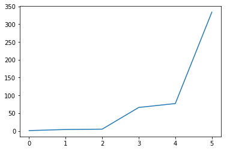

# Numpy 

NumPy is a Python library, which is mainly used for scientific computing. It contains a collection of tools and techniques that can be used to resolve number of problems in scientific computing. 

## Installing Numpy

pip install numpy

## Validating installation


```python
import numpy as np
```


```python
a = np.array([1, 4, 5, 66, 77, 334], float)
print(a)
```

    [   1.    4.    5.   66.   77.  334.]


```python
import matplotlib.pyplot as plt
plt.plot(a)
plt.show()
```





```python

```


## Data Type Objects (dtype)

A data type object represent, fixed block of memory corresponding to an array, depending on the following aspects:
* Size of data
* Type of data (integer, float or Python object)
* Byte order (little-endian or big-endian)
* In case of custom type, the name & data type of each field and part of the memory block taken by each field
* If data type is a subarray, its shape and data type

Numpy supports following data types, some of them might not be present in python.

**Data Types**|**Description**|**Range**|
:-----:|:-----:|:-----:|
bool\_|Boolean (True or False) stored as a byte| 0 1
int\_|Default integer type (same as C long; normally either int64 or int32)|
intc| Identical to C int (normally int32 or int64)|
intp| Integer used for indexing (same as C ssize\_t; normally either int32 or int64)|
int8| Byte | (-128 to 127)
int16| Integer | (-32768 to 32767)
int32| Integer | (-2147483648 to 2147483647)
int64| Integer |(-9223372036854775808 to 9223372036854775807)|
uint8| Unsigned integer |(0 to 255)|
uint16| Unsigned integer |(0 to 65535)|
uint32| Unsigned integer |(0 to 4294967295)|
uint64| Unsigned integer |(0 to 18446744073709551615)|
float\_| Shorthand for float64||
float16| Half precision float: sign bit, 5 bits exponent, 10 bits mantissa||
float32| Single precision float: sign bit, 8 bits exponent, 23 bits mantissa| |
float64| Double precision float: sign bit, 11 bits exponent, 52 bits mantissa||
complex\_|Shorthand for complex128||
complex64| Complex number, represented by two 32-bit floats (real and imaginary components)||
complex128| Complex number, represented by two 64-bit floats (real and imaginary components)||

built-in data type has a character code that uniquely identifies it. 

| Char code 	| Data Types               	|
|----------	|------------------------	|
| 'b'      	| boolean                	|
| 'i'      	| (signed) integer       	|
| 'u'      	| unsigned integer       	|
| 'f'      	| floating-point         	|
| 'c'      	| complex-floating point 	|
| 'm'      	| timedelta              	|
| 'M'      	| datetime               	|
| 'O'      	| (Python) objects       	|
| 'S', 'a' 	| (byte-)string          	|
| 'U'      	| Unicode                	|
| 'V'      	| raw data (void)        	|

A dtype object is constructed using the following syntax:

**np.dtype(object, align, copy)**

The parameters are:
* Object: To be converted to data type object
* Align: If true, adds padding to the field to make it similar to C-struct
* Copy: Makes a new copy of dtype object. If false, the result is reference to built-in data type object


```python
dt=np.dtype(np.int32)
print (dt)
```

    int32


or using the character code as shown in the above tables


```python
#int8, int16, int32, int64, ... can be replaced by equivalent string 'i1', 'i2','i4', 'i8' and so on.

dt = np.dtype('i1')
print(dt)
dt = np.dtype('i2')
print(dt)
dt = np.dtype('i4')
print(dt)
dt = np.dtype('i8')
print(dt)
```

    int8
    int16
    int32
    int64


```python
dt = np.dtype([('we will be using this user later in our examples.','a128')])
print(dt)
```

    [('we will be using this user later in our examples.', 'S128')]


```python
user=np.dtype([('first_name','S30'), ('last_name','S30'), ('pay', 'i2'), ('designation_id', 'f2')])
print(user)
```

    [('first_name', 'S30'), ('last_name', 'S30'), ('pay', '<i2'), ('designation_id', '<f2')]


we will be using this user later in our examples. 

### N-Dimension Array

One of tools provided by NumPy is ndarray. It is high-performance multidimensional array object that is a powerful data structure for efficient computation of arrays and matrices. 

To work with these arrays, there’s a huge amount of high-level mathematical functions operate on these matrices and arrays.

In other words, numpy array is a n dimentional grid of same data type values and is indexed by a tuple of non-negative integers. 

The number of dimenstions is the rank of the array and 

numpy.array(object, dtype=None, copy=True, order=None, subok=False, ndmin=0)

The above constructor takes the following parameters:

| Name  	| Description   	|
|---	|---	|
| object  	|  Any object exposing the array interface method returns an array, or any (nested) sequence 	|
| dtype  	| Desired data type of array, optional  	|
| copy  	| Optional. By default (true), the object is copied  	|
| order  	| C (row major) or F (column major) or A (any) (default)  	|
| subok  	| By default, returned array forced to be a base class array. If true, sub-classes passed through  	|
| ndimin  	| Specifies minimum dimensions of resultant array  	|

An ndarray can be **created** from a list:


```python
a = np.array([2, 1, 4, 5, 222222], np.uint64)
print(a)
```

    [     2      1      4      5 222222]


```python
a = np.array([2, 1, 4, 5, 77777777777], np.int16)
print(a)
```

    [     2      1      4      5 -19343]


array takes two parameters, list and data type. 

The list is converted to narray with the requested data type. lets update the above example for float and observe the changes in the array elements.


```python
af = np.array([2, 1, 4, 5, 77777777777], float)
print(af)
```

    [  2.00000000e+00   1.00000000e+00   4.00000000e+00   5.00000000e+00
       7.77777778e+10]


```python
a2 = np.array([2, 1, 4, 5, 8])
print(a2)
```

    [2 1 4 5 8]


```python
class T:
    def __init__(self):
        self.x = 1
        
a3 = np.array([2, 1, 4, 5, 8], T)
print(a3)
print(a3.dtype)
```

    [2 1 4 5 8]
    object


### Other ways to create narray

NumPy's `arange` method is similar to range method and it returns numpy array. 


```python
np.arange(6, dtype=complex)
```


    array([ 0.+0.j,  1.+0.j,  2.+0.j,  3.+0.j,  4.+0.j,  5.+0.j])


```python
np.arange(6, dtype=int)
```


    array([0, 1, 2, 3, 4, 5])


similarly, zero's and ones's can also be used to create narray.


```python
np.ones((2,3), dtype='i8')
```


    array([[1, 1, 1],
           [1, 1, 1]])


```python
np.zeros((2,3), dtype=float)
```


    array([[ 0.,  0.,  0.],
           [ 0.,  0.,  0.]])


```python
print(type(af[1]))
```

    <class 'numpy.float64'>


lets find all the methods available in array using introspection method `dir`


```python
print(dir(a))
```

    ['T', '__abs__', '__add__', '__and__', '__array__', '__array_finalize__', '__array_interface__', '__array_prepare__', '__array_priority__', '__array_struct__', '__array_ufunc__', '__array_wrap__', '__bool__', '__class__', '__complex__', '__contains__', '__copy__', '__deepcopy__', '__delattr__', '__delitem__', '__dir__', '__divmod__', '__doc__', '__eq__', '__float__', '__floordiv__', '__format__', '__ge__', '__getattribute__', '__getitem__', '__gt__', '__hash__', '__iadd__', '__iand__', '__ifloordiv__', '__ilshift__', '__imatmul__', '__imod__', '__imul__', '__index__', '__init__', '__init_subclass__', '__int__', '__invert__', '__ior__', '__ipow__', '__irshift__', '__isub__', '__iter__', '__itruediv__', '__ixor__', '__le__', '__len__', '__lshift__', '__lt__', '__matmul__', '__mod__', '__mul__', '__ne__', '__neg__', '__new__', '__or__', '__pos__', '__pow__', '__radd__', '__rand__', '__rdivmod__', '__reduce__', '__reduce_ex__', '__repr__', '__rfloordiv__', '__rlshift__', '__rmatmul__', '__rmod__', '__rmul__', '__ror__', '__rpow__', '__rrshift__', '__rshift__', '__rsub__', '__rtruediv__', '__rxor__', '__setattr__', '__setitem__', '__setstate__', '__sizeof__', '__str__', '__sub__', '__subclasshook__', '__truediv__', '__xor__', 'all', 'any', 'argmax', 'argmin', 'argpartition', 'argsort', 'astype', 'base', 'byteswap', 'choose', 'clip', 'compress', 'conj', 'conjugate', 'copy', 'ctypes', 'cumprod', 'cumsum', 'data', 'diagonal', 'dot', 'dtype', 'dump', 'dumps', 'fill', 'flags', 'flat', 'flatten', 'getfield', 'imag', 'item', 'itemset', 'itemsize', 'max', 'mean', 'min', 'nbytes', 'ndim', 'newbyteorder', 'nonzero', 'partition', 'prod', 'ptp', 'put', 'ravel', 'real', 'repeat', 'reshape', 'resize', 'round', 'searchsorted', 'setfield', 'setflags', 'shape', 'size', 'sort', 'squeeze', 'std', 'strides', 'sum', 'swapaxes', 'take', 'tobytes', 'tofile', 'tolist', 'tostring', 'trace', 'transpose', 'var', 'view']


```python
type(a)
```


    numpy.ndarray


we can use the ndarray as normal array.


```python
print(af[2:])
```

    [  4.00000000e+00   5.00000000e+00   7.77777778e+10]


```python
a[::-1]
```


    array([-19343,      5,      4,      1,      2], dtype=int16)


```python
a + af
```


    array([  4.00000000e+00,   2.00000000e+00,   8.00000000e+00,
             1.00000000e+01,   7.77777584e+10])


now lets try the same with different length arrays and observe the error message


```python
np.array([2, 1, 4, 5, 8], float) + np.array([2, 1, 5, 8], float)
```


    ---------------------------------------------------------------------------

    ValueError                                Traceback (most recent call last)

    <ipython-input-22-749b8b7b8da8> in <module>()
    ----> 1 np.array([2, 1, 4, 5, 8], float) + np.array([2, 1, 5, 8], float)
    

    ValueError: operands could not be broadcast together with shapes (5,) (4,) 


Arrays can be of multiple dimensions, following examples are of type multiple dimension


```python
am = np.array([[3,5,7,9], [2, 4, 5, 6]], float)
print(am)

am1 = np.array([[3,5,7,9], [2, 4, 5, 6], [1,5,10,15]], int)
print(am1)

am2 = np.array([[3+2j,5,7], [2, 4, 6], [1,5,10]], complex)
print(am2)
```

    [[ 3.  5.  7.  9.]
     [ 2.  4.  5.  6.]]
    [[ 3  5  7  9]
     [ 2  4  5  6]
     [ 1  5 10 15]]
    [[  3.+2.j   5.+0.j   7.+0.j]
     [  2.+0.j   4.+0.j   6.+0.j]
     [  1.+0.j   5.+0.j  10.+0.j]]


```python
### 
```

### Array Functions

All the functions available are as follows

'all', 'any', 'argmax', 'argmin', 'argpartition', 'argsort', 'astype', 'base', 'byteswap', 'choose', 'clip', 'compress', 'conj', 'conjugate', 'copy', 'ctypes', 'cumprod', 'cumsum', 'data', 'diagonal', 'dot', 'dtype', 'dump', 'dumps', 'fill', 'flags', 'flat', 'flatten', 'getfield', 'imag', 'item', 'itemset', 'itemsize', 'max', 'mean', 'min', 'nbytes', 'ndim', 'newbyteorder', 'nonzero', 'partition', 'prod', 'ptp', 'put', 'ravel', 'real', 'repeat', 'reshape', 'resize', 'round', 'searchsorted', 'setfield', 'setflags', 'shape', 'size', 'sort', 'squeeze', 'std', 'strides', 'sum', 'swapaxes', 'take', 'tobytes', 'tofile', 'tolist', 'tostring', 'trace', 'transpose', 'var', 'view'

We are going to cover few of them in coming sections. I have tried to place them in logical sections for easy understanding. 

Following are used to manage the arguments 
- 'argmax',
- 'argmin',
- 'argpartition',
- 'argsort'

#### astype


```python
am.base
```


```python
am.choose
```


```python
am.clip(3)
```


```python
am.clip(1, 4)
```


```python
am.compress([2,2])
```


```python
am.conjugate()
```

#### ndarray.shape
Array dimensions can be found by using function `shape`


```python
print(am.shape)
print(am1.shape)
print(am2.shape)
print(a.shape)
print(af.shape)
```

#### ndarray.dtype
and data type of array can be obtained using `dtype`


```python
print(am.dtype)
print(am1.dtype)
print(am2.dtype)
print(a.dtype)
print(af.dtype)
```

#### ndarray.ndim
It returns the number of array dimensions.


```python
print(am.ndim)
print(am1.ndim)
print(am2.ndim)
print(a.ndim)
```

#### numpy.itemsize

It returns the length of each element of array in **bytes**.


```python
print(am.itemsize)
print(am1.itemsize)
print(am2.itemsize)
print(a.itemsize)
```

#### numpy.flags

The ndarray object has the following attributes. Its current values are returned by this
function.


```python
print(am.flags)
print('')
print(am1.flags)
print('')
print(am2.flags, end='\n\n')
print(a.flags)
```

### Maths Operations

In numpy standard mathematical operations when used with arrays, operate at element level, which makes it mandetory that the  arrays  should  be  the  same  size.


```python
am = np.array([[3,5,7,9], [2, 4, 5, 6], [12, 14, 15, 6]], float)
print(am)
print(am.shape)

am1 = np.array([[3,5,7,9], [2, 4, 5, 6]], float)
print(am1)
print(am1.shape)
```

In the above examples am and am1 are of different shapes, thus any operation performed on the will result in failure as shown in the below maths operations,  


```python
am + am1
```


```python
am - am1
```


```python
am * am1
```

Now, lets update the arrays with similar shape and observe the standard maths operations, 


```python
am = np.array([[2, 4, 5, 6], [12, 14, 15, 6]], float)
print(am)
print(am.shape)

am1 = np.array([[3,5,7,9], [2, 4, 5, 6]], float)
print(am1)
print(am1.shape)
```


```python
am + am1
```


```python
am - am1
```


```python
am * am1
```


```python
am ** am1
```


```python
am % am1
```


```python
am / am1
```

But, arrays that do not match in the number of dimensions will be broadcasted by Python to perform mathematical operations.  This often means that the smaller array will be repeated 
as necessary to perform the operation indicated


```python
a = np.array([[1, 2 , 3], [3, 4, 3], [5, 6, 5]], float)
b = np.array([-1, 3, 3], float)
```


```python
a+b
```

but, following example will **fail.**


```python
a = np.array([[1, 2 , 3], [3, 4, 3], [5, 6, 5]], float)
b = np.array([[-1, 3, 3], [-1, 3, 3]], float)
```


```python
a+b
```

in order for the 'a' to work they should be something similar to below example


```python
a = np.array([[[1, 2 , 3], [3, 4, 3]], [[5, 6, 5], [6,7,6]]], float)
b = np.array([[-1, 3, 3], [-1, 3, 3]], float)
```

and the below code will work without any issue as smaller array can be repeated on the larger array.


```python
a+b
```

Numpy also offers large  library  of  common  mathematical functions  that  can  be  applied elementwise to  arrays.

Some of the other maths related functions are as follows: 

```abs, sign, sqrt, exp, (log, log10), (sin,  cos,  tan,  arcsin,  arccos, arctan), (sinh, cosh, tanh, arcsinh, arccosh and arctanh).```


```python
np.sqrt(a)
```


```python
np.sqrt(a + b)
```

Numpi also provide access to Maths constants such as `pi`


```python
print(np.pi)
print(np.e)
```

Numpy also provide functions to find the lower, upper, or nearest (rounded) integer through floor, ceil, and rint


```python
np.floor(b)
```


```python
np.ceil(a)
```


```python
np.rint(a)
```

### Array iteration

Just like normal array np array's can also be iterated 


```python
for i in a:
    print(i, "....")
#     print("---")
```


```python
for i in am:
    print(i, "....")
#     print("---")
```

for multi-dimensional array, multiple assinations is also available


```python
for i, j , k, l in am:
    print(i, j, k, l)
```

### Basic array operations

The argmin and argmax functions return the array indices of the minimum and maximum values


```python
#### max
print(a.max())
```


```python
#### argmax 
print(a.argmax())
```


```python
#### min 
print(a.min())
```


```python
#### argmax 
print(a.argmin())
```


```python
# unique, Unique elements can be extracted from an array
np.unique(a)
```


```python
#### sorting , sorting can happed on only 1-D arrays

print(sorted(a))
```


```python
ad1 = np.array([3,4,52,23,43,2], int)
```


```python
print(sorted(ad1))
```

Values  in  an  array  can  be  "clipped"  to  be  within  a  prespecified range. That is, every value in elements will be bumped up to be equal to min value and bumped down to be equal to max value


```python
ad1.clip(0, 5)
```

For two dimensional arrays, the diagonal can be extracted:


```python
ad2 = np.array([[1, 2], [3, 4]], int)
print(ad2.diagonal())
```

### Comparison operators
Similar to maths operators, comparison operators also operate at element level.


```python
a = np.array([2, 3, 0], float)
b = np.array([0, 3, 3], float)
c = np.array([1, 2, 2], float)
```


```python
a > b
```


```python
a == b
```


```python
a < b
```


```python
a != b
```


```python
a > (b + c)
```


```python
a > (b - c)
```


```python
b + c
```


```python
b - c
```

Compound Boolean expressions can also be used on the array elements using the following functions,  

#### logical_and


```python
 np.logical_and(a > 0, a < 3)
```

#### logical_or


```python
np.logical_or(a < 3, a > 3)
```

#### logical_not


```python
np.logical_not(a < 3, a > 3)
```

A number of functions allow testing of the values in an array. The nonzero function gives a
tuple of indices of the nonzero values in an array. The number of items in the tuple equals the
number of axes of the array:


```python
a.nonzero()
```

It is also possible to test whether or not values are NaN ("not a number") or finite:


```python
a = np.array([1, np.NaN, np.Inf], float)
```


```python
np.isfinite(a)
```


```python
np.isnan(a)
```

The where function forms a new array from two arrays of equivalent size using a Boolean filter
to choose between elements of the two. Its basic syntax is where(boolarray,
truearray, falsearray):


```python
import matplotlib.pyplot as plt
vals = [10.6, 7.9, 9.5, 7.4, 3.6, 6.9, 3.9, 2.7, 2.1]
C = np.array(vals)

plt.plot(C)
plt.show()
```


    ---------------------------------------------------------------------------

    NameError                                 Traceback (most recent call last)

    <ipython-input-1-5057d544fefd> in <module>()
          1 import matplotlib.pyplot as plt
          2 vals = [10.6, 7.9, 9.5, 7.4, 3.6, 6.9, 3.9, 2.7, 2.1]
    ----> 3 C = np.array(vals)
          4 
          5 plt.plot(C)


    NameError: name 'np' is not defined


```python
Broadcasting can also be used with the where function:
```

### Array item selection and manipulation


```python
Subsetting
```
