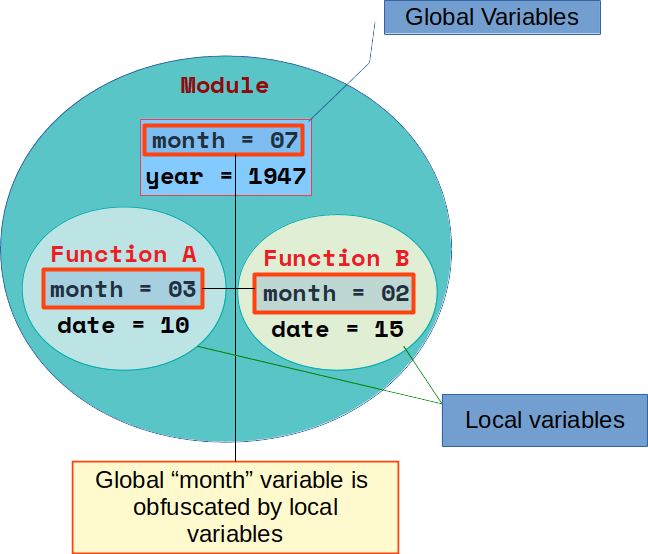

# Chapter 7: Scope of names
_____________________________

The scope of names (variables) are maintained by **_Namespaces_**, which are dictionaries containing the names of the objects (references) and the objects themselves.

As we have seen that names are not pre-defined thus Python uses the code block of the assignment of a name to associate it with a particular namespace. In other words, the place where you assign a name in your source code determines its scope of visibility.

Python uses `lexical` scoping, which means that variable scopes are determined entirely by their locations in the source code and not by function calls. 

Rules for names inside **Functions** are as follows 

* Names assigned inside a `def` can only be seen by the code within that `def` and cannot be referred from outside the function.
* Names assigned inside a `def` do'nt clash with variables from outside the `def`. i.e. a name assigned outside a `def` is a completely different variable from a name assigned inside that `def`.
* If a variable is assigned outside all `defs`, then it is global to the entire file and can be accessed with the help of `global` keyword inside the `def`.


Normally, the names are defined in two dictionaries, which can be accessed through the functions `locals()` and `globals()`. These dictionaries are updated dynamically at <span class="note" title="Although the dictionaries returned by locals() and globals() can be changed directly, this should be avoided because it can have undesirable effects.">runtime</span>.



Global variables can be overshadowed by local variables (because the local scope is consulted before the global scope). To avoid this, you must declare the variable as global in the local scope.

example:


```python
a = 10

def test():
    print(a)
    a = 12 

test()
print(a)
```


    ---------------------------------------------------------------------------

    UnboundLocalError                         Traceback (most recent call last)

    <ipython-input-2-f851c4989db0> in <module>()
          4     print(a)
          5     a = 12
    ----> 6 test()
          7 print(a)


    <ipython-input-2-f851c4989db0> in test()
          2 
          3 def test():
    ----> 4     print(a)
          5     a = 12
          6 test()


    UnboundLocalError: local variable 'a' referenced before assignment


```python
a = 10

def test():
    a = 12 
    print(a)

test()
print(a)
```

    12
    10


```python
a = 10

def test():
    """
    - Only for viewing value of Global Variable
    - Cannot change the global variable
    """
    print(a)

test()
print(a)
```

    10
    10


```python
a = 10

def test():
    """
    - When you need to update the value of Global variable
    """
    global a
    print(a)
    a = 12
    print(a)
    print(id(a))
#     print(locals())
#     print(globals())

print(a)
test()
print(id(a))
print(a)
```

    10
    10
    12
    1387491136
    1387491136
    12


```python

```

    10
    10


```python
def test():
    """
    Updating the data
    """
    global glb
    print(glb)
    glb = 12
    
test()
glb = 10
print(glb)
```


    ---------------------------------------------------------------------------

    NameError                                 Traceback (most recent call last)

    <ipython-input-9-e96badd21161> in <module>()
          7     glb = 12
          8 
    ----> 9 test()
         10 glb = 10
         11 print(glb)


    <ipython-input-9-e96badd21161> in test()
          4     """
          5     global glb
    ----> 6     print(glb)
          7     glb = 12
          8 


    NameError: name 'glb' is not defined


```python
def test():
    """
    Updating the data
    """
    global glb
    print(glb)
    glb = 12

glb = 10    
test()
print(glb)
```

    10
    12


```python
def test():
    """
    Updating the data
    """
    global glb1
    glb1 = 12
    print(glb1)
   
test()
print(glb)
```

    12
    12


```python
a = 10

def test():
    global a
    a = "Chennai Riders"
    print(a)
    a = "Pune Rocks"

test()
print(a)
```

    Chennai Riders
    Pune Rocks


```python
global a
a = 10

def test():
    a = "Pune Rocks"
    print(a)
    print(locals())
    print("~"*20)
#     print(globals())
    
test()
print(a)
```

    Pune Rocks
    {'a': 'Pune Rocks'}
    ~~~~~~~~~~~~~~~~~~~~
    10


```python
a = 10

def test(a):
    print(a)
    a = "Pune Rocks"
    print(locals())
    return a
    
a= test(a)
print(a)
print(len(locals()))
print(len(globals()))
```

    10
    {'a': 'Pune Rocks'}
    Pune Rocks
    30
    30


```python
def addlist(lists):
    """
    Add lists of lists, recursively
    the result is global
    """
    global add
    for item in lists:
        if isinstance(item, list): # If item type is list
            addlist(item)
        else:
            add += item # add = add + item

add = 0
addlist([[1, 2], [3, 4, 5], 6])

print(add)
```

    21


```python
# add = 10

def addlist(lists):
    """
    Add lists of lists, recursively
    the result is global
    """
    global add2
    
    for item in lists:
        if isinstance(item, list): # If item type is list
            addlist(item)
        else:
            if 'add2' in globals():
                add2 += item
            else:
                print("Creating add")
                add2 = item

addlist([[1, 2], [3, 4, 5], 6])

print(add2)
```

    41


Using global variables is not considered a good development practice, as they make the system harder to understand, so it is better to avoid their use. The same applies to overshadowing variables.


```python
#add = 10

def addlist(lists):
    """
    Add lists of lists, recursively
    the result is global
    """
    global add
    
    for item in lists:
        if isinstance(item, list): # If item type is list
            addlist(item)
            x = 100
        else:
            add += item
            
        print(x)

addlist([[1, 2], [3, 4, 5], 6])

print(add)
```


    ---------------------------------------------------------------------------

    UnboundLocalError                         Traceback (most recent call last)

    <ipython-input-3-0cd1c571bef2> in <module>()
         17         print(x)
         18 
    ---> 19 addlist([[1, 2], [3, 4, 5], 6])
         20 
         21 print(add)


    <ipython-input-3-0cd1c571bef2> in addlist(lists)
         10     for item in lists:
         11         if isinstance(item, list): # If item type is list
    ---> 12             addlist(item)
         13             x = 100
         14         else:


    <ipython-input-3-0cd1c571bef2> in addlist(lists)
         15             add += item
         16 
    ---> 17         print(x)
         18 
         19 addlist([[1, 2], [3, 4, 5], 6])


    UnboundLocalError: local variable 'x' referenced before assignment


```python
def outer():
    a = 0
    b = 1

    def inner():
        print(a)
        print(b)

    inner()
    
outer()
```

    0
    1


**NOTE:** - A special quirk of Python is that – if no global statement is in effect – assignments to names always go into the innermost scope. Assignments do not copy data — they just bind names to objects.


```python
def outer():
    a = 0
    b = 1

    def inner():
        print(a)
        print(b)
        b = 4

    inner()

outer()
```

    0


    ---------------------------------------------------------------------------

    UnboundLocalError                         Traceback (most recent call last)

    <ipython-input-19-a4496f6e9644> in <module>()
         10     inner()
         11 
    ---> 12 outer()
    

    <ipython-input-19-a4496f6e9644> in outer()
          8         b = 4
          9 
    ---> 10     inner()
         11 
         12 outer()


    <ipython-input-19-a4496f6e9644> in inner()
          5     def inner():
          6         print(a)
    ----> 7         print(b)
          8         b = 4
          9 


    UnboundLocalError: local variable 'b' referenced before assignment


```python
def outer():
    a = 0
    print("outer: ", a)
    
    def inner():
        global a
        print("inner: ", a)
        
    inner()

a = 200
b = 10
outer()
print("base")
print(a)
print(b)
```

    outer:  0
    inner:  200
    base
    200
    10


```python
def List_fun(l, a=[]):
    """function takes 2 parameters list having values and empty list."""

    for i in l:
        #checking whether the values are list or not
        if isinstance(i, list):
            List_fun(i, a)
        else:
            a.append(i)
    return a 

b=[]
l2 = List_fun([[1,2],[3,[4,5]],6,7], b)
print(l2)
print(b)
print(id(l2))
print(id(b))
```

    [1, 2, 3, 4, 5, 6, 7]
    [1, 2, 3, 4, 5, 6, 7]
    2231595557320
    2231595557320


```python
def List_fun(l, a=[]):
    """function takes 2 parameters list having values and empty list."""
    
    for i in l:
        #checking whether the values are list or not
        if isinstance(i, list):
            List_fun(i, a)
        else:
            a.append(i)


b=[]
List_fun([[1,2],[3,[4,5]],6,7], b)
print(b)
```

    [1, 2, 3, 4, 5, 6, 7]


```python
def fun_numbers(a):
    print(a)
    print(id(a))
    a += 10
    print(a)
    print(id(a))

b = 10
print(id(b))
fun_numbers(b)
print(b)
```

    1387491072
    10
    1387491072
    20
    1387491392
    10


```python
def fun_numbers(a):
    print(a)
    print(id(a))
    a = [20]
    print(a)
    print(id(a))

b = [10]
print(id(b))
fun_numbers(b)
print(b)
```

    2231595541512
    [10]
    2231595541512
    [20]
    2231595557576
    [10]


```python
def fun_numbers(a):
    print(a)
    print(id(a))
    a.append(20)
    print(a)
    print(id(a))

b = [10]
print(id(b))
fun_numbers(b)
print(b)
```

    2231595560456
    [10]
    2231595560456
    [10, 20]
    2231595560456
    [10, 20]


```python
def fun_numbers(a):
    print(a)
    a.append(120)
    print(a)

b = [10]
fun_numbers(b)
print(b)
```

    [10]
    [10, 120]
    [10, 120]


```python
def func():
    a = 10
    for d in [10,20,30]:
        a = a+d
    print(a)
    
func()
```

    70

